# 🔧 **PHASE 12: MCP-BY-DEFAULT INTEGRATION - MCP ENHANCED DESIGN**

**Date**: August 29, 2025
**Architect**: Martin | Platform Architecture with MCP Sequential enhancement
**Context**: Post-Phase 11 foundation (33/33 P0 tests, Enhanced Predictive Intelligence)
**Status**: 🎯 **DESIGN PHASE** - Strategic Architecture Enhancement

---

## 🔧 **MCP SEQUENTIAL ANALYSIS: CURRENT STATE → DESIRED STATE**

🔧 Accessing MCP Server: sequential (systematic_architecture_analysis)
*Analyzing current MCP integration architecture to design always-on enhancement system...*

### **Current Architecture Analysis:**

#### **❌ Current Limitations (Opt-in Behavior):**
- **Complexity Thresholds**: Users miss MCP enhancement due to arbitrary 0.5-0.8 confidence thresholds
- **Inconsistent Experience**: Some queries get enhancement, others don't - user confusion
- **Performance Variability**: Response quality varies dramatically based on complexity detection
- **Decision Fatigue**: System requires complex heuristics to determine when to enhance

#### **✅ Current Strengths to Preserve:**
- **Transparent Disclosure**: `🔧 Accessing MCP Server: [server] ([capability])` format
- **Server-Persona Mapping**: Diego→Sequential, Martin→Context7, Rachel→Context7, etc.
- **Graceful Fallback**: System works without MCP servers available
- **Framework Attribution**: `📚 Strategic Framework: [name] detected` after enhancement

---

## 🎯 **MCP-BY-DEFAULT STRATEGIC DESIGN**

### **🏗️ Core Architectural Transformation:**

```mermaid
graph TD
    A[Strategic Query] --> B[🎯 Persona Selection]
    B --> C[🔧 MCP Enhancement - ALWAYS ON]
    C --> D[Primary Server Selection]
    D --> E[🔧 Accessing MCP Server Disclosure]
    E --> F[Enhanced Strategic Response]
    F --> G[📚 Framework Attribution]
    F --> H[⚡ Performance Metrics]

    subgraph "Server Selection Logic"
        I[Diego → Sequential]
        J[Martin → Context7]
        K[Rachel → Context7]
        L[Camille → Sequential]
        M[Alvaro → Sequential]
    end

    D --> I
    D --> J
    D --> K
    D --> L
    D --> M

    classDef persona fill:#4dabf7,color:#fff
    classDef mcp fill:#51cf66,color:#fff
    classDef framework fill:#ffd43b

    class C,E mcp
    class G framework
    class B,D persona
```



### **🔄 Transformation Strategy:**

#### **1. Eliminate Complexity Detection** ✅
- **Remove**: `AnalysisComplexityDetector.should_enhance_with_mcp()`
- **Remove**: Threshold configurations (0.5-0.8 complexity scoring)
- **Remove**: `minimum_complexity` checks
- **Simplify**: Direct persona → MCP server routing

#### **2. Always-On MCP Routing** ✅
- **Primary Server**: Every persona gets their primary MCP server automatically
- **Fallback Handling**: Graceful degradation if MCP server unavailable
- **Transparency**: Always show MCP enhancement disclosure
- **Performance**: <500ms target maintained with caching

#### **3. Intelligent Server Selection** ✅
- **Strategic Queries**: All queries route to appropriate MCP server
- **Persona Optimization**: Server selection based on persona expertise
- **Multi-Server Coordination**: Complex queries still get multiple servers
- **Load Balancing**: Intelligent routing for performance

---

## 🏗️ **IMPLEMENTATION ARCHITECTURE**

### **Core Components to Modify:**

#### **1. Enhanced Persona Manager Transformation**
```python
# BEFORE: Threshold-based enhancement
def should_enhance_with_mcp(analysis, persona, thresholds):
    if analysis.confidence < thresholds.get("minimum_complexity", 0.5):
        return False, None
    # Complex decision logic...

# AFTER: Always-on enhancement
def get_mcp_server_for_persona(persona: str) -> str:
    """Always return appropriate MCP server for persona"""
    return self.persona_configs[persona]["primary_server"]
```

#### **2. Decision Orchestrator Simplification**
```python
# BEFORE: Complex routing based on complexity analysis
def _determine_complexity(detected_patterns, frameworks):
    if pattern_count >= 3 and framework_count >= 3:
        return DecisionComplexity.STRATEGIC
    # Multiple complexity levels...

# AFTER: Simplified persona-based routing
def route_to_mcp_server(persona: str, query_context: Dict) -> List[str]:
    """Direct routing based on persona + query enhancement needs"""
    base_server = self.persona_server_mapping[persona]
    enhanced_servers = self._detect_additional_servers(query_context)
    return [base_server] + enhanced_servers
```

#### **3. Transparency System Enhancement**
```python
# ALWAYS show MCP enhancement
def format_mcp_disclosure(persona: str, server: str, capability: str) -> str:
    return f"🔧 Accessing MCP Server: {server} ({capability})"

# ALWAYS include in response
def enhance_response_with_transparency(response: str, persona: str) -> str:
    disclosure = self.format_mcp_disclosure(persona, server, capability)
    return f"{disclosure}\n*{processing_message}*\n\n{response}"
```

---

## 📊 **PERFORMANCE & QUALITY TARGETS**

### **Response Time Optimization:**
- **Primary Server**: <300ms for single MCP server enhancement
- **Multi-Server**: <500ms for complex queries requiring multiple servers
- **Fallback Mode**: <100ms when MCP servers unavailable
- **Caching Strategy**: Intelligent caching of framework patterns and persona preferences

### **Quality Improvements:**
- **Consistency**: 100% of strategic queries get MCP enhancement
- **Predictability**: Users always know they're getting enhanced intelligence
- **Transparency**: Complete disclosure of AI capabilities being used
- **Enterprise Grade**: Consistent professional-level strategic guidance

---

## 🔧 **MCP SERVER UTILIZATION STRATEGY**

### **Persona → Server Mapping (Always Active):**

| Persona | Primary Server | Capability | Use Case |
|---------|---------------|------------|----------|
| **Diego** | Sequential | systematic_analysis | Engineering leadership, organizational scaling |
| **Martin** | Context7 | architecture_patterns | Technical architecture, system design |
| **Rachel** | Context7 | design_methodology | Design systems, UX strategy |
| **Camille** | Sequential | strategic_technology | Technology leadership, executive strategy |
| **Alvaro** | Sequential | business_strategy | Platform investment, competitive analysis |

### **Multi-Server Enhancement Logic:**
- **Executive Context**: Add Sequential for business modeling
- **Visual Requirements**: Add Magic for diagram generation
- **Complex Architecture**: Add Context7 for pattern lookup
- **Cross-Functional**: Coordinate multiple servers with transparency

---

## 🛡️ **P0 PROTECTION & GRACEFUL DEGRADATION**

### **Mandatory Requirements:**
- **33/33 P0 Tests**: Must remain passing throughout implementation
- **Fallback Compatibility**: Full functionality without MCP servers
- **Performance SLA**: <500ms response time maintained
- **Zero Regression**: Existing functionality preserved

### **Graceful Degradation Strategy:**
```python
async def enhance_with_mcp_or_fallback(persona: str, query: str) -> str:
    try:
        # Always attempt MCP enhancement
        server = self.get_primary_server(persona)
        enhanced_response = await self.mcp_client.enhance(server, query)
        return self.add_transparency_disclosure(enhanced_response, server)
    except MCPServerUnavailable:
        # Fallback to high-quality persona response
        fallback_response = await self.generate_persona_response(persona, query)
        return self.add_fallback_disclosure(fallback_response)
```

---

## 🚀 **IMPLEMENTATION PHASES**

### **Phase 12.1: Core Architecture (Week 1)**
1. **Simplify Persona Manager**: Remove complexity thresholds, implement always-on routing
2. **Update Decision Orchestrator**: Streamline MCP server selection logic
3. **Enhance Transparency**: Always-on disclosure formatting
4. **P0 Test Updates**: Ensure all tests pass with new behavior

### **Phase 12.2: Performance Optimization (Week 2)**
1. **Caching Strategy**: Implement intelligent MCP response caching
2. **Load Balancing**: Optimize server selection for performance
3. **Fallback Enhancement**: Improve fallback response quality
4. **Monitoring Integration**: Real-time performance tracking

### **Phase 12.3: Advanced Features (Week 3)**
1. **Smart Multi-Server**: Intelligent coordination for complex queries
2. **Adaptive Routing**: Learn from user feedback for server selection
3. **Enterprise Dashboard**: MCP usage analytics and performance metrics
4. **A/B Testing Framework**: Compare always-on vs. threshold-based performance

---

## 📈 **BUSINESS VALUE & COMPETITIVE ADVANTAGE**

### **Strategic Benefits:**
- **🎯 Consistent Excellence**: Every interaction gets enterprise-grade intelligence
- **🚀 User Experience**: Predictable, high-quality strategic guidance
- **💼 Executive Appeal**: "Always-on AI enhancement" as a key differentiator
- **📊 Performance**: Eliminate inconsistency in response quality

### **Market Positioning:**
- **First Platform**: Always-on MCP enhancement for strategic leadership
- **Enterprise Ready**: Consistent professional-level AI assistance
- **Transparent AI**: Complete disclosure of enhancement capabilities
- **Performance Guaranteed**: <500ms response time with enterprise intelligence

---

## ✅ **SUCCESS CRITERIA**

### **Technical Milestones:**
- [ ] **Complexity Thresholds Removed**: Simplified always-on architecture
- [ ] **Persona-Server Mapping**: Direct routing without decision complexity
- [ ] **Transparency Enhanced**: Always-on MCP disclosure
- [ ] **Performance Maintained**: <500ms response time with 100% MCP enhancement

### **Quality Milestones:**
- [ ] **33/33 P0 Tests**: All tests passing with new architecture
- [ ] **Response Consistency**: 100% of queries get MCP enhancement
- [ ] **Fallback Reliability**: Full functionality without MCP servers
- [ ] **User Experience**: Predictable, enterprise-grade strategic guidance

### **Business Milestones:**
- [ ] **Competitive Differentiation**: "Always-on AI enhancement" positioning
- [ ] **Enterprise Sales**: Professional demonstration of consistent intelligence
- [ ] **Performance Metrics**: Measurable improvement in response quality consistency
- [ ] **User Satisfaction**: Increased satisfaction with predictable enhancement

---

**🔧 MCP Sequential Analysis Complete: Ready for implementation of always-on enterprise AI enhancement that transforms ClaudeDirector from "sometimes enhanced" to "always excellent"!**
