# Phase 13: ML-Enhanced Intelligence Technical Stories

**Technical Implementation Stories Grounded in Architecture Foundation**

🏗️ **Martin | Platform Architecture** with MCP Sequential enhancement
📅 **Created**: 2025-08-29
🎯 **Implementation**: Q1 2025 (4 Phases, 8 Weeks)
📋 **Foundation**: Leverages @OVERVIEW.md and @TESTING_ARCHITECTURE.md

---

## 🏗️ **ARCHITECTURE FOUNDATION ANALYSIS**

### **✅ Phase 12 Foundation Strengths (from OVERVIEW.md)**
- **Always-On MCP Router**: 100% enhancement rate provides foundation for ML routing
- **Enhanced Predictive Engine**: Phase 11 foundation ready for ML implementation
- **Lightweight Fallback Pattern**: Enterprise reliability pattern extends to ML components
- **Context Engineering (8-Layer)**: Memory architecture ready for ML pattern recognition
- **Performance Optimization**: <50ms transparency overhead maintained for ML predictions

### **✅ Testing Architecture Foundation (from TESTING_ARCHITECTURE.md)**
- **P0 Test Registry**: YAML-driven system ready for ML P0 test integration
- **Unified Test Runner**: Single test execution across local/CI environments
- **36 P0 Tests Operational**: Zero regression tolerance maintained for ML development
- **Modular Test Architecture**: Pattern established for complex ML test scenarios

---

## 🔧 **TECHNICAL STORY FRAMEWORK**

**Format**: As a [system component], I need [capability] so that [technical outcome]
**Architecture Compliance**: Direct references to OVERVIEW.md components
**P0 Protection**: Integration with TESTING_ARCHITECTURE.md validation
**Performance**: <50ms transparency overhead maintained (Phase 12 standard)

---

## 🎯 **PHASE 13.1: ML INFRASTRUCTURE FOUNDATION** (Weeks 1-2)

### **TS-13.1.1: ML Pipeline Integration with Decision Orchestrator** ✅ **COMPLETED**
**As the** Decision Orchestrator (from OVERVIEW.md AI Intelligence Layer)
**I need** ML prediction capabilities integrated with existing always-on MCP routing
**So that** strategic queries receive ML-enhanced intelligence with same transparency standards

#### **🏗️ Technical Implementation** ✅ **COMPLETED**
- **Component**: ✅ Extended `DecisionIntelligenceOrchestrator` class in `.claudedirector/lib/ai_intelligence/decision_orchestrator.py`
- **Integration Point**: ✅ Added ML prediction router integration with graceful fallback
- **Architecture Compliance**: ✅ Maintains Phase 12 always-on MCP routing while adding ML layer
- **Performance Target**: ✅ <5s for ML predictions, <50ms for simple queries (fallback to Phase 12)

#### **✅ Acceptance Criteria** ✅ **COMPLETED**
- ✅ Given strategic query requires ML enhancement
- ✅ When Decision Orchestrator processes the request
- ✅ Then ML predictions integrate with existing MCP routing
- ✅ And transparency disclosure includes ML enhancement: "🤖 ML Enhancement: [capability] (confidence: X%)"
- ✅ And performance remains <5s for complex predictions, <50ms for simple queries
- ✅ And graceful fallback to Phase 12 MCP enhancement when ML unavailable

#### **🛡️ P0 Protection Strategy** ✅ **COMPLETED**
- ✅ Extend existing P0 tests in `p0_test_definitions.yaml` with ML infrastructure validation
- ✅ Ensure 36/36 existing P0 tests continue passing during ML integration
- ✅ Add new P0 test: "ML Infrastructure P0" with BLOCKING critical level
- ✅ Validate lightweight fallback pattern extends to ML components
- ✅ Restored P0 enforcement infrastructure after cleanup (mandatory_test_validator.py, README protection hooks)

**✅ IMPLEMENTATION COMPLETED**: ML prediction routing integrated with Decision Orchestrator, maintaining full backward compatibility and performance standards.

### **TS-13.1.2: Context Engineering ML Extension**
**As the** Advanced Context Engine (from OVERVIEW.md Context Engineering 8-Layer)
**I need** ML feature extraction capabilities integrated with Layer 8: ML Pattern Detection
**So that** organizational data becomes training features for collaboration prediction models

#### **🏗️ Technical Implementation**
- **Component**: Extend Layer 8 (ML Pattern Detection) in Context Engineering system
- **Data Sources**: Strategic Memory DB, Stakeholder Intelligence, Team Dynamics layers
- **Feature Pipeline**: Extract collaboration patterns from 8-layer memory architecture
- **Storage**: Enhance Strategic Memory DB with time-series ML feature storage

#### **✅ Acceptance Criteria**
- Given organizational interactions stored in Context Engineering layers
- When ML feature extraction processes organizational data
- Then collaboration success features extracted with <200ms latency
- And features stored in Strategic Memory DB with time-series indexing
- And data anonymization preserves privacy while enabling ML training
- And feature pipeline integrates with existing 8-layer architecture

#### **🛡️ P0 Protection Strategy**
- Memory Context Persistence P0 test extended to validate ML feature extraction
- Performance targets maintained: Context operations <50ms (Phase 8 optimization)
- Data privacy validation: No sensitive stakeholder data in ML features
- Backward compatibility: All existing context layers function unchanged

### **TS-13.1.3: ML Model Serving Infrastructure**
**As the** MCP Coordinator (from OVERVIEW.md AI Intelligence Layer)
**I need** ML model serving capabilities integrated with existing MCP server architecture
**So that** ML predictions route through established transparency and enhancement patterns

#### **🏗️ Technical Implementation**
- **Component**: Extend MCP Coordinator for ML model serving
- **Model Storage**: Local model storage with version management
- **Serving**: In-memory model serving with LRU caching for <50ms predictions
- **Integration**: ML predictions as "special MCP server" maintaining transparency standards

#### **✅ Acceptance Criteria**
- Given trained ML models for collaboration prediction
- When strategic queries require ML enhancement
- Then ML models serve predictions through MCP architecture
- And transparency disclosure follows established MCP patterns
- And model versioning enables A/B testing and gradual rollout
- And memory usage <200MB additional for ML models (Phase 13 target)

#### **🛡️ P0 Protection Strategy**
- MCP Integration P0 test extended to validate ML model serving
- Circuit breaker pattern: ML failures fall back to Phase 12 MCP enhancement
- Performance monitoring: Track ML prediction latency and accuracy
- Memory pressure detection: Automatic model unloading if memory limits exceeded

---

## 🎯 **PHASE 13.2: COLLABORATION PREDICTION ENGINE** (Weeks 3-4)

### **TS-13.2.1: Collaboration Success ML Models**
**As the** Enhanced Predictive Engine (from OVERVIEW.md AI Intelligence Layer)
**I need** collaboration success prediction capabilities with 85%+ accuracy
**So that** strategic queries about team initiatives receive data-driven success predictions

#### **🏗️ Technical Implementation**
- **Component**: Extend Enhanced Predictive Engine foundation from Phase 11
- **Models**: Ensemble methods (Random Forest + Gradient Boosting) for collaboration prediction
- **Features**: Communication patterns, timeline adherence, stakeholder engagement metrics
- **Confidence Scoring**: Uncertainty quantification with prediction intervals

#### **✅ Acceptance Criteria**
- Given historical collaboration data and success outcomes
- When ML models train on organizational patterns
- Then collaboration success predicted with 85%+ accuracy on validation set
- And confidence scores provided with all predictions (0-100%)
- And prediction explanations include top success/risk factors
- And model retraining pipeline updates predictions weekly

#### **🛡️ P0 Protection Strategy**
- New P0 test: "Collaboration Prediction Accuracy P0" with 85% minimum accuracy
- Model validation: Cross-validation and hold-out test sets
- Drift detection: Monitor prediction accuracy degradation over time
- A/B testing framework: Gradual rollout with performance comparison

### **TS-13.2.2: Persona Integration with ML Predictions**
**As** Diego, Camille, Rachel, Martin personas (from OVERVIEW.md Specialized AI Personas)
**I need** ML-enhanced capabilities specific to my strategic domain
**So that** my persona responses include predictive insights relevant to my expertise area

#### **🏗️ Technical Implementation**
- **Component**: Extend Enhanced Persona Manager with ML prediction integration
- **Diego Enhancement**: Team collaboration prediction, coordination risk assessment
- **Martin Enhancement**: Technical timeline prediction, architecture decision optimization
- **Camille Enhancement**: Strategic risk modeling, executive communication optimization
- **Rachel Enhancement**: Cross-functional collaboration pattern optimization

#### **✅ Acceptance Criteria**
- Given persona selection for strategic query
- When ML predictions are available for persona domain
- Then persona responses include relevant ML insights
- And ML predictions formatted appropriately for persona communication style
- And transparency attribution includes both persona and ML enhancement
- And persona fallback works when ML predictions unavailable

#### **🛡️ P0 Protection Strategy**
- Persona Consistency P0 test extended to validate ML integration
- Each persona maintains characteristic communication style with ML enhancement
- Fallback: Personas work with Phase 12 capabilities when ML unavailable
- Validation: ML predictions don't override persona strategic expertise

### **TS-13.2.3: Real-Time Pattern Recognition**
**As the** Real-Time Intelligence Layer (Layer 7 from OVERVIEW.md Context Engineering)
**I need** live collaboration pattern analysis with <5 minute issue detection
**So that** coordination problems are identified before they escalate

#### **🏗️ Technical Implementation**
- **Component**: Extend Layer 7: Real-Time Intelligence with ML pattern detection
- **Streaming**: Real-time data ingestion for team interaction monitoring
- **Anomaly Detection**: Statistical and ML-based anomaly detection for coordination issues
- **Alert Generation**: Integration with existing alert systems in Context Engineering

#### **✅ Acceptance Criteria**
- Given real-time team interaction data
- When collaboration patterns deviate from success baselines
- Then coordination issues detected within <5 minutes
- And alerts generated with specific intervention recommendations
- And alert fatigue prevented through intelligent escalation rules
- And detection accuracy >80% for coordination risks

#### **🛡️ P0 Protection Strategy**
- Real-Time Monitoring P0 test extended for ML pattern detection
- Performance target: <5 minute detection maintained
- False positive rate: <10% to prevent alert fatigue
- Integration testing: Coordination with existing Context Engineering layers

---

## 🎯 **PHASE 13.3: REAL-TIME MONITORING SYSTEM** (Weeks 5-6)

### **TS-13.3.1: ML-Enhanced Dashboard Integration**
**As the** Leadership Workspace (from OVERVIEW.md User Interface Layer)
**I need** real-time ML prediction visualization integrated with existing strategic workspace
**So that** users access predictive intelligence through familiar interface patterns

#### **🏗️ Technical Implementation**
- **Component**: Extend Leadership Workspace with ML dashboard widgets
- **Visualization**: Collaboration health scores, timeline predictions, risk indicators
- **Integration**: Embed ML insights in existing workspace document analysis
- **Real-time**: WebSocket integration for live prediction updates

#### **✅ Acceptance Criteria**
- Given user accesses Leadership Workspace
- When ML predictions are available for current initiatives
- Then predictive insights display in familiar workspace interface
- And health scores update in real-time (<1 minute refresh)
- And users can drill down from predictions to detailed analysis
- And workspace maintains existing document analysis capabilities

#### **🛡️ P0 Protection Strategy**
- Workspace Integration P0 test extended for ML dashboard validation
- Performance: Workspace loading time <2s including ML widgets
- Graceful degradation: Workspace works without ML when unavailable
- User experience: ML enhancement doesn't disrupt existing workflow

### **TS-13.3.2: Proactive Alert System Architecture**
**As the** Transparency Engine (from OVERVIEW.md ClaudeDirector Core)
**I need** ML prediction alerts integrated with existing transparency disclosure system
**So that** predictive warnings maintain enterprise audit trail and transparency standards

#### **🏗️ Technical Implementation**
- **Component**: Extend Transparency Engine for ML prediction disclosure
- **Alert Framework**: Proactive notification system with escalation rules
- **Audit Trail**: ML prediction alerts logged for enterprise governance
- **Integration**: Coordinate with existing MCP transparency patterns

#### **✅ Acceptance Criteria**
- Given ML models detect coordination risks
- When proactive alerts are generated
- Then alerts follow established transparency disclosure patterns
- And alert audit trail maintained for enterprise compliance
- And alert escalation rules prevent notification fatigue
- And users understand ML reasoning behind alerts

#### **🛡️ P0 Protection Strategy**
- Enhanced Security Scanner P0 test validates ML alert audit trails
- Transparency standards maintained: All ML predictions fully disclosed
- Enterprise governance: Complete audit trail for ML-generated alerts
- Privacy protection: No sensitive stakeholder data in alert logs

### **TS-13.3.3: Performance Optimization for ML Components**
**As the** Performance Optimization Layer (from OVERVIEW.md Core System Infrastructure)
**I need** ML prediction performance integrated with existing <50ms transparency overhead
**So that** ML enhancements don't degrade established performance characteristics

#### **🏗️ Technical Implementation**
- **Component**: Extend Cache Manager, Memory Optimizer for ML workloads
- **ML Caching**: Intelligent caching of ML predictions and model outputs
- **Memory Management**: Efficient ML model loading and unloading strategies
- **Performance Monitoring**: ML-specific metrics integrated with existing monitoring

#### **✅ Acceptance Criteria**
- Given ML predictions requested for strategic queries
- When performance optimization layer processes ML workloads
- Then ML predictions served with <5s latency for complex queries
- And transparency overhead remains <50ms (Phase 12 standard)
- And memory usage stays within <200MB additional for ML components
- And ML performance metrics integrated with existing monitoring

#### **🛡️ P0 Protection Strategy**
- Performance P0 test extended with ML prediction latency validation
- Memory pressure detection prevents ML from degrading system performance
- Circuit breaker: Automatic ML fallback if performance targets exceeded
- Continuous monitoring: Track ML impact on overall system performance

---

## 🎯 **PHASE 13.4: ADVANCED PREDICTIVE ANALYTICS** (Weeks 7-8)

### **TS-13.4.1: Multi-Horizon Timeline Forecasting**
**As the** Decision Orchestrator (from OVERVIEW.md AI Intelligence Layer)
**I need** 1-4 week timeline prediction capabilities with scenario modeling
**So that** strategic planning queries receive multi-horizon forecasting with confidence intervals

#### **🏗️ Technical Implementation**
- **Component**: Extend Decision Orchestrator with advanced forecasting models
- **Models**: Time series forecasting (ARIMA, Prophet) with ensemble methods
- **Scenarios**: Multiple timeline scenarios with probability distributions
- **Integration**: Timeline predictions embedded in strategic decision responses

#### **✅ Acceptance Criteria**
- Given strategic query about initiative timeline
- When advanced forecasting models analyze historical patterns
- Then multi-week predictions provided: Week 1 (95%), Week 2 (87%), Week 4 (72%)
- And scenario modeling shows best/worst/expected cases
- And prediction accuracy targets: 90%/85%/80% for 1/2/4 week horizons
- And timeline predictions integrate with existing strategic framework responses

#### **🛡️ P0 Protection Strategy**
- New P0 test: "Timeline Prediction Accuracy P0" with accuracy thresholds
- Validation: Historical back-testing for timeline prediction accuracy
- Confidence calibration: Prediction intervals match actual outcomes
- Model monitoring: Track prediction accuracy degradation over time

### **TS-13.4.2: Strategic Framework ML Enhancement**
**As the** Framework Detector (from OVERVIEW.md ClaudeDirector Core)
**I need** ML-enhanced framework selection based on prediction accuracy
**So that** strategic framework application is optimized for success probability

#### **🏗️ Technical Implementation**
- **Component**: Extend Framework Detector with ML-driven framework selection
- **Enhancement**: Analyze which frameworks perform best for specific contexts
- **Success Tracking**: Monitor framework application outcomes for ML training
- **Dynamic Selection**: ML models recommend optimal framework combinations

#### **✅ Acceptance Criteria**
- Given strategic query requiring framework application
- When Framework Detector analyzes context with ML enhancement
- Then optimal frameworks selected based on predicted success for situation
- And framework effectiveness tracked for continuous ML model improvement
- And transparency includes ML-enhanced framework selection reasoning
- And fallback to rule-based framework selection when ML unavailable

#### **🛡️ P0 Protection Strategy**
- Framework Attribution System P0 test extended for ML framework selection
- Framework accuracy monitoring: Track outcomes of ML-selected frameworks
- Baseline protection: ML framework selection must outperform rule-based selection
- Transparency requirements: Clear attribution for ML-enhanced framework choices

### **TS-13.4.3: Continuous Learning and Model Updates**
**As the** Configuration Management (from OVERVIEW.md Core System Infrastructure)
**I need** automated ML model retraining and deployment capabilities
**So that** prediction accuracy improves continuously from new organizational data

#### **🏗️ Technical Implementation**
- **Component**: Extend Configuration Management with ML model lifecycle management
- **Retraining Pipeline**: Automated weekly model retraining with new data
- **A/B Testing**: Gradual rollout of model updates with performance comparison
- **Model Versioning**: Version control for ML models with rollback capabilities

#### **✅ Acceptance Criteria**
- Given new organizational outcome data becomes available
- When ML model retraining pipeline executes
- Then updated models deployed with A/B testing validation
- And prediction accuracy improvements tracked and validated
- And model rollback capability available if accuracy degrades
- And ML model updates integrate with existing configuration management

#### **🛡️ P0 Protection Strategy**
- Configuration Persistence P0 test extended for ML model management
- Model validation: New models must outperform existing baselines
- Rollback testing: Ensure reliable model version rollback capability
- Performance protection: Model updates can't degrade system performance

---

## 🔄 **TECHNICAL INTEGRATION PATTERNS**

### **Architecture Integration (OVERVIEW.md Compliance)**

#### **AI Intelligence Layer Extension**

```mermaid
graph TB
    subgraph "AI Intelligence Layer (Extended)"
        H[🤖 Decision Orchestrator]
        NEW[🎯 Enhanced Predictive Engine]
        ML1[🧠 ML Prediction Router]
        ML2[📊 Collaboration Models]
        ML3[🔮 Timeline Forecasting]
        P12[🚀 Always-On MCP Router]
        VTM[🎨 Visual Template Manager]
    end

    H --> ML1
    ML1 --> ML2
    ML1 --> ML3
    ML2 --> NEW
    ML3 --> NEW
    NEW --> P12
    P12 --> VTM
```


#### **Context Engineering ML Extension**

```mermaid
graph TB
    subgraph "Context Engineering (8-Layer + ML)"
        N[🧠 Advanced Context Engine]
        V[🤖 Layer 8: ML Pattern Detection]
        ML4[📈 Feature Extraction]
        ML5[🎯 Pattern Recognition]
        ML6[⚡ Real-Time Analysis]
    end

    N --> V
    V --> ML4
    ML4 --> ML5
    ML5 --> ML6
```


### **P0 Testing Integration (TESTING_ARCHITECTURE.md Compliance)**

#### **P0 Test Registry Extension**
```yaml
# Additional P0 tests for Phase 13
p0_tests:
  - name: "ML Infrastructure P0"
    test_module: ".claudedirector/tests/regression/p0_blocking/test_ml_infrastructure.py"
    critical_level: "BLOCKING"
    description: "ML pipeline infrastructure must maintain <5s prediction latency"

  - name: "Collaboration Prediction Accuracy P0"
    test_module: ".claudedirector/tests/regression/p0_blocking/test_collaboration_prediction.py"
    critical_level: "BLOCKING"
    description: "Collaboration success prediction must achieve 85%+ accuracy"

  - name: "Timeline Prediction Accuracy P0"
    test_module: ".claudedirector/tests/regression/p0_blocking/test_timeline_prediction.py"
    critical_level: "BLOCKING"
    description: "Timeline forecasting must achieve 90%/85%/80% accuracy for 1/2/4 weeks"
```

#### **Unified Test Runner Integration**
- Extend existing `run_mandatory_p0_tests.py` with ML test execution
- Maintain 100% P0 pass rate requirement during ML development
- Add ML-specific test environment setup and validation
- Integrate ML model validation with existing test infrastructure

---

## ⚡ **PERFORMANCE CHARACTERISTICS**

### **ML-Enhanced Performance Targets**
- **ML Predictions**: <5s for complex collaboration/timeline predictions
- **Simple Queries**: <50ms transparency overhead maintained (Phase 12 standard)
- **Real-Time Detection**: <5 minutes for coordination issue detection
- **Memory Usage**: <200MB additional for ML models and feature storage
- **Cache Operations**: <50ms for ML prediction caching and retrieval

### **Scalability Design**
- **Concurrent ML Predictions**: 50+ simultaneous ML predictions with priority queuing
- **Model Serving**: Efficient model loading/unloading based on usage patterns
- **Feature Pipeline**: Parallel feature extraction for multiple users/initiatives
- **Performance Monitoring**: Real-time ML performance metrics integrated with existing monitoring

### **Reliability Features**
- **ML Circuit Breakers**: Automatic fallback to Phase 12 when ML unavailable
- **Model Health Monitoring**: Continuous validation of ML prediction accuracy
- **Graceful Degradation**: Full Phase 12 functionality maintained without ML
- **Performance SLAs**: ML components can't degrade existing <500ms response guarantee

---

## ✅ **TECHNICAL STORY COMPLETION CRITERIA**

### **Phase 13.1 Foundation Complete When:**
- [ ] ML infrastructure integrated with Decision Orchestrator
- [ ] Context Engineering 8-layer extended for ML feature extraction
- [ ] ML model serving integrated with MCP architecture
- [ ] 36/36 existing P0 tests still passing + 3 new ML P0 tests passing
- [ ] Performance targets met: <5s ML predictions, <50ms transparency overhead

### **Phase 13.2 Prediction Engine Complete When:**
- [ ] Collaboration success prediction achieving 85%+ accuracy
- [ ] All 5 personas enhanced with ML prediction capabilities
- [ ] Real-time pattern recognition detecting issues <5 minutes
- [ ] ML predictions integrated with transparency and audit systems

### **Phase 13.3 Monitoring System Complete When:**
- [ ] ML dashboard integrated with Leadership Workspace
- [ ] Proactive alert system operational with audit trails
- [ ] Performance optimization maintains existing SLA targets
- [ ] Real-time collaboration health monitoring operational

### **Phase 13.4 Advanced Analytics Complete When:**
- [ ] Multi-horizon timeline forecasting (1-4 weeks) operational
- [ ] ML-enhanced framework selection improving strategic outcomes
- [ ] Continuous learning pipeline updating models weekly
- [ ] Full enterprise deployment with monitoring and governance

---

**Phase 13 Technical Stories provide systematic implementation path leveraging ClaudeDirector's architectural foundation for seamless ML-enhanced intelligence integration.** 🚀

---

📚 **Strategic Framework Applied**: Systems Thinking + Agile Development + Technical Architecture for comprehensive Phase 13 implementation
