# ClaudeDirector Architecture Documentation

**Complete system architecture for the industry's first transparent AI strategic leadership platform.**

---

## 📖 **Architecture Diagram Reference**

**All diagrams in this document follow consistent visual conventions for maximum clarity.**

### **Universal Diagram Symbols**

| Symbol | Meaning | Usage |
|--------|---------|-------|
| `-->` | **Data Flow** | Information, requests, or data moving between components |
| `-.->` | **Feedback/Notification** | Real-time updates, notifications, or transparency disclosure |
| `\|Label\|` | **Flow Description** | Explains what type of data or process is flowing |
| `{Decision?}` | **Decision Point** | System evaluation or routing logic |
| `[📱 Component]` | **System Component** | Functional element with emoji for visual identification |
| `Subgraph` | **System Layer** | Logical grouping of related components |

### **Color Coding System**

| Color | Purpose | Component Types |
|-------|---------|-----------------|
| **Blue** `#e3f2fd` | **Input/Selection** | User interfaces, input processing, selection engines |
| **Purple** `#f3e5f5` | **Core Processing** | Main system logic, persona management, core functionality |
| **Green** `#e8f5e8` | **Enhancement/Operations** | MCP servers, enhancement processing, operational components |
| **Orange** `#fff3e0` | **Decisions/Output** | Decision points, final outputs, integration processes |

### **Component Naming Convention**

| Pattern | Meaning | Example |
|---------|---------|---------|
| `CATEGORY1` | **Numbered Components** | Clear identification within each system layer |
| `🎯 Name` | **Emoji Prefixed** | Quick visual identification of component type |
| `*Italic Description*` | **Clarifying Context** | Additional detail about component purpose |

### **Reading Flow Patterns**

#### **Top-to-Bottom (TB)**
- User input flows down through system layers
- Used for: Overall architecture, processing pipelines

#### **Left-to-Right (LR)**  
- Sequential process flows
- Used for: Workflows, decision trees, linear processes

#### **Hierarchical (TD)**
- Tree-like structures with branching
- Used for: Selection processes, organizational structures

---

## 🏗️ **System Overview**

ClaudeDirector is built on a **modular, transparent architecture** that combines strategic AI personas with real-time capability disclosure, ensuring users always understand how insights are enhanced.

### **Core Design Principles**
- **Transparency First**: Every AI enhancement is disclosed in real-time
- **Persona Authenticity**: Strategic personalities preserved through all interactions
- **Graceful Degradation**: Full functionality maintained without external dependencies
- **Zero Configuration**: Advanced capabilities activate automatically
- **Enterprise Ready**: Complete audit trails and compliance support

---

## 🎯 **High-Level Architecture**

### **System Flow Diagram**

```mermaid
graph TB
    subgraph "User Interface Layer"
        UI1[📱 Cursor IDE] 
        UI2[💬 Claude Chat]
        UI3[🌐 Other Interfaces]
    end
    
    subgraph "ClaudeDirector Core"
        CORE1[🎯 Strategic Persona System]
        CORE2[🔍 Transparency Engine]
        CORE3[📚 Framework Detection]
        CORE4[🤝 Multi-Persona Coordination]
    end
    
    subgraph "Enhancement Layer"
        ENH1[🔧 MCP Client]
        ENH2[🧠 Sequential Server<br/>Strategic Analysis]
        ENH3[📖 Context7 Server<br/>Framework Patterns]
        ENH4[✨ Magic Server<br/>UI Generation]
        ENH5[🎭 Playwright Server<br/>Testing & Validation]
    end
    
    subgraph "Storage & Memory"
        STORE1[💾 Persistent Context<br/>Cursor Only]
        STORE2[🧩 Strategic Memory]
        STORE3[📚 Framework Library]
    end
    
    %% User input flows
    UI1 -->|User Questions| CORE1
    UI2 -->|User Questions| CORE1
    UI3 -->|User Questions| CORE1
    
    %% Core processing flows
    CORE1 -->|Activates| CORE2
    CORE1 -->|Triggers| CORE3
    CORE1 -->|Coordinates| CORE4
    
    %% Enhancement flows
    CORE2 -->|Requests Enhancement| ENH1
    ENH1 -->|Routes to| ENH2
    ENH1 -->|Routes to| ENH3
    ENH1 -->|Routes to| ENH4
    ENH1 -->|Routes to| ENH5
    
    %% Memory and storage flows
    CORE1 -->|Stores Context| STORE1
    CORE1 -->|Accesses| STORE2
    CORE3 -->|References| STORE3
    
    %% Transparency feedback loops
    CORE2 -.->|Real-time Disclosure| UI1
    CORE2 -.->|Real-time Disclosure| UI2
    CORE2 -.->|Real-time Disclosure| UI3
    
    %% Styling
    classDef userInterface fill:#e1f5fe
    classDef coreSystem fill:#f3e5f5
    classDef enhancement fill:#e8f5e8
    classDef storage fill:#fff3e0
    
    class UI1,UI2,UI3 userInterface
    class CORE1,CORE2,CORE3,CORE4 coreSystem
    class ENH1,ENH2,ENH3,ENH4,ENH5 enhancement
    class STORE1,STORE2,STORE3 storage
```



### **Diagram Legend**

| Symbol | Meaning | Example |
|--------|---------|---------|
| `-->` | **Data Flow** - Information or requests flowing between components | User input flows to persona system |
| `-.->` | **Feedback/Notification** - Real-time updates or transparency disclosure | Transparency engine notifies user interfaces |
| `📱 Component` | **Active Component** - System element that processes or transforms data | Cursor IDE processes user interactions |
| `Subgraph` | **System Layer** - Logical grouping of related components | User Interface Layer groups all user touchpoints |

### **Component Descriptions**

#### **User Interface Layer**
- **Cursor IDE**: Primary development environment with persistent memory
- **Claude Chat**: Secondary interface for strategic conversations
- **Other Interfaces**: Future integrations (VS Code, web apps, etc.)

#### **ClaudeDirector Core**
- **Strategic Persona System**: Selects and manages AI strategic advisors
- **Transparency Engine**: Provides real-time disclosure of AI enhancements
- **Framework Detection**: Identifies and attributes strategic methodologies
- **Multi-Persona Coordination**: Manages cross-functional collaboration

#### **Enhancement Layer** 
- **MCP Client**: Manages communication with enhancement servers
- **Sequential Server**: Provides systematic strategic analysis capabilities
- **Context7 Server**: Delivers proven framework patterns and methodologies
- **Magic Server**: Generates UI components and visual design elements
- **Playwright Server**: Offers testing automation and validation tools

#### **Storage & Memory**
- **Persistent Context**: Long-term memory available only in Cursor
- **Strategic Memory**: Session-based strategic insights and patterns
- **Framework Library**: Repository of proven strategic methodologies

---

## 🔍 **Transparency System Architecture**

**The industry's first complete AI transparency system with real-time capability disclosure.**

### **Transparency Pipeline**

```mermaid
graph LR
    subgraph "Input Processing"
        INPUT1[📝 User Question] --> INPUT2[🎯 Persona Selection]
        INPUT2 --> INPUT3[🔍 Complexity Analysis]
    end
    
    subgraph "Enhancement Detection"
        INPUT3 --> DECISION{❓ Enhancement Needed?}
        DECISION -->|Simple Query| STANDARD[📋 Standard Response]
        DECISION -->|Complex Query| SELECT[🚀 MCP Server Selection]
    end
    
    subgraph "Transparent Enhancement"
        SELECT --> DISCLOSE[🔧 MCP Disclosure<br/>*Show user what's happening*]
        DISCLOSE --> PROCESS[⚙️ Server Processing<br/>*Enhanced analysis*]
        PROCESS --> ATTRIBUTE[📚 Framework Attribution<br/>*Credit methodologies*]
    end
    
    subgraph "Response Integration"
        ATTRIBUTE --> BLEND[🔄 Response Blending<br/>*Merge enhanced insights*]
        STANDARD --> OUTPUT[✨ Final Output]
        BLEND --> OUTPUT
    end
    
    OUTPUT --> AUDIT[📊 Complete Audit Trail<br/>*Enterprise compliance*]
    
    %% Styling for clarity
    classDef inputClass fill:#e3f2fd
    classDef decisionClass fill:#fff3e0
    classDef enhanceClass fill:#e8f5e8
    classDef outputClass fill:#f3e5f5
    
    class INPUT1,INPUT2,INPUT3 inputClass
    class DECISION decisionClass
    class SELECT,DISCLOSE,PROCESS,ATTRIBUTE,BLEND enhanceClass
    class STANDARD,OUTPUT,AUDIT outputClass
```



### **Pipeline Flow Legend**

| Symbol | Process Type | Description |
|--------|-------------|-------------|
| `📝 Input` | **User Interaction** | User provides strategic question or challenge |
| `❓ Decision` | **System Decision Point** | Automated evaluation of complexity and enhancement needs |
| `🔧 Enhancement` | **AI Enhancement** | MCP servers provide advanced analytical capabilities |
| `🔄 Integration` | **Response Blending** | Seamless integration of enhanced insights with persona personality |
| `📊 Output` | **Final Delivery** | Complete response with full transparency and audit trail |

### **Flow Descriptions**

#### **Input Processing (Blue)**
1. **User Question**: Strategic challenge or question from user
2. **Persona Selection**: Automatic selection of optimal strategic advisor
3. **Complexity Analysis**: Assessment of whether advanced analysis would add value

#### **Enhancement Detection (Orange)**
- **Decision Point**: System determines if MCP enhancement is beneficial
- **Simple Path**: Direct persona response for straightforward questions
- **Complex Path**: Advanced analysis route for strategic challenges

#### **Transparent Enhancement (Green)**
1. **MCP Disclosure**: Real-time notification of AI enhancement activation
2. **Server Processing**: External strategic analysis and framework application
3. **Framework Attribution**: Clear crediting of methodologies used

#### **Response Integration (Purple)**
- **Response Blending**: Seamless merger of enhanced insights with persona authenticity
- **Final Output**: Complete strategic guidance with full transparency
- **Audit Trail**: Enterprise-ready compliance documentation

### **Transparency Components**

#### **1. Real-Time MCP Disclosure**
```
🎯 Diego | Engineering Leadership
🔧 Accessing MCP Server: sequential_server (strategic_analysis)
*Analyzing your organizational challenge using systematic frameworks...*
```

#### **2. Framework Attribution**
```
📚 Strategic Framework: Team Topologies detected
---
**Framework Attribution**: This analysis combines Team Topologies methodology, 
adapted through my organizational leadership experience.
```

#### **3. Multi-Persona Coordination**
```
🔧 **Multi-Persona MCP Enhancement**
• 🎯 Diego | Engineering Leadership: sequential_server
• 🎨 Rachel | Design Systems Strategy: magic_server
• 🏗️ Martin | Platform Architecture: context7_server
---
**Enhanced Analysis**: Cross-functional insights powered by strategic frameworks.
```

---

## 🤖 **Strategic Persona System**

### **Persona Architecture**

```mermaid
graph TD
    subgraph "Persona Selection Engine"
        SELECT1[📥 User Input] --> SELECT2[🔍 Context Analysis]
        SELECT2 --> SELECT3[🎭 Role Detection]
        SELECT3 --> SELECT4[📊 Complexity Assessment]
    end
    
    subgraph "Strategic Leadership Team"
        LEAD1[🎯 Diego<br/>Engineering Leadership]
        LEAD2[📊 Camille<br/>Strategic Technology]
        LEAD3[🎨 Rachel<br/>Design Systems]
        LEAD4[💼 Alvaro<br/>Business Strategy]
    end
    
    subgraph "Platform Operations Team"
        OPS1[🏗️ Martin<br/>Architecture]
        OPS2[📈 Marcus<br/>Change Management]
        OPS3[💰 David<br/>Financial Strategy]
        OPS4[🤝 Sofia<br/>Vendor Strategy]
    end
    
    subgraph "Enhancement Integration"
        INT1[🚀 MCP Server Router<br/>*Routes to optimal servers*]
        INT2[📚 Framework Detector<br/>*Identifies methodologies*]
        INT3[🔄 Response Integrator<br/>*Blends insights*]
    end
    
    %% Selection flows to personas
    SELECT4 -->|Selects Best Match| LEAD1
    SELECT4 -->|Selects Best Match| LEAD2
    SELECT4 -->|Selects Best Match| LEAD3
    SELECT4 -->|Selects Best Match| LEAD4
    SELECT4 -->|Selects Best Match| OPS1
    SELECT4 -->|Selects Best Match| OPS2
    SELECT4 -->|Selects Best Match| OPS3
    SELECT4 -->|Selects Best Match| OPS4
    
    %% Persona to enhancement flows
    LEAD1 -->|Requests Enhancement| INT1
    LEAD2 -->|Requests Enhancement| INT1
    LEAD3 -->|Requests Enhancement| INT1
    LEAD4 -->|Requests Enhancement| INT1
    OPS1 -->|Requests Enhancement| INT1
    OPS2 -->|Requests Enhancement| INT1
    OPS3 -->|Requests Enhancement| INT1
    OPS4 -->|Requests Enhancement| INT1
    
    %% Enhancement processing flows
    INT1 -->|Processes| INT2
    INT2 -->|Enhances| INT3
    
    %% Styling
    classDef selection fill:#e3f2fd
    classDef leadership fill:#f3e5f5
    classDef operations fill:#e8f5e8
    classDef integration fill:#fff3e0
    
    class SELECT1,SELECT2,SELECT3,SELECT4 selection
    class LEAD1,LEAD2,LEAD3,LEAD4 leadership
    class OPS1,OPS2,OPS3,OPS4 operations
    class INT1,INT2,INT3 integration
```



### **Persona Flow Legend**

| Process Stage | Color | Description |
|---------------|-------|-------------|
| **Selection** (Blue) | 🔍 | Analyzes user input to identify optimal strategic advisor |
| **Leadership** (Purple) | 🎯 | Strategic leadership personas for high-level guidance |
| **Operations** (Green) | ⚙️ | Platform operations personas for specialized execution |
| **Integration** (Orange) | 🔄 | Enhancement processing and response integration |

### **Persona Selection Process**

#### **Stage 1: Context Analysis (Blue)**
1. **User Input**: Receives strategic question or challenge
2. **Context Analysis**: Evaluates domain, complexity, and stakeholder needs
3. **Role Detection**: Identifies required expertise areas
4. **Complexity Assessment**: Determines sophistication level needed

#### **Stage 2: Persona Activation (Purple/Green)**
- **Strategic Leadership**: High-level organizational and business strategy
- **Platform Operations**: Specialized technical and operational expertise
- **Best Match Selection**: Algorithm selects optimal advisor based on context

#### **Stage 3: Enhancement Integration (Orange)**
1. **MCP Server Router**: Connects to appropriate analysis capabilities
2. **Framework Detector**: Identifies relevant strategic methodologies  
3. **Response Integrator**: Seamlessly blends enhanced insights with persona authenticity

### **Persona Capabilities Matrix**

| Persona | Domain | MCP Integration | Frameworks Applied |
|---------|---------|-----------------|-------------------|
| 🎯 **Diego** | Engineering Leadership | Sequential (systematic analysis) | Team Topologies, Scaling Up Excellence |
| 📊 **Camille** | Strategic Technology | Sequential + Context7 | Technology Radar, Strategic Planning |
| 🎨 **Rachel** | Design Systems | Magic + Context7 | Design System Maturity, UX Patterns |
| 💼 **Alvaro** | Business Strategy | Sequential (business analysis) | Porter's Five Forces, Business Model Canvas |
| 🏗️ **Martin** | Platform Architecture | Context7 (architectural patterns) | Evolutionary Architecture, ADR Patterns |
| 📈 **Marcus** | Change Management | Context7 (adoption patterns) | Change Management, Process Optimization |
| 💰 **David** | Financial Strategy | Sequential (financial modeling) | Capital Allocation, ROI Analysis |

---

## 🔧 **MCP Integration Architecture**

### **MCP Server Ecosystem**

```mermaid
graph TB
    subgraph "ClaudeDirector Core"
        CORE1[🎛️ MCP Client Manager<br/>*Orchestrates server communication*]
        CORE2[🔍 Server Discovery<br/>*Finds available servers*]
        CORE3[🔗 Connection Pool<br/>*Manages server connections*]
        CORE4[⚡ Circuit Breaker<br/>*Handles server failures*]
    end
    
    subgraph "MCP Servers"
        SERVER1[🧠 Sequential Server<br/>Strategic Analysis]
        SERVER2[📖 Context7 Server<br/>Framework Patterns]
        SERVER3[✨ Magic Server<br/>UI Generation]
        SERVER4[🎭 Playwright Server<br/>Testing & Automation]
    end
    
    subgraph "Enhanced Capabilities"
        CAP1[📊 Systematic Analysis<br/>📈 Business Strategy<br/>🏢 Organizational Design]
        CAP2[🏗️ Architectural Patterns<br/>🎨 Design Systems<br/>✅ Best Practices]
        CAP3[🧩 Component Generation<br/>🎨 Visual Design<br/>📱 Responsive Layouts]
        CAP4[🔬 E2E Testing<br/>⚡ Performance Testing<br/>🌐 Cross-browser Validation]
    end
    
    %% Core management flows
    CORE1 -->|Manages| CORE2
    CORE1 -->|Manages| CORE3
    CORE1 -->|Manages| CORE4
    
    %% Connection flows
    CORE3 -->|Connects to| SERVER1
    CORE3 -->|Connects to| SERVER2
    CORE3 -->|Connects to| SERVER3
    CORE3 -->|Connects to| SERVER4
    
    %% Capability flows
    SERVER1 -->|Provides| CAP1
    SERVER2 -->|Provides| CAP2
    SERVER3 -->|Provides| CAP3
    SERVER4 -->|Provides| CAP4
    
    %% Styling
    classDef coreClass fill:#e3f2fd
    classDef serverClass fill:#e8f5e8
    classDef capabilityClass fill:#fff3e0
    
    class CORE1,CORE2,CORE3,CORE4 coreClass
    class SERVER1,SERVER2,SERVER3,SERVER4 serverClass
    class CAP1,CAP2,CAP3,CAP4 capabilityClass
```



### **MCP Ecosystem Legend**

| Component Type | Color | Purpose |
|----------------|-------|---------|
| **Core Management** (Blue) | 🎛️ | Manages server connections, discovery, and reliability |
| **MCP Servers** (Green) | 🧠 | External enhancement servers providing specialized capabilities |
| **Enhanced Capabilities** (Orange) | 📊 | Specific strategic and technical enhancements available |

### **Server Descriptions**

#### **Sequential Server** 🧠
- **Purpose**: Systematic strategic analysis and business modeling
- **Capabilities**: Organizational design, business strategy, systematic frameworks
- **Used By**: Diego (strategy), Camille (executive analysis), Alvaro (business cases)

#### **Context7 Server** 📖  
- **Purpose**: Access to proven framework patterns and methodologies
- **Capabilities**: Architectural patterns, design systems, best practices library
- **Used By**: Martin (architecture), Rachel (design systems), Marcus (change management)

#### **Magic Server** ✨
- **Purpose**: UI component generation and visual design
- **Capabilities**: Component creation, visual layouts, responsive design
- **Used By**: Rachel (design systems), Alvaro (presentations), Frontend specialists

#### **Playwright Server** 🎭
- **Purpose**: Testing automation and cross-browser validation  
- **Capabilities**: E2E testing, performance testing, browser automation
- **Used By**: All personas for validation, QA specialists, testing workflows

### **Enhancement Decision Flow**

```mermaid
graph TD
    FLOW1[📝 User Input] --> FLOW2[🔍 Complexity Analysis]
    
    FLOW2 --> DECISION{🎯 Strategic Complexity Level?}
    DECISION -->|Low Complexity| SIMPLE[📋 Standard Persona Response<br/>*Direct guidance*]
    DECISION -->|Medium Complexity| SINGLE[🚀 Single MCP Enhancement<br/>*One specialized server*]
    DECISION -->|High Complexity| MULTI[🤝 Multi-Server Coordination<br/>*Multiple expert systems*]
    
    SINGLE --> SELECT[🎯 Select Optimal Server<br/>*Best match for domain*]
    MULTI --> COORDINATE[🔄 Coordinate Multiple Servers<br/>*Cross-functional analysis*]
    
    SELECT --> PROCESS[⚙️ Process Enhancement<br/>*Apply specialized capabilities*]
    COORDINATE --> PROCESS
    
    PROCESS --> BLEND[🔄 Blend with Persona<br/>*Maintain authenticity*]
    BLEND --> TRANSPARENT[🔍 Apply Transparency<br/>*Show all enhancements*]
    TRANSPARENT --> FINAL[✨ Final Response<br/>*Complete strategic guidance*]
    
    SIMPLE --> FINAL
    
    %% Styling
    classDef inputClass fill:#e3f2fd
    classDef decisionClass fill:#fff3e0
    classDef pathClass fill:#e8f5e8
    classDef processClass fill:#f3e5f5
    
    class FLOW1,FLOW2 inputClass
    class DECISION decisionClass
    class SIMPLE,SINGLE,MULTI,SELECT,COORDINATE pathClass
    class PROCESS,BLEND,TRANSPARENT,FINAL processClass
```



### **Decision Flow Legend**

| Flow Stage | Color | Process Description |
|------------|-------|-------------------|
| **Input Analysis** (Blue) | 📝 | Receives and analyzes user strategic questions |
| **Decision Point** (Orange) | 🎯 | Evaluates complexity and determines enhancement strategy |
| **Enhancement Paths** (Green) | 🚀 | Routes to appropriate enhancement capabilities |
| **Response Processing** (Purple) | ⚙️ | Integrates enhancements with persona authenticity |

### **Complexity Routing Logic**

#### **Low Complexity** → Standard Response
- **Criteria**: Straightforward questions with clear answers
- **Examples**: "What is Team Topologies?", "How do I set up a design system?"
- **Process**: Direct persona response without MCP enhancement
- **Response Time**: 1-2 seconds

#### **Medium Complexity** → Single Server Enhancement  
- **Criteria**: Domain-specific challenges requiring specialized analysis
- **Examples**: "How should we restructure our teams?", "What's our API strategy?"
- **Process**: One optimal MCP server provides enhanced analysis
- **Response Time**: 3-5 seconds

#### **High Complexity** → Multi-Server Coordination
- **Criteria**: Cross-functional challenges requiring multiple expert perspectives
- **Examples**: "How do we scale our platform architecture globally?", "What's our complete digital transformation strategy?"
- **Process**: Multiple MCP servers provide coordinated analysis
- **Response Time**: 5-8 seconds

---

## 🧠 **Framework Detection System**

### **Framework Recognition Pipeline**


### **Framework Categories**

#### **Strategic Frameworks (11 Core)**
- **Strategy & Planning**: Good Strategy Bad Strategy, Strategic Platform Assessment, Scaling Up Excellence
- **Team & Organizational**: Team Topologies, Accelerate Performance Framework
- **Communication & Stakeholder**: Crucial Conversations, Capital Allocation Framework
- **Decision & Process**: WRAP Framework, Integrated Strategic Decision Framework
- **Transformation & Technical**: Organizational Transformation, Technical Strategy Framework

#### **Enhanced Framework Detection (25+ Total)**
- **Business Strategy**: Porter's Five Forces, Business Model Canvas, Competitive Analysis
- **Technical Architecture**: Evolutionary Architecture, ADR Patterns, Platform Design
- **Design Systems**: Design System Maturity Model, Component Architecture, UX Patterns
- **Leadership**: Technology Leadership, Change Management, Cultural Transformation

---

## 📊 **Multi-Persona Collaboration System**

### **Collaboration Patterns**


### **Multi-Persona Transparency**


---

## 🏛️ **System Architecture Layers**

### **Layer Breakdown**


### **Component Responsibilities**

#### **Core Components**
- **Persona Management**: Strategic advisor selection and personality preservation
- **Transparency Engine**: Real-time capability disclosure and audit trail generation
- **Framework Detection**: Automatic identification and attribution of strategic methodologies
- **Multi-Persona Coordination**: Cross-functional collaboration and response integration

#### **Integration Components**
- **MCP Client**: Protocol implementation and server communication
- **Enhancement Router**: Intelligent routing based on complexity and capability
- **Response Integrator**: Seamless blending of enhanced insights with persona authenticity
- **Circuit Breaker**: Graceful degradation and error recovery

#### **Enhancement Components**
- **Sequential Server**: Systematic strategic analysis and business modeling
- **Context7 Server**: Framework patterns and architectural best practices
- **Magic Server**: UI generation and visual design capabilities
- **Playwright Server**: Testing automation and validation

---

## 📈 **Performance Architecture**

### **Performance Optimization Strategy**


### **Performance Targets**

| Metric | Standard Response | Enhanced Response | SLA Threshold |
|--------|------------------|-------------------|---------------|
| **Response Time** | 1-2 seconds | 3-5 seconds | 8 seconds |
| **Cache Hit Rate** | N/A | 70%+ | 60% minimum |
| **Error Rate** | <0.1% | <1% | <2% maximum |
| **Transparency Overhead** | N/A | <1ms | <5ms maximum |
| **Availability** | 99.9% | 99.5% | 99% minimum |

### **Caching Strategy**


---

## 🔒 **Security Architecture**

### **Security Layers**


### **Security Controls**

#### **Data Protection**
- **Input Sanitization**: All user inputs validated and sanitized
- **Secure Communication**: TLS encryption for all MCP server communication
- **Credential Security**: Secure storage and rotation of API credentials
- **Data Isolation**: User contexts isolated and protected

#### **Audit & Compliance**
- **Complete Audit Trails**: Full traceability of all AI enhancements
- **Access Logging**: Comprehensive logging of system access and operations
- **Error Handling**: Secure error responses that don't leak sensitive information
- **Compliance Ready**: Architecture supports GDPR, SOC2, and enterprise requirements

---

## 📋 **Implementation Architecture**

### **Development Environment Setup**

```
📁 ClaudeDirector/
├── 📁 .claudedirector/           # Core framework files
│   ├── 📁 lib/claudedirector/    # Python implementation
│   │   ├── 📁 core/              # Core conversation engine
│   │   ├── 📁 personas/          # Strategic persona implementations
│   │   ├── 📁 transparency/      # Transparency system
│   │   ├── 📁 mcp/              # MCP client infrastructure
│   │   └── 📁 frameworks/        # Framework detection engine
│   ├── 📁 framework/             # Framework definitions and documentation
│   └── 📁 config/               # Configuration management
├── 📁 docs/                     # Architecture and user documentation
├── 📁 tests/                    # Comprehensive test suite
└── 📄 README.md                 # User-focused documentation
```

### **Module Architecture**

#### **Core Modules**
- `core/conversation_engine.py` - Main conversation flow control
- `core/persona_manager.py` - Strategic persona selection and management
- `core/complexity_analyzer.py` - Enhancement trigger detection

#### **Transparency Modules**
- `transparency/integrated_transparency.py` - Complete transparency system
- `transparency/mcp_transparency.py` - MCP server disclosure
- `transparency/framework_detection.py` - Strategic framework attribution

#### **Enhancement Modules**
- `mcp/client_manager.py` - MCP protocol client implementation
- `mcp/server_router.py` - Intelligent server selection and routing
- `mcp/response_integrator.py` - Enhanced response blending

---

## 🎯 **Architectural Decisions**

### **Key Design Decisions**

#### **1. Transparency-First Architecture**
**Decision**: All AI enhancements must be disclosed in real-time
**Rationale**: Builds trust, enables audit compliance, accelerates learning
**Trade-offs**: Slight complexity increase for significant trust and compliance benefits

#### **2. Persona Authenticity Preservation**
**Decision**: Enhanced responses must maintain strategic persona personalities
**Rationale**: User experience consistency and authentic advisory relationship
**Trade-offs**: Response integration complexity for authentic user experience

#### **3. Graceful Degradation Design**
**Decision**: Full functionality maintained without external dependencies
**Rationale**: Reliable user experience regardless of external service availability
**Trade-offs**: Dual code paths for enhanced reliability and user satisfaction

#### **4. Zero Configuration Philosophy**
**Decision**: Advanced capabilities activate automatically based on context
**Rationale**: Optimal user experience without configuration complexity
**Trade-offs**: Intelligent detection complexity for seamless user experience

### **Architecture Trade-offs**

| Decision | Benefits | Trade-offs | Mitigation |
|----------|----------|------------|------------|
| **Real-time Transparency** | Trust, compliance, learning | Response complexity | Optimized formatting, clear attribution |
| **Multi-Persona Support** | Cross-functional insights | Coordination complexity | Clean handoff patterns, clear identification |
| **MCP Integration** | Enhanced capabilities | External dependencies | Graceful degradation, circuit breakers |
| **Framework Detection** | Learning acceleration | Processing overhead | Efficient pattern matching, caching |

---

## 🚀 **Deployment Architecture**

### **Deployment Models**

#### **Cursor Integration (Primary)**


#### **Claude Chat Integration**


### **Scalability Considerations**

#### **Horizontal Scaling**
- **Stateless Design**: All components designed for horizontal scaling
- **Load Balancing**: Intelligent routing across multiple instances
- **Caching Strategy**: Distributed caching for performance optimization
- **Circuit Breakers**: Automatic failover and recovery

#### **Vertical Scaling**
- **Resource Optimization**: Efficient memory and CPU usage patterns
- **Async Processing**: Non-blocking operations for maximum throughput
- **Connection Pooling**: Optimal resource utilization for external services
- **Performance Monitoring**: Real-time optimization based on usage patterns

---

## 📊 **Monitoring & Observability**

### **Monitoring Architecture**


### **Key Performance Indicators**

#### **Technical KPIs**
- **Response Time P95**: 95th percentile response times for user experience
- **Enhancement Success Rate**: Percentage of successful AI enhancements
- **Cache Hit Ratio**: Efficiency of caching strategy
- **Error Rate**: System reliability and user experience quality

#### **Business KPIs**
- **Strategic Value Delivery**: Quality and relevance of strategic insights
- **User Adoption**: Growth in active users and engagement patterns
- **Framework Utilization**: Application of proven strategic methodologies
- **Cross-Persona Usage**: Multi-persona collaboration effectiveness

---

## 🎯 **Future Architecture Roadmap**

### **Phase 3: Advanced Multi-Persona Collaboration**
- **Real-time persona coordination** for complex strategic challenges
- **Collaborative workshop mode** with multiple personas working simultaneously
- **Strategic scenario planning** with cross-functional team simulation

### **Phase 4: Intelligent Strategic Memory**
- **Organization-specific learning** from historical strategic decisions
- **Pattern recognition** for recurring strategic challenges and solutions
- **Predictive strategic guidance** based on organizational patterns and outcomes

### **Phase 5: Enterprise Integration**
- **Corporate knowledge base integration** for organization-specific insights
- **LDAP/SSO integration** for enterprise user management
- **Custom persona development** for organization-specific strategic roles

---

## 📚 **Related Documentation**

### **Technical Documentation**
- **[MCP Integration Guide](technical/mcp-integration-technical-assessment.md)** - Detailed MCP implementation
- **[Transparency Implementation](../lib/claudedirector/transparency/)** - Complete transparency system
- **[Framework Detection System](../framework/)** - Strategic framework definitions

### **User Documentation**
- **[Quick Start Guide](QUICK_START_GUIDE.md)** - Get started with ClaudeDirector
- **[Strategic Frameworks Guide](STRATEGIC_FRAMEWORKS_GUIDE.md)** - Complete framework reference
- **[Multi-Persona Guide](MULTI_PERSONA_GUIDE.md)** - Cross-functional collaboration patterns

### **Business Documentation**
- **[Demo Package](demo/)** - Executive presentations and business value
- **[Product Requirements](product/)** - Feature specifications and user stories

---

**Architecture Documentation maintained by Martin (Principal Platform Architect)**  
**Last Updated**: ClaudeDirector v1.1.1 - Enhanced Architecture Documentation Release