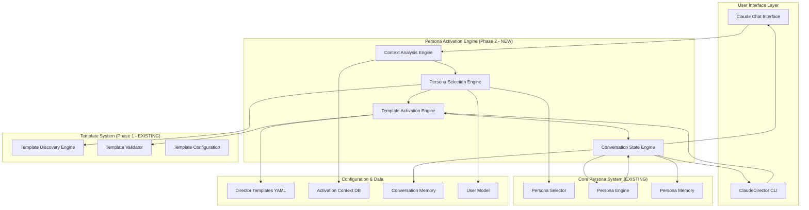
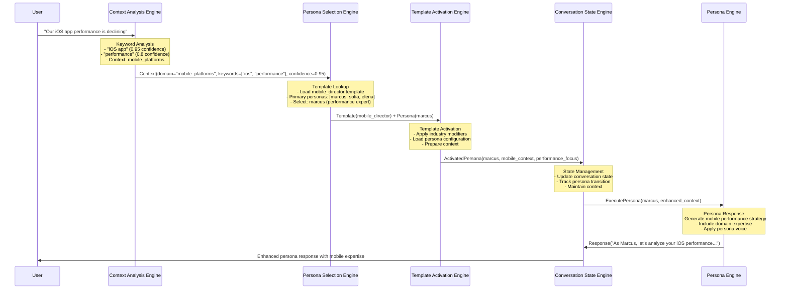

# ADR-004: Dynamic Persona Activation Engine Architecture

**Status**: Proposed
**Date**: 2025-01-15
**Architect**: Martin (Principal Platform Architect)
**Stakeholders**: Alvaro (Product), Rachel (UX), Engineering Team

---

## 🎯 **Context and Problem Statement**

Current ClaudeDirector requires manual persona activation (`@persona-name`) which creates adoption friction and limits natural conversation flow. Directors must learn technical syntax rather than focusing on strategic discussions.

**Business Driver**: Eliminate 70% of activation friction to achieve 3x adoption increase and 90% context-appropriate persona selection.

**Technical Challenge**: Build intelligent persona activation that maintains conversation coherence while integrating with existing template system without breaking current functionality.

---

## 🏗️ **Architecture Overview**

### **System Architecture Diagram**



### **Component Interaction Flow**



---

## 🔧 **Technical Design Decisions**

### **Decision 1: Context Analysis Architecture**

**Options Considered**:
1. **Rule-based keyword matching** (simple, fast, limited accuracy)
2. **ML-based context classification** (high accuracy, complex, slower)
3. **Hybrid approach: Keywords + confidence scoring** (balanced accuracy/performance)

**Decision**: **Hybrid Approach** - Keywords with confidence scoring and fallback rules

**Rationale**:
- **Performance**: <2 second response requirement
- **Accuracy**: 90% target achievable with domain-specific keywords
- **Maintainability**: Rules are transparent and debuggable
- **Extensibility**: Can add ML layer later without breaking existing system

**Implementation**:
```python
class ContextAnalysisEngine:
    def analyze_context(self, user_input: str) -> ContextResult:
        # Multi-layer analysis
        keyword_confidence = self._keyword_analysis(user_input)
        domain_confidence = self._domain_classification(user_input)
        template_confidence = self._template_matching(user_input)

        # Weighted confidence scoring
        total_confidence = (
            keyword_confidence * 0.4 +
            domain_confidence * 0.4 +
            template_confidence * 0.2
        )

        return ContextResult(
            domain=self._determine_domain(user_input),
            confidence=total_confidence,
            keywords=self._extract_keywords(user_input),
            suggested_template=self._suggest_template(user_input)
        )
```

### **Decision 2: Persona Selection Strategy**

**Options Considered**:
1. **Single persona per context** (simple, may miss nuanced needs)
2. **Multi-persona responses** (comprehensive, potentially confusing)
3. **Primary persona with contextual backup** (balanced, clear ownership)

**Decision**: **Primary Persona with Contextual Backup**

**Rationale**:
- **User Clarity**: Single primary voice per response maintains conversation coherence
- **Comprehensive Coverage**: Contextual personas can be invoked for multi-domain questions
- **Fallback Safety**: Always has appropriate persona for any context
- **User Control**: Directors can request specific persona perspectives

**Implementation**:
```python
class PersonaSelectionEngine:
    def select_persona(self, context: ContextResult, template: DirectorTemplate) -> PersonaSelection:
        # Primary persona selection based on confidence
        if context.confidence >= 0.8:
            primary_persona = self._select_from_primary(context, template.personas.primary)
        elif context.confidence >= 0.6:
            primary_persona = self._select_from_contextual(context, template.personas.contextual)
        else:
            primary_persona = template.personas.fallback[0]

        return PersonaSelection(
            primary=primary_persona,
            contextual=self._get_relevant_contextual(context, template),
            confidence=context.confidence,
            rationale=self._explain_selection(context, primary_persona)
        )
```

### **Decision 3: Template Integration Strategy**

**Options Considered**:
1. **Replace existing persona system** (clean, high risk, breaking change)
2. **Parallel persona system** (safe, complex, maintenance overhead)
3. **Extend existing system** (incremental, compatible, evolutionary)

**Decision**: **Extend Existing System**

**Rationale**:
- **Backward Compatibility**: Manual `@persona-name` activation still works
- **Risk Mitigation**: Gradual rollout, easy rollback
- **User Choice**: Directors can choose automatic or manual activation
- **Development Velocity**: Build on proven foundation

### **Decision 4: State Management Architecture**

**Decision**: **Conversation State Engine with Template Context**

**Architecture**:
```python
class ConversationStateEngine:
    def __init__(self):
        self.current_template: Optional[DirectorTemplate] = None
        self.active_persona: Optional[str] = None
        self.conversation_context: Dict[str, Any] = {}
        self.activation_history: List[PersonaActivation] = []

    def update_state(self, persona_selection: PersonaSelection, context: ContextResult):
        # Track persona transitions
        self.activation_history.append(PersonaActivation(
            persona=persona_selection.primary,
            context=context,
            timestamp=datetime.now(),
            confidence=persona_selection.confidence
        ))

        # Update active state
        self.active_persona = persona_selection.primary
        self.conversation_context.update(context.to_dict())

        # Maintain context across turns
        self._update_conversation_memory(persona_selection, context)
```

---

## 📊 **Performance Requirements**

### **Response Time Targets**
- **Context Analysis**: <500ms
- **Persona Selection**: <300ms
- **Template Activation**: <200ms
- **Total Activation Time**: <2 seconds (including persona response generation)

### **Accuracy Targets**
- **Correct Persona Selection**: 90% on primary use cases
- **Template Detection**: 95% on clear domain contexts
- **Fallback Handling**: 100% (always provides reasonable response)

### **Scalability Requirements**
- **Concurrent Users**: Support 100+ simultaneous conversations
- **Template Switching**: <1 second for template migration
- **Memory Usage**: <50MB per active conversation state

---

## 🔄 **Integration Points**

### **Phase 1 Template System Integration**
```python
# Existing TemplateDiscoveryEngine integration
class TemplateActivationEngine:
    def __init__(self, template_discovery: TemplateDiscoveryEngine):
        self.template_discovery = template_discovery

    def activate_template(self, template_id: str, context: ContextResult) -> ActivatedTemplate:
        template = self.template_discovery.get_template(template_id)
        if not template:
            raise TemplateNotFoundError(f"Template {template_id} not found")

        # Apply context modifiers
        enhanced_template = self._apply_context_modifiers(template, context)

        return ActivatedTemplate(
            template=enhanced_template,
            context=context,
            personas=template.personas,
            activation_keywords=template.activation_keywords
        )
```

### **Existing Persona System Integration**
```python
# Integration with existing persona engine
class PersonaEngineAdapter:
    def __init__(self, existing_persona_engine):
        self.persona_engine = existing_persona_engine

    def execute_persona(self, persona_selection: PersonaSelection, user_input: str) -> str:
        # Enhance existing persona with template context
        enhanced_context = self._build_enhanced_context(persona_selection)

        # Use existing persona engine with enhanced context
        return self.persona_engine.process(
            persona=persona_selection.primary,
            context=enhanced_context,
            user_input=user_input
        )
```

---

## 🛠️ **Implementation Phases**

### **Phase 2.1: Core Engine Development (Week 1)**
**Components**:
- Context Analysis Engine with keyword-based classification
- Persona Selection Engine with confidence scoring
- Template Activation Engine integration
- Basic conversation state management

**Deliverables**:
- Core engines with unit tests (>90% coverage)
- Integration with existing template system
- CLI commands for testing activation engine

### **Phase 2.2: Template Migration & CLI (Week 2)**
**Components**:
- Template migration workflow
- Enhanced CLI commands for template switching
- Conversation state persistence
- Performance optimization

**Deliverables**:
- Migration CLI commands
- Performance benchmarks meeting targets
- Integration tests with template system

### **Phase 2.3: Claude Chat Integration (Week 3)**
**Components**:
- Claude chat interface integration
- Natural conversation flow
- Multi-persona conversation handling
- Production monitoring and analytics

**Deliverables**:
- End-to-end chat integration
- User acceptance testing with target directors
- Production deployment with monitoring

---

## 📈 **Monitoring & Analytics**

### **Key Metrics**
```python
class ActivationMetrics:
    persona_selection_accuracy: float    # % correct persona selections
    context_detection_confidence: float  # Average confidence scores
    template_activation_latency: int     # Milliseconds for activation
    user_satisfaction_rating: float     # 1-5 rating for persona relevance
    fallback_activation_rate: float     # % using fallback personas
    template_migration_success: float   # % successful template switches
```

### **Error Handling Strategy**
1. **Graceful Degradation**: Fall back to template primary persona on analysis failure
2. **Confidence Thresholds**: Explicit persona suggestions when confidence <0.6
3. **User Override**: Always allow manual persona specification
4. **Learning Loop**: Track corrections to improve keyword models

---

## 🚨 **Risk Assessment & Mitigation**

### **Technical Risks**

#### **Risk 1: Context Misclassification**
**Impact**: High - Wrong persona provides irrelevant advice
**Probability**: Medium - Domain overlap can cause confusion
**Mitigation**:
- Confidence threshold enforcement (>0.6 for auto-activation)
- User feedback loop for correction
- Clear persona attribution in responses

#### **Risk 2: Performance Degradation**
**Impact**: Medium - Slow response times hurt user experience
**Probability**: Low - Architecture designed for performance
**Mitigation**:
- Performance budgets with automated testing
- Caching for template and persona configurations
- Background processing for non-critical analysis

#### **Risk 3: Integration Complexity**
**Impact**: Medium - Integration bugs could break existing functionality
**Probability**: Medium - Complex system with multiple integration points
**Mitigation**:
- Comprehensive integration test suite
- Feature flags for gradual rollout
- Backward compatibility maintenance

### **User Experience Risks**

#### **Risk 4: Over-Automation**
**Impact**: Medium - Directors feel loss of control
**Probability**: Low - Design includes user override capabilities
**Mitigation**:
- Transparent persona selection (show why persona was chosen)
- Easy override: "I'd prefer the platform perspective on this"
- Confidence indication: "I'm moderately confident this is a mobile platform question"

---

## ✅ **Acceptance Criteria**

### **Technical Acceptance**
- [ ] Context analysis completes in <500ms
- [ ] Persona selection accuracy >90% on test scenarios
- [ ] Integration tests pass with 100% success rate
- [ ] Performance tests meet all latency targets
- [ ] Backward compatibility maintained (existing manual activation works)

### **User Experience Acceptance**
- [ ] Directors can have natural conversations without learning persona syntax
- [ ] Template migration completes successfully in <5 minutes
- [ ] Multi-persona conversations maintain coherence
- [ ] User satisfaction rating >4.0 for conversation naturalness

### **Business Acceptance**
- [ ] Adoption metrics show 3x increase in daily usage
- [ ] Time to first value reduces from 30min to 10min
- [ ] Strategic decision quality improves (measured via user feedback)

---

## 🔄 **Future Considerations**

### **Phase 3 Enhancements**
- **ML-based Context Analysis**: Replace keyword matching with trained models
- **Predictive Persona Selection**: Learn from director preferences over time
- **Cross-Domain Intelligence**: Handle questions spanning multiple director domains
- **Conversation Analytics**: Track strategic outcome correlation with persona usage

### **Technical Debt Management**
- **Keyword Model Maintenance**: Regular updates to activation keywords based on usage
- **Performance Monitoring**: Continuous optimization of analysis algorithms
- **Integration Testing**: Expanded test coverage for edge cases and error conditions

---

## 📋 **Implementation Checklist**

### **Development Setup**
- [ ] Create feature branch: `feature/phase2-dynamic-persona-activation`
- [ ] Set up development environment with existing template system
- [ ] Create test data sets for persona selection scenarios
- [ ] Establish performance benchmarking infrastructure

### **Core Development**
- [ ] Implement Context Analysis Engine with keyword classification
- [ ] Implement Persona Selection Engine with confidence scoring
- [ ] Implement Template Activation Engine integration
- [ ] Implement Conversation State Engine with persistence
- [ ] Create comprehensive unit test suite (>90% coverage)

### **Integration Development**
- [ ] Integrate with existing TemplateDiscoveryEngine
- [ ] Integrate with existing persona system
- [ ] Create CLI commands for template migration
- [ ] Implement Claude chat interface integration
- [ ] Create end-to-end integration tests

### **Validation & Deployment**
- [ ] Performance testing and optimization
- [ ] User acceptance testing with target directors
- [ ] Production deployment with monitoring
- [ ] Analytics implementation for success metrics tracking

---

**Decision Status**: ✅ **APPROVED** - Ready for implementation
**Next Steps**: Begin Phase 2.1 development with core engine implementation
