# ClaudeDirector Component Architecture

**Detailed component documentation for the transparent AI strategic leadership system.**

---

## 🔍 **Transparency System Architecture**

The industry's first complete AI transparency system with real-time capability disclosure.

### **Transparency Pipeline**

```mermaid
graph LR
    subgraph "Input Processing"
        INPUT1[📝 User Question] --> INPUT2[🎯 Persona Selection]
        INPUT2 --> INPUT3[🔍 Complexity Analysis]
    end

    subgraph "Enhancement Detection"
        INPUT3 --> DECISION{❓ Enhancement Needed?}
        DECISION -->|Simple Query| STANDARD[📋 Standard Response]
        DECISION -->|Complex Query| SELECT[🚀 MCP Server Selection]
    end

    subgraph "Transparent Enhancement"
        SELECT --> DISCLOSE[🔧 MCP Disclosure<br/>*Show user what's happening*]
        DISCLOSE --> PROCESS[⚙️ Server Processing<br/>*Enhanced analysis*]
        PROCESS --> ATTRIBUTE[📚 Framework Attribution<br/>*Credit methodologies*]
    end

    subgraph "Response Integration"
        ATTRIBUTE --> BLEND[🔄 Response Blending<br/>*Merge enhanced insights*]
        STANDARD --> OUTPUT[✨ Final Output]
        BLEND --> OUTPUT
    end

    OUTPUT --> AUDIT[📊 Complete Audit Trail<br/>*Enterprise compliance*]

    %% Styling for clarity
    classDef inputClass fill:#e3f2fd
    classDef decisionClass fill:#fff3e0
    classDef enhanceClass fill:#e8f5e8
    classDef outputClass fill:#f3e5f5

    class INPUT1,INPUT2,INPUT3 inputClass
    class DECISION decisionClass
    class SELECT,DISCLOSE,PROCESS,ATTRIBUTE,BLEND enhanceClass
    class STANDARD,OUTPUT,AUDIT outputClass
```



### **Flow Descriptions**

#### **Input Processing (Blue)**
1. **User Question**: Strategic challenge or question from user
2. **Persona Selection**: Automatic selection of optimal strategic advisor
3. **Complexity Analysis**: Assessment of whether advanced analysis would add value

#### **Enhancement Detection (Orange)**
- **Decision Point**: System determines if MCP enhancement is beneficial
- **Simple Path**: Direct persona response for straightforward questions
- **Complex Path**: Advanced analysis route for strategic challenges

#### **Transparent Enhancement (Green)**
1. **MCP Disclosure**: Real-time notification of AI enhancement activation
2. **Server Processing**: External strategic analysis and framework application
3. **Framework Attribution**: Clear crediting of methodologies used

#### **Response Integration (Purple)**
- **Response Blending**: Seamless merger of enhanced insights with persona authenticity
- **Final Output**: Complete strategic guidance with full transparency
- **Audit Trail**: Enterprise-ready compliance documentation

## 🎭 **Persona System Components**

### **Persona Manager**
```python
class PersonaManager:
    """Central persona selection and coordination system"""

    def select_optimal_persona(self, context: ContextAnalysis) -> Persona:
        """Select best persona based on multi-factor analysis"""

    def coordinate_multi_persona(self, personas: List[Persona]) -> CoordinationPlan:
        """Handle cross-functional strategic collaboration"""

    def apply_personality_traits(self, response: str, persona: Persona) -> str:
        """Apply persona-specific communication patterns"""
```

### **Strategic Personas**

#### **Leadership Personas**
- **🎯 Diego | Engineering Leadership**: Organizational scaling, team coordination, platform strategy
- **📊 Camille | Strategic Technology**: Executive communication, business alignment, strategic planning
- **🎨 Rachel | Design Systems Strategy**: Cross-functional design, user experience, accessibility
- **💼 Alvaro | Platform Investment Strategy**: ROI analysis, business value, stakeholder communication

#### **Technical Personas**
- **🏗️ Martin | Platform Architecture**: Technical architecture, evolutionary design, system scaling
- **🔒 Security | Platform Security**: Security architecture, threat modeling, compliance
- **🤖 Berny | AI/ML Engineering**: Decision intelligence, predictive analytics, ML architecture

#### **Operational Personas**
- **🤝 Sofia | Vendor Strategy**: Technology partnerships, vendor evaluation, procurement
- **⚖️ Elena | Compliance Strategy**: Accessibility, legal requirements, audit management
- **📈 Marcus | Platform Adoption**: Change management, internal marketing, adoption metrics

### **Context Analyzer**
```python
class ContextAnalyzer:
    """Analyzes user input for optimal persona selection and enhancement needs"""

    def analyze_complexity(self, user_input: str) -> ComplexityScore:
        """Calculate complexity score for MCP enhancement decision"""

    def detect_domain_indicators(self, text: str) -> DomainMetrics:
        """Identify strategic domain and persona requirements"""

    def assess_stakeholder_scope(self, context: str) -> StakeholderAnalysis:
        """Determine stakeholder complexity and communication needs"""
```

## 🔧 **MCP Integration Components**

### **MCP Client Manager**
```python
class MCPClientManager:
    """Manages connections to external MCP servers for enhanced capabilities"""

    def initialize_servers(self) -> Dict[str, ConnectionStatus]:
        """Connect to all configured MCP servers with circuit breakers"""

    def call_capability(self, server: str, capability: str, params: dict) -> Response:
        """Execute capability with timeout and fallback handling"""

    def health_check_all(self) -> HealthReport:
        """Monitor health of all MCP server connections"""
```

### **MCP Server Capabilities**

#### **Sequential Server** (`systematic_analysis`)
- **Business Strategy**: Strategic analysis and business modeling
- **Organizational Design**: Team structure and scaling patterns
- **Decision Framework**: Systematic decision-making methodologies

#### **Context7 Server** (`pattern_access`)
- **Architectural Patterns**: Technical architecture and design patterns
- **Methodology Lookup**: Strategic framework and methodology access
- **Best Practices**: Industry-proven implementation patterns

#### **Magic Server** (`diagram_generation`)
- **Visual Generation**: Mermaid diagrams and visual representations
- **UI Generation**: Interface mockups and design concepts
- **Data Visualization**: Charts and analytical visualizations

### **Circuit Breaker System**
```python
class CircuitBreaker:
    """Prevents cascade failures and enables graceful degradation"""

    def call_with_protection(self, operation: Callable) -> Result:
        """Execute operation with circuit breaker protection"""

    def record_success(self):
        """Reset failure count on successful operation"""

    def record_failure(self):
        """Track failures and open circuit if threshold exceeded"""
```

## 📚 **Framework Detection Components**

### **Framework Detector**
```python
class FrameworkDetector:
    """Automatic detection and attribution of strategic frameworks"""

    def detect_frameworks(self, response: str) -> List[FrameworkMatch]:
        """Identify applied strategic methodologies with confidence scoring"""

    def generate_attribution(self, frameworks: List[Framework]) -> str:
        """Create transparent framework attribution"""

    def load_framework_patterns(self) -> FrameworkLibrary:
        """Load 25+ strategic framework patterns for detection"""
```

### **Framework Library**
- **Business Strategy**: Porter's Five Forces, Business Model Canvas, Lean Startup
- **Leadership**: Team Topologies, Crucial Conversations, Scaling Up Excellence
- **Technical**: Accelerate Metrics, Evolutionary Architecture, ADR Patterns
- **Decision Making**: WRAP Framework, Cynefin Framework, Strategic Analysis
- **Platform Strategy**: Network Effects, Ecosystem Design, Platform Economics

### **Attribution Engine**
```python
class AttributionEngine:
    """Generates transparent framework attribution"""

    def create_attribution_text(self, framework: Framework) -> str:
        """Generate standard attribution format"""

    def handle_multiple_frameworks(self, frameworks: List[Framework]) -> str:
        """Create multi-framework attribution"""

    def validate_attribution_accuracy(self, response: str, frameworks: List[Framework]) -> bool:
        """Ensure attribution accuracy and prevent false positives"""
```

## 💾 **Storage & Memory Components**

### **Strategic Memory Database**
```python
class StrategicMemoryDB:
    """Persistent storage for strategic conversations and context"""

    def store_conversation(self, session: ConversationSession) -> str:
        """Persist conversation with full transparency metadata"""

    def retrieve_context(self, session_id: str, max_turns: int = 10) -> Context:
        """Load conversation context for continuity"""

    def search_strategic_patterns(self, query: str) -> List[StrategicInsight]:
        """Search past conversations for strategic patterns"""
```

### **Conversation Context Manager**
```python
class ConversationContextManager:
    """Real-time conversation state and persona history"""

    def add_conversation_turn(self, turn: ConversationTurn) -> None:
        """Add turn with persona, MCP usage, and framework metadata"""

    def get_persona_continuity(self) -> ContinuityAnalysis:
        """Analyze persona usage patterns for consistent experience"""

    def optimize_context_window(self) -> None:
        """Intelligently truncate context to maintain performance"""
```

### **Configuration Store**
```python
class ConfigurationStore:
    """User preferences, persona settings, and system configuration"""

    def load_user_config(self, user_id: str) -> UserConfiguration:
        """Load personalized settings and persona preferences"""

    def save_persona_preferences(self, user_id: str, preferences: PersonaPrefs) -> None:
        """Persist persona selection and communication preferences"""

    def get_mcp_server_config(self) -> MCPServerConfiguration:
        """Load MCP server connection and capability configuration"""
```

## 🛡️ **Security & Monitoring Components**

### **Security Scanner**
```python
class EnhancedSecurityScanner:
    """Enterprise-grade security scanning with stakeholder protection"""

    def scan_for_sensitive_data(self, content: str) -> SecurityReport:
        """Detect sensitive stakeholder information and strategic data"""

    def validate_enterprise_compliance(self, session: ConversationSession) -> ComplianceReport:
        """Ensure enterprise governance and audit requirements"""

    def generate_audit_trail(self, transparency_events: List[TransparencyEvent]) -> AuditTrail:
        """Create complete audit trail for enterprise governance"""
```

### **Performance Monitor**
```python
class PerformanceMonitor:
    """System performance monitoring and optimization"""

    def track_response_times(self, operation: str, duration: float) -> None:
        """Monitor response times with alerting thresholds"""

    def monitor_mcp_server_health(self) -> HealthDashboard:
        """Track MCP server availability and performance"""

    def optimize_memory_usage(self) -> MemoryOptimizationReport:
        """Monitor and optimize memory consumption"""
```

## 🔄 **Integration Components**

### **Cursor Integration Bridge**
```python
class CursorTransparencyBridge:
    """Integration layer for Cursor IDE with real-time transparency"""

    def apply_transparency_system(self, response: str, context: dict) -> EnhancedResponse:
        """Apply full transparency system to Cursor conversations"""

    def detect_mcp_usage_context(self, user_input: str, response: str) -> MCPContext:
        """Detect when MCP enhancement should be applied"""

    def ensure_cursorrules_compliance(self, response: str) -> ComplianceValidation:
        """Validate response matches .cursorrules specification"""
```

### **Enterprise Integration Layer**
```python
class EnterpriseIntegrationLayer:
    """Enterprise system integration and governance"""

    def integrate_with_cicd(self, pipeline_config: CICDConfig) -> Integration:
        """Integrate with CI/CD pipelines for automated validation"""

    def connect_monitoring_systems(self, monitoring_config: MonitoringConfig) -> None:
        """Connect to enterprise monitoring and alerting systems"""

    def enable_sso_authentication(self, sso_config: SSOConfig) -> AuthenticationProvider:
        """Enable enterprise single sign-on integration"""
```

---

**🎯 Complete component architecture enabling transparent AI strategic leadership at enterprise scale.**
