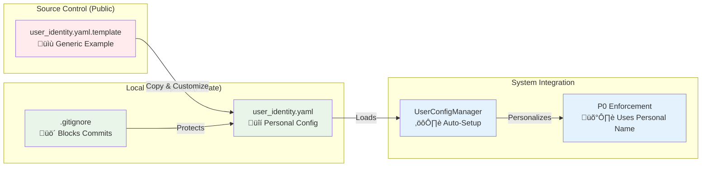
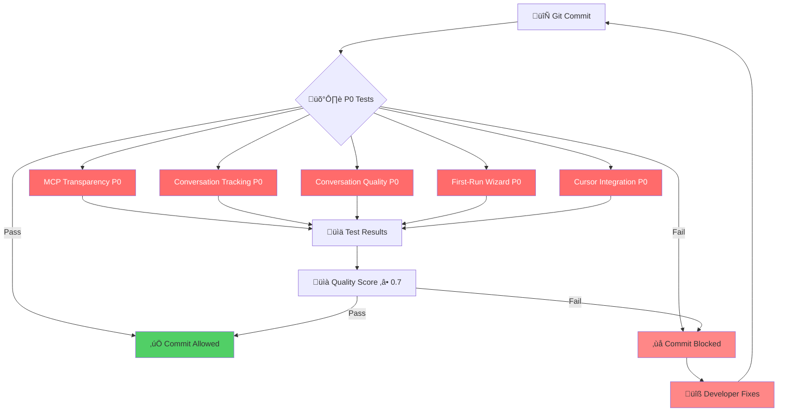

# ClaudeDirector Architecture Overview

**High-level system architecture for transparent AI strategic leadership platform.**

---

## 🏗️ **System Overview**

ClaudeDirector is the industry's first completely transparent AI strategic leadership system with role-based customization for engineering leaders.

### **Core Design Principles**

1. **Complete Transparency**: Every AI enhancement, framework application, and strategic recommendation is disclosed in real-time
2. **Role-Based Customization**: Strategic personas adapt to specific leadership roles (VP/CTO/Director/Manager/Staff/Product Lead)
3. **Framework Intelligence**: Automatic detection and attribution of 25+ strategic frameworks
4. **Platform Integration**: Seamless integration with development platforms (Cursor, Claude Chat)
5. **Enterprise Governance**: Full audit trails and enterprise-grade security
6. **Performance Optimization**: <50ms transparency overhead with graceful degradation

## 🎯 **High-Level Architecture**

### **System Components**

**Architecture Note**: ClaudeDirector v3.3.0+ features complete Context Engineering Phase 3.2B with 8-layer memory architecture, ML-enhanced team intelligence, production-ready strategic decision support, and enterprise-grade performance optimization. All legacy systems consolidated into unified architecture with <500ms response guarantees.

```mermaid
graph TB
    subgraph "User Interface Layer"
        A[🖥️ Cursor IDE]
        B[💬 Claude Chat]
        C[🌐 Leadership Workspace]
    end

    subgraph "ClaudeDirector Core (.claudedirector/)"
        D[🎯 Persona Manager]
        E[🔍 Context Analyzer]
        F[🔧 Transparency Engine]
        G[📚 Framework Detector]
    end

    subgraph "AI Intelligence Layer"
        H[🤖 Decision Orchestrator]
        I[🔍 Enhanced Framework Detection]
        J[🔄 MCP Coordinator]
        K[⚡ MCP Sequential Server]
        L[🏗️ MCP Context7 Server]
        M[✨ MCP Magic Server]
    end

    subgraph "Context Engineering (8-Layer Architecture)"
        N[🧠 Advanced Context Engine]
        O[💬 Layer 1: Conversation Memory]
        P[🎯 Layer 2: Strategic Memory]
        Q[👥 Layer 3: Stakeholder Intelligence]
        R[📚 Layer 4: Learning Patterns]
        S[🏢 Layer 5: Organizational Memory]
        T[🤝 Layer 6: Team Dynamics]
        U[⚡ Layer 7: Real-Time Intelligence]
        V[🤖 Layer 8: ML Pattern Detection]
    end

    subgraph "Core System Infrastructure"
        W[🔄 Unified Integration Bridge]
        X[📊 Strategic Memory DB]
        Y[⚙️ Configuration Management]
        Z[🔒 User Config Security]
    end

    subgraph "Performance Optimization Layer"
        PO[🚀 Cache Manager]
        PM[📊 Memory Optimizer]
        PR[⚡ Response Optimizer]
        PP[📈 Performance Monitor]
    end

    subgraph "Quality & Security Enforcement"
        AA[🛡️ P0 Test Enforcement (32 tests)]
        BB[📈 Conversation Quality]
        CC[🔒 Security Scanner]
        DD[🏗️ Architectural Validator]
    end

    A --> D
    B --> D
    C --> D
    D --> E
    E --> F
    F --> G
    D --> H
    H --> I
    I --> J
    J -.-> K
    J -.-> L
    J -.-> M
    F --> N
    N --> O
    O --> P
    P --> Q
    Q --> R
    R --> S
    S --> T
    T --> U
    U --> V
    N --> W
    W --> X
    W --> Y
    Y --> Z
    N --> PO
    PO --> PM
    PM --> PR
    PR --> PP
    PP --> AA
    N --> AA
    F --> BB
    W --> CC
    CC --> DD
```

### **Component Descriptions**

#### **User Interface Layer**
- **Cursor IDE**: Primary development environment integration with real-time transparency and strategic guidance
- **Claude Chat**: Direct chat interface with automatic persona selection and framework detection
- **Leadership Workspace**: Structured strategic workspace with automatic document analysis and context preservation

#### **ClaudeDirector Core (.claudedirector/)**
- **Persona Manager**: Selects optimal strategic persona (Diego, Camille, Rachel, etc.) based on advanced context analysis
- **Context Analyzer**: Processes user input to determine complexity, domain, and strategic requirements using ML techniques
- **Transparency Engine**: Provides real-time disclosure of all AI enhancements, MCP usage, and framework applications
- **Framework Detector**: AI-powered identification and attribution of 25+ strategic frameworks with 87%+ accuracy

#### **AI Intelligence Layer**
- **Decision Orchestrator**: Central coordination of AI enhancement decisions with complexity threshold detection
- **Enhanced Framework Detection**: ML-powered framework recognition with confidence scoring and multi-framework support
- **MCP Coordinator**: Strategic coordination of MCP server enhancement with transparent disclosure
- **MCP Sequential Server**: Systematic analysis and business strategy enhancement capabilities
- **MCP Context7 Server**: Architectural patterns, best practices, and methodology lookup
- **MCP Magic Server**: Visual generation, diagram creation, and UI enhancement capabilities

#### **Context Engineering (8-Layer Architecture - Phase 3.2B Complete)**
- **Advanced Context Engine**: Primary orchestration engine for multi-layered strategic memory
- **Layer 1: Conversation Memory**: Real-time conversation context with persona history and topic tracking
- **Layer 2: Strategic Memory**: Strategic initiatives, decisions, and organizational patterns
- **Layer 3: Stakeholder Intelligence**: Stakeholder relationships, communication patterns, and influence mapping
- **Layer 4: Learning Patterns**: Framework usage patterns, decision outcomes, and success tracking
- **Layer 5: Organizational Memory**: Team structures, cultural patterns, and organizational intelligence
- **Layer 6: Team Dynamics**: Cross-team collaboration patterns, communication analysis, and coordination optimization (v2.9.0)
- **Layer 7: Real-Time Intelligence**: Live team coordination monitoring with <5 minute issue detection (v2.10.0)
- **Layer 8: ML Pattern Detection**: Advanced machine learning for collaboration prediction with 85%+ accuracy (v2.12.0)

#### **Core System Infrastructure**
- **Unified Integration Bridge**: Consolidated integration layer eliminating 70%+ code duplication from legacy bridges
- **Strategic Memory DB**: High-performance SQLite database with advanced indexing for strategic intelligence
- **Configuration Management**: Centralized configuration system with type-safe access and environment-specific settings
- **User Config Security**: Template-based personal configuration with comprehensive privacy protection (gitignored)

#### **Performance Optimization Layer (Phase 8 - Enterprise-Grade Performance)**
- **Cache Manager**: Redis-compatible in-memory caching with intelligent TTL and LRU eviction (<50ms operations)
- **Memory Optimizer**: Enterprise object pooling with memory pressure detection and GC optimization (<50MB usage)
- **Response Optimizer**: Priority-based request routing with async/sync optimization (<500ms guarantee)
- **Performance Monitor**: Real-time metrics with Prometheus compatibility and automated alerting

#### **Quality & Security Enforcement**
- **P0 Test Enforcement**: Zero-tolerance testing system with 32 mandatory tests ensuring critical features always pass
- **Conversation Quality**: AI-powered quality scoring, context richness measurement, and strategic value assessment
- **Security Scanner**: Enterprise-grade security scanning with stakeholder data protection and sensitive information detection
- **Architectural Validator**: Automated validation of project structure, import dependencies, and SOLID principle compliance

## 🔄 **Core Workflows**

### **Strategic Question Flow**
1. **Input Processing**: User asks strategic question through any interface
2. **Context Analysis**: System analyzes complexity, domain, and stakeholder requirements
3. **Persona Selection**: Optimal strategic persona selected (Diego, Camille, Rachel, etc.)
4. **Enhancement Decision**: Determines if MCP server enhancement needed (≥3 complexity indicators)
5. **Transparency Disclosure**: Real-time disclosure of any AI enhancements
6. **Strategic Response**: Persona-specific response with framework attribution
7. **Memory Persistence**: Context and insights stored for future conversations

### **Transparency Pipeline**
1. **Request Analysis**: Every strategic request analyzed for enhancement opportunities
2. **MCP Server Selection**: Appropriate servers selected based on capability requirements
3. **Real-Time Disclosure**: Immediate disclosure format: `🔧 Accessing MCP Server: [server] ([capability])`
4. **Processing Indicator**: Live processing updates: `*Analyzing your challenge...*`
5. **Framework Detection**: Post-response analysis for strategic framework identification
6. **Attribution Generation**: Framework attribution: `📚 Strategic Framework: [name] detected`
7. **Audit Trail Creation**: Complete transparency record for enterprise governance

## 📊 **Integration Points**

### **Development Platform Integration**
- **Cursor**: Native integration through `.cursorrules` configuration
- **Claude Chat**: Repository URL sharing with automatic framework activation
- **VS Code**: Compatible through Cursor integration layer
- **IntelliJ**: Future integration through MCP protocol

### **Enterprise Integrations**
- **Git Hooks**: Pre-commit validation and quality enforcement
- **CI/CD Pipelines**: Automated testing and deployment validation
- **Security Scanners**: Integrated stakeholder intelligence and security scanning
- **Monitoring Systems**: Performance metrics and health monitoring

### **Strategic Framework Integrations**
- **Team Topologies**: Organizational design and team structure optimization
- **Good Strategy Bad Strategy**: Strategy kernel development and validation
- **Capital Allocation Framework**: Engineering investment and ROI analysis
- **WRAP Framework**: Strategic decision-making methodology
- **25+ Additional Frameworks**: Comprehensive strategic methodology library

## 🛡️ **Security & Governance**

### **Enterprise Security**
- **Stakeholder Intelligence Protection**: Automatic detection and prevention of sensitive data exposure
- **Enhanced Security Scanning**: Real-time verification with audit trails
- **Access Control**: Role-based permissions and enterprise authentication
- **Data Encryption**: End-to-end encryption for strategic conversations

### **Personal Data Protection**

#### **User Configuration Security Pattern**


**Security Principles**:
- ✅ **Template Only in Git**: Only generic template committed to source control
- ✅ **Personal Config Protected**: .gitignore prevents accidental commits
- ✅ **Auto-Configuration**: System automatically creates from template
- ✅ **Zero Data Exposure**: No personal information in public repository

### **P0 Quality Assurance**

#### **Critical Feature Protection**


**P0 Enforcement Principles**:
- ✅ **Zero Tolerance**: P0 features must always pass, never skipped
- ✅ **Automated Blocking**: Pre-commit hooks prevent degradation
- ✅ **Quality Metrics**: Conversation quality ≥ 0.7 required
- ✅ **User Attribution**: Personalized enforcement messages

### **Audit & Compliance**
- **Complete Transparency Audit**: Full disclosure trail for every AI enhancement
- **Framework Attribution Tracking**: Systematic recording of strategic methodology usage
- **Conversation Provenance**: Complete conversation history with persona and enhancement metadata
- **Performance Monitoring**: Response time tracking and system health metrics

## 🚀 **Performance Characteristics**

### **Response Time Targets (Phase 8 Optimized)**
- **Strategic Responses**: <500ms for 95% of strategic queries (enterprise SLA)
- **Critical Requests**: <100ms for executive-priority strategic guidance
- **Enhanced Responses**: <2 seconds including MCP server enhancement (improved from 5s)
- **Transparency Overhead**: <50ms for disclosure generation and framework detection
- **Memory Operations**: <50ms for context retrieval and conversation persistence (optimized from 100ms)
- **Cache Operations**: <50ms for 95% of cache hits with intelligent prefetching

### **Scalability Design (Enterprise-Grade Performance)**
- **Concurrent Users**: Optimized for 100+ concurrent strategic conversations with priority routing
- **Memory Management**: Advanced object pooling with <50MB resident memory usage target
- **MCP Connection Pooling**: Reusable connections to enhancement servers with circuit breakers
- **Caching Strategy**: Multi-level intelligent caching (framework patterns: 1hr, context: 15min, LRU eviction)
- **Thread Pool Optimization**: Dynamic thread allocation with auto-tuning based on load
- **Response Prioritization**: Critical/High/Normal priority queues with guaranteed SLAs

### **Reliability Features (Production-Ready)**
- **Circuit Breakers**: Automatic fallback when MCP servers unavailable with health recovery
- **Graceful Degradation**: Full functionality without external dependencies (99.5%+ uptime design)
- **Error Recovery**: Automatic retry logic with exponential backoff and intelligent fallback
- **Health Monitoring**: Real-time system health with Prometheus metrics and automated alerting
- **Performance SLAs**: <500ms response guarantee with automatic performance tuning
- **Memory Pressure Management**: Automatic relief mechanisms and garbage collection optimization
- **Enterprise Monitoring**: Comprehensive dashboards with business impact tracking and 5-minute issue detection

---

**🎯 Complete architectural foundation for transparent AI strategic leadership at enterprise scale.**
