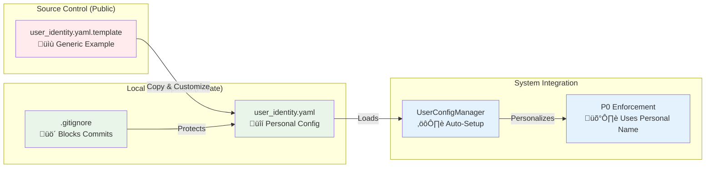
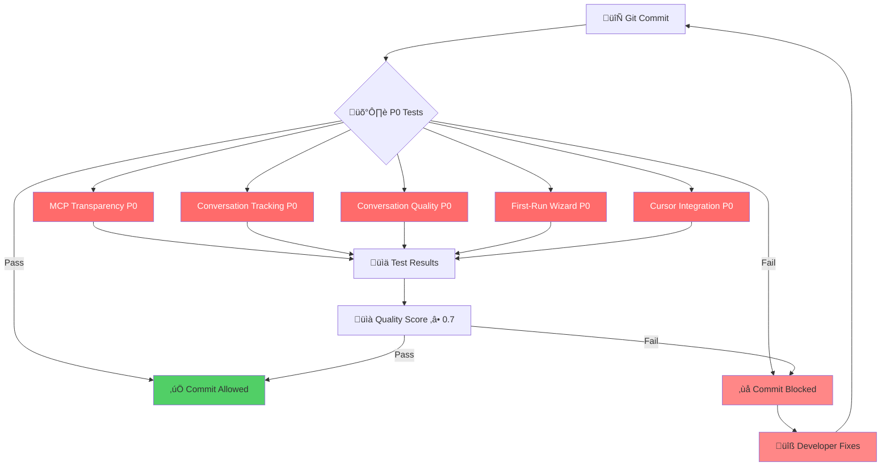

# ClaudeDirector Architecture Overview

**High-level system architecture for transparent AI strategic leadership platform.**

---

## 🏗️ **System Overview**

ClaudeDirector is the industry's first completely transparent AI strategic leadership system with role-based customization for engineering leaders.

### **Core Design Principles**

1. **Complete Transparency**: Every AI enhancement, framework application, and strategic recommendation is disclosed in real-time
2. **Role-Based Customization**: Strategic personas adapt to specific leadership roles (VP/CTO/Director/Manager/Staff/Product Lead)
3. **Framework Intelligence**: Automatic detection and attribution of 25+ strategic frameworks
4. **Platform Integration**: Seamless integration with development platforms (Cursor, Claude Chat)
5. **Enterprise Governance**: Full audit trails and enterprise-grade security
6. **Performance Optimization**: <50ms transparency overhead with graceful degradation

## 🎯 **High-Level Architecture**

### **System Components**

**Architecture Note**: ClaudeDirector has migrated to Context Engineering as the primary memory and intelligence system, with the Unified Bridge pattern eliminating 70%+ code duplication from legacy bridge implementations.

```mermaid
graph TB
    subgraph "User Interface Layer"
        A[🖥️ Cursor IDE]
        B[💬 Claude Chat]
        C[🌐 Web Interface]
    end

    subgraph "ClaudeDirector Core"
        D[🎯 Persona Manager]
        E[🔍 Context Analyzer]
        F[🔧 Transparency Engine]
        G[📚 Framework Detector]
    end

    subgraph "Enhancement Layer"
        H[⚡ MCP Sequential Server]
        I[🏗️ MCP Context7 Server]
        J[✨ MCP Magic Server]
    end

    subgraph "Context Engineering (Primary)"
        K[🧠 Advanced Context Engine]
        L[💬 Conversation Layer]
        M[🎯 Strategic Layer]
        N[👥 Stakeholder Layer]
        O[📚 Learning Layer]
        P[🏢 Organizational Layer]
    end

    subgraph "Integration Layer"
        Q[🔄 Unified Bridge]
        R[📊 Strategic Memory DB]
        S[⚙️ Configuration Store]
        T[🔒 User Config Template]
    end

    subgraph "Quality & Enforcement"
        O[⚡ P0 Test Enforcement]
        P[📈 Conversation Quality]
        Q[🛡️ Security Scanner]
    end

    A --> D
    B --> D
    C --> D
    D --> E
    E --> F
    F --> G
    D -.-> H
    D -.-> I
    D -.-> J
    F --> K
    E --> L
    G --> M
    M --> N
    F --> O
    L --> P
    F --> Q
```

### **Component Descriptions**

#### **User Interface Layer**
- **Cursor IDE**: Primary development environment integration with real-time transparency
- **Claude Chat**: Direct chat interface with strategic persona selection
- **Web Interface**: Browser-based access for standalone strategic guidance

#### **ClaudeDirector Core**
- **Persona Manager**: Selects optimal strategic persona based on context analysis
- **Context Analyzer**: Processes user input to determine complexity and strategic requirements
- **Transparency Engine**: Provides real-time disclosure of AI enhancements and framework usage
- **Framework Detector**: Identifies and attributes strategic frameworks applied in responses

#### **Enhancement Layer**
- **MCP Sequential Server**: Systematic analysis and business strategy enhancement
- **MCP Context7 Server**: Architectural patterns and methodology lookup
- **MCP Magic Server**: Visual generation and diagram creation capabilities

#### **Storage & Memory**
- **Strategic Memory DB**: Persistent storage of strategic conversations and context
- **Conversation Context**: Real-time conversation state and persona history
- **Configuration Store**: User preferences, persona settings, and framework configurations
- **User Config Template**: Template-based personal configuration with privacy protection (never tracked in git)

#### **Quality & Enforcement**
- **P0 Test Enforcement**: Zero-tolerance testing system ensuring critical features always pass
- **Conversation Quality**: AI-powered quality scoring and context richness measurement
- **Security Scanner**: Enterprise-grade security scanning with stakeholder data protection

## 🔄 **Core Workflows**

### **Strategic Question Flow**
1. **Input Processing**: User asks strategic question through any interface
2. **Context Analysis**: System analyzes complexity, domain, and stakeholder requirements
3. **Persona Selection**: Optimal strategic persona selected (Diego, Camille, Rachel, etc.)
4. **Enhancement Decision**: Determines if MCP server enhancement needed (≥3 complexity indicators)
5. **Transparency Disclosure**: Real-time disclosure of any AI enhancements
6. **Strategic Response**: Persona-specific response with framework attribution
7. **Memory Persistence**: Context and insights stored for future conversations

### **Transparency Pipeline**
1. **Request Analysis**: Every strategic request analyzed for enhancement opportunities
2. **MCP Server Selection**: Appropriate servers selected based on capability requirements
3. **Real-Time Disclosure**: Immediate disclosure format: `🔧 Accessing MCP Server: [server] ([capability])`
4. **Processing Indicator**: Live processing updates: `*Analyzing your challenge...*`
5. **Framework Detection**: Post-response analysis for strategic framework identification
6. **Attribution Generation**: Framework attribution: `📚 Strategic Framework: [name] detected`
7. **Audit Trail Creation**: Complete transparency record for enterprise governance

## 📊 **Integration Points**

### **Development Platform Integration**
- **Cursor**: Native integration through `.cursorrules` configuration
- **Claude Chat**: Repository URL sharing with automatic framework activation
- **VS Code**: Compatible through Cursor integration layer
- **IntelliJ**: Future integration through MCP protocol

### **Enterprise Integrations**
- **Git Hooks**: Pre-commit validation and quality enforcement
- **CI/CD Pipelines**: Automated testing and deployment validation
- **Security Scanners**: Integrated stakeholder intelligence and security scanning
- **Monitoring Systems**: Performance metrics and health monitoring

### **Strategic Framework Integrations**
- **Team Topologies**: Organizational design and team structure optimization
- **Good Strategy Bad Strategy**: Strategy kernel development and validation
- **Capital Allocation Framework**: Engineering investment and ROI analysis
- **WRAP Framework**: Strategic decision-making methodology
- **25+ Additional Frameworks**: Comprehensive strategic methodology library

## 🛡️ **Security & Governance**

### **Enterprise Security**
- **Stakeholder Intelligence Protection**: Automatic detection and prevention of sensitive data exposure
- **Enhanced Security Scanning**: Real-time verification with audit trails
- **Access Control**: Role-based permissions and enterprise authentication
- **Data Encryption**: End-to-end encryption for strategic conversations

### **Personal Data Protection**

#### **User Configuration Security Pattern**

**Security Principles**:
- ✅ **Template Only in Git**: Only generic template committed to source control
- ✅ **Personal Config Protected**: .gitignore prevents accidental commits
- ✅ **Auto-Configuration**: System automatically creates from template
- ✅ **Zero Data Exposure**: No personal information in public repository

### **P0 Quality Assurance**

#### **Critical Feature Protection**

**P0 Enforcement Principles**:
- ✅ **Zero Tolerance**: P0 features must always pass, never skipped
- ✅ **Automated Blocking**: Pre-commit hooks prevent degradation
- ✅ **Quality Metrics**: Conversation quality ≥ 0.7 required
- ✅ **User Attribution**: Personalized enforcement messages

### **Audit & Compliance**
- **Complete Transparency Audit**: Full disclosure trail for every AI enhancement
- **Framework Attribution Tracking**: Systematic recording of strategic methodology usage
- **Conversation Provenance**: Complete conversation history with persona and enhancement metadata
- **Performance Monitoring**: Response time tracking and system health metrics

## 🚀 **Performance Characteristics**

### **Response Time Targets**
- **Standard Responses**: <2 seconds for persona selection and response generation
- **Enhanced Responses**: <5 seconds including MCP server enhancement
- **Transparency Overhead**: <50ms for disclosure generation and framework detection
- **Memory Operations**: <100ms for context retrieval and conversation persistence

### **Scalability Design**
- **Concurrent Users**: Designed for 100+ concurrent strategic conversations
- **Memory Management**: Efficient context buffer with automatic truncation
- **MCP Connection Pooling**: Reusable connections to enhancement servers
- **Caching Strategy**: Intelligent caching for persona selection and framework detection

### **Reliability Features**
- **Circuit Breakers**: Automatic fallback when MCP servers unavailable
- **Graceful Degradation**: Full functionality without external dependencies
- **Error Recovery**: Automatic retry logic with exponential backoff
- **Health Monitoring**: Continuous system health validation and alerting

---

**🎯 Complete architectural foundation for transparent AI strategic leadership at enterprise scale.**
