# ClaudeDirector Architectural Patterns

**Design patterns, collaboration models, and architectural decisions for the transparent AI strategic leadership system.**

---

## 🤝 **Multi-Persona Collaboration Patterns**

### **Pattern 1: Sequential Consultation**


**Use Case**: When primary persona needs domain expertise
**Example**: Diego (Engineering Leadership) consulting Rachel (Design Systems) for UX architecture decisions

### **Pattern 2: Collaborative Analysis**


**Use Case**: Complex strategic challenges requiring multiple perspectives
**Example**: Platform strategy requiring Diego + Camille + Martin coordination

### **Pattern 3: Context Handoff**


**Use Case**: When conversation naturally shifts to specialized domain
**Example**: Technical discussion transitioning from Diego to Martin

## 🔧 **Multi-Persona Transparency**

### **Transparency Coordination**


### **Multi-Persona Enhancement Example**
```
🔧 **Multi-Persona MCP Enhancement**
• 🎯 Diego | Engineering Leadership: sequential_server (organizational_analysis)
• 🎨 Rachel | Design Systems Strategy: magic_server (visual_generation)
• 🏗️ Martin | Platform Architecture: context7_server (architectural_patterns)

*Analyzing your platform challenge with integrated cross-functional expertise...*

🎯 Diego | Engineering Leadership
[Strategic organizational analysis with systematic frameworks]

🎨 Rachel | Design Systems Strategy
[UX and design system considerations with visual examples]

🏗️ Martin | Platform Architecture
[Technical architecture recommendations with proven patterns]

📚 **Integrated Framework Application**:
• Team Topologies (organizational design)
• Design System Maturity Model (design strategy)
• Evolutionary Architecture (technical patterns)
```

## 🏛️ **System Architecture Layers**

### **Layered Architecture Pattern**


### **Layer Responsibilities**

#### **Presentation Layer**
- **User Interface**: Platform-specific interaction handling (Cursor, Claude Chat, Web)
- **Response Formatting**: Persona-specific response styling and structure
- **Transparency Display**: Real-time MCP disclosure and framework attribution

#### **Business Logic Layer**
- **Persona Management**: Selection, coordination, and personality application
- **Strategic Framework Engine**: Framework detection, attribution, and application
- **Multi-Persona Coordination**: Cross-functional collaboration orchestration
- **Conversation Flow Control**: Session management and context preservation

#### **Integration Layer**
- **MCP Client Infrastructure**: External server communication and circuit breakers
- **Framework Detection Engine**: Pattern recognition and confidence scoring
- **Transparency Middleware**: Real-time disclosure generation and audit trail
- **Enhancement Router**: Intelligent routing to appropriate enhancement services

#### **Enhancement Layer**
- **MCP Servers**: External analytical capabilities (Sequential, Context7, Magic)
- **Framework Library**: 25+ strategic frameworks and methodologies
- **Pattern Recognition**: Advanced analysis and insight generation

#### **Data Layer**
- **Strategic Memory Database**: Persistent conversation storage and retrieval
- **Conversation Context Store**: Real-time session state and persona history
- **Configuration Storage**: User preferences and system configuration
- **Audit Trail Database**: Complete transparency audit for enterprise governance

## 🔄 **Data Flow Patterns**

### **Request-Response Pattern**

```mermaid
sequenceDiagram
    participant User
    participant PersonaManager
    participant ContextAnalyzer
    participant MCPClient
    participant TransparencyEngine
    participant FrameworkDetector

    User->>PersonaManager: Strategic Question
    PersonaManager->>ContextAnalyzer: Analyze Context
    ContextAnalyzer->>PersonaManager: Complexity Score + Domain

    alt Complex Query (Score ≥ 3)
        PersonaManager->>TransparencyEngine: Start MCP Disclosure
        TransparencyEngine->>User: 🔧 Accessing MCP Server...
        PersonaManager->>MCPClient: Request Enhancement
        MCPClient->>PersonaManager: Enhanced Analysis
    end

    PersonaManager->>FrameworkDetector: Detect Frameworks
    FrameworkDetector->>PersonaManager: Framework Matches
    PersonaManager->>User: Strategic Response + Attribution
```


### **Error Handling Pattern**


### **Caching Pattern**


## 🛡️ **Security Patterns**

### **Defense in Depth**


### **Data Protection Pattern**


## 📊 **Performance Patterns**

### **Circuit Breaker Pattern**


### **Connection Pooling**


### **Memory Management Pattern**


## 🔧 **Integration Patterns**

### **Adapter Pattern for Platform Integration**


### **Plugin Pattern for MCP Servers**


## 📈 **Scalability Patterns**

### **Horizontal Scaling Pattern**


### **Async Processing Pattern**


---

**🎯 Complete architectural patterns enabling scalable, secure, and maintainable transparent AI strategic leadership system.**
