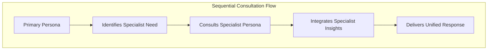
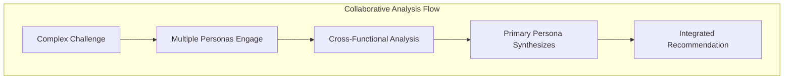
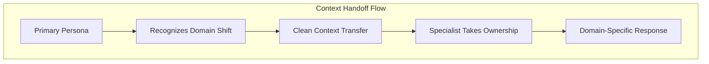

# Multi-Persona Collaboration Patterns

**Design patterns for coordinating multiple AI personas in strategic leadership contexts.**

---

## 🤝 **Multi-Persona Collaboration Patterns**

### **Pattern 1: Sequential Consultation**

**Use Case**: When primary persona needs domain expertise
**Example**: Diego (Engineering Leadership) consulting Rachel (Design Systems) for UX architecture decisions

### **Pattern 2: Collaborative Analysis**

**Use Case**: Complex strategic challenges requiring multiple perspectives
**Example**: Platform strategy requiring Diego + Camille + Martin coordination

### **Pattern 3: Context Handoff**

**Use Case**: When conversation naturally shifts to specialized domain
**Example**: Technical discussion transitioning from Diego to Martin

---

## 📋 **Implementation Guidelines**

### **Collaboration Triggers**
- **Complexity Threshold**: Multi-step strategic challenges
- **Domain Boundaries**: Cross-functional requirements
- **Stakeholder Scope**: Multiple organizational levels
- **Time Horizon**: Long-term strategic implications

### **Quality Assurance**
- **Consistency Check**: Ensure aligned recommendations
- **Completeness Validation**: All perspectives considered
- **Clarity Verification**: Single, clear final recommendation
- **Transparency Maintenance**: All persona contributions visible

---

*Part of the [ClaudeDirector Architecture](../OVERVIEW.md) documentation suite.*
