# Data Flow Patterns

**Request-response patterns, error handling, and data processing flows for ClaudeDirector.**

---

## 🔄 **Data Flow Patterns**

### **Request-Response Pattern**

```mermaid
sequenceDiagram
    participant User
    participant PersonaManager
    participant ContextAnalyzer
    participant MCPClient
    participant TransparencyEngine
    participant FrameworkDetector

    User->>PersonaManager: Strategic Question
    PersonaManager->>ContextAnalyzer: Analyze Context
    ContextAnalyzer->>PersonaManager: Complexity Score + Domain

    alt Complex Query (Score ≥ 3)
        PersonaManager->>TransparencyEngine: Start MCP Disclosure
        TransparencyEngine->>User: 🔧 Accessing MCP Server...
        PersonaManager->>MCPClient: Request Enhancement
        MCPClient->>PersonaManager: Enhanced Analysis
    end

    PersonaManager->>FrameworkDetector: Detect Frameworks
    FrameworkDetector->>PersonaManager: Framework Matches
    PersonaManager->>User: Strategic Response + Attribution
```

### **Error Handling Pattern**

### **Caching Pattern**

---

## 📋 **Flow Characteristics**

### **Performance Optimization**
- **Circuit Breaker**: Automatic fallback when external services fail
- **Caching Strategy**: Multi-level caching for frequently accessed data
- **Async Processing**: Non-blocking operations for enhanced responsiveness

### **Reliability Patterns**
- **Graceful Degradation**: System continues functioning without external enhancements
- **Health Monitoring**: Real-time tracking of component availability
- **Retry Logic**: Intelligent retry with exponential backoff

### **Transparency Integration**
- **Real-time Disclosure**: User visibility into processing steps
- **Audit Trail**: Complete request/response logging for governance
- **Performance Metrics**: Response time tracking and optimization

---

*Part of the [ClaudeDirector Architecture](../OVERVIEW.md) documentation suite.*
