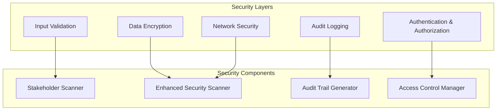
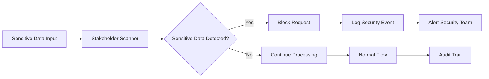

# Security Patterns

**Security architecture patterns and data protection strategies for ClaudeDirector.**

---

## 🛡️ **Security Patterns**

### **Defense in Depth**

### **Data Protection Pattern**

---

## 📋 **Security Requirements**

### **Data Protection**
- **Stakeholder Intelligence**: Automatic detection and protection of sensitive names/information
- **Enhanced Security Scanning**: Multi-pattern threat detection with verifiable proof
- **Audit Trail Completeness**: Full traceability for enterprise governance
- **Access Control**: Role-based permissions and authentication

### **Threat Mitigation**
- **Input Validation**: Comprehensive sanitization and validation
- **Circuit Breaker Security**: Fail-safe patterns for external service failures
- **Encryption Standards**: Data encryption at rest and in transit
- **Security Monitoring**: Real-time threat detection and response

### **Compliance Framework**
- **Enterprise Governance**: Complete audit trails for regulatory compliance
- **Data Residency**: Local data processing and storage options
- **Privacy Protection**: Automatic PII detection and handling
- **Security Verification**: Verifiable proof of security scanning and validation

---

*Part of the [ClaudeDirector Architecture](../OVERVIEW.md) documentation suite.*
