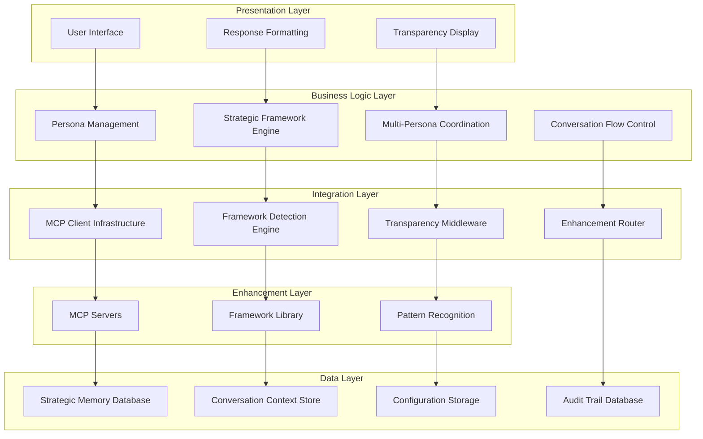

# System Architecture Patterns

**Layered architecture patterns and component organization for ClaudeDirector.**

---

## 🏛️ **System Architecture Layers**

### **Layered Architecture Pattern**

### **Layer Responsibilities**

#### **Presentation Layer**
- **User Interface**: Platform-specific interaction handling (Cursor, Claude Chat, Web)
- **Response Formatting**: Persona-specific response styling and structure
- **Transparency Display**: Real-time MCP disclosure and framework attribution

#### **Business Logic Layer**
- **Persona Management**: Selection, coordination, and personality application
- **Strategic Framework Engine**: Framework detection, attribution, and application
- **Multi-Persona Coordination**: Cross-functional collaboration orchestration
- **Conversation Flow Control**: Session management and context preservation

#### **Integration Layer**
- **MCP Client Infrastructure**: External server communication and circuit breakers
- **Framework Detection Engine**: Pattern recognition and confidence scoring
- **Transparency Middleware**: Real-time disclosure generation and audit trail
- **Enhancement Router**: Intelligent routing to appropriate enhancement services

#### **Enhancement Layer**
- **MCP Servers**: External analytical capabilities (Sequential, Context7, Magic)
- **Framework Library**: 25+ strategic frameworks and methodologies
- **Pattern Recognition**: Advanced analysis and insight generation

#### **Data Layer**
- **Strategic Memory Database**: Persistent conversation storage and retrieval
- **Conversation Context Store**: Real-time session state and persona history
- **Configuration Storage**: User preferences and system configuration
- **Audit Trail Database**: Complete transparency audit for enterprise governance

---

## 📋 **Architecture Principles**

### **Separation of Concerns**
- **Clear Layer Boundaries**: Each layer has distinct responsibilities
- **Minimal Coupling**: Layers interact through well-defined interfaces
- **High Cohesion**: Related functionality grouped within layers

### **Scalability Patterns**
- **Horizontal Scaling**: Stateless components enable load distribution
- **Vertical Scaling**: Resource-intensive operations isolated to enhancement layer
- **Caching Strategy**: Multi-level caching across presentation and data layers

---

*Part of the [ClaudeDirector Architecture](../OVERVIEW.md) documentation suite.*
