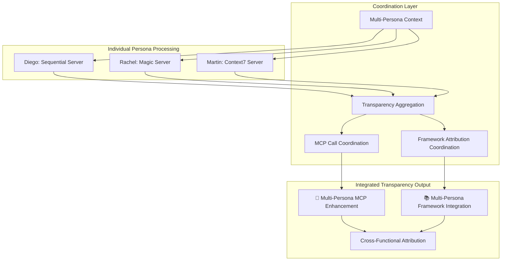

# Multi-Persona Transparency Patterns

**Transparency coordination patterns for multi-persona AI interactions with complete audit trails.**

---

## 🔧 **Multi-Persona Transparency**

### **Transparency Coordination**


### **Multi-Persona Enhancement Example**
```
🔧 **Multi-Persona MCP Enhancement**
• 🎯 Diego | Engineering Leadership: sequential_server (organizational_analysis)
• 🎨 Rachel | Design Systems Strategy: magic_server (visual_generation)
• 🏗️ Martin | Platform Architecture: context7_server (architectural_patterns)

*Analyzing your platform challenge with integrated cross-functional expertise...*

🎯 Diego | Engineering Leadership
[Strategic organizational analysis with systematic frameworks]

🎨 Rachel | Design Systems Strategy
[UX and design system considerations with visual examples]

🏗️ Martin | Platform Architecture
[Technical architecture recommendations with proven patterns]

📚 **Integrated Framework Application**:
• Team Topologies (organizational design)
• Design System Maturity Model (design strategy)
• Evolutionary Architecture (technical patterns)
```

---

## 📋 **Transparency Requirements**

### **Multi-Persona Disclosure Standards**
- **Individual Persona Headers**: Clear identification of each contributing persona
- **MCP Enhancement Attribution**: Server and capability disclosure for each persona
- **Framework Integration**: Cross-functional framework application visibility
- **Processing Messages**: Real-time status updates during multi-persona coordination

### **Audit Trail Completeness**
- **Persona Contribution Tracking**: Individual persona input and reasoning
- **Enhancement Coordination**: MCP server coordination and timing
- **Framework Attribution**: Strategic methodology application across personas
- **Decision Synthesis**: How individual contributions are integrated

---

*Part of the [ClaudeDirector Architecture](../OVERVIEW.md) documentation suite.*
