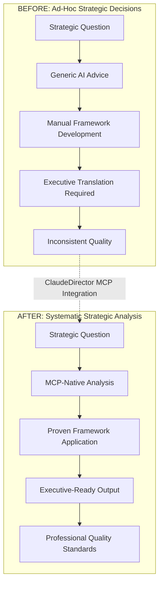
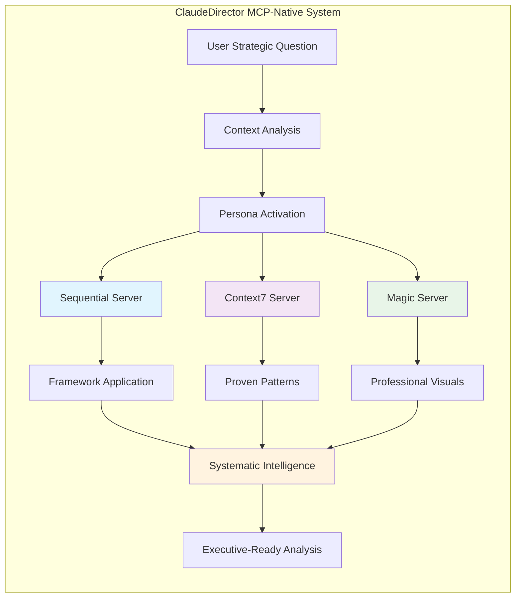
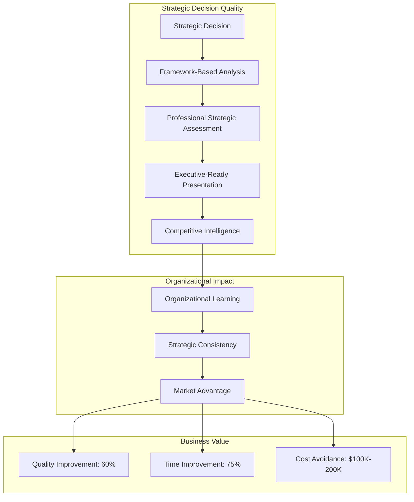
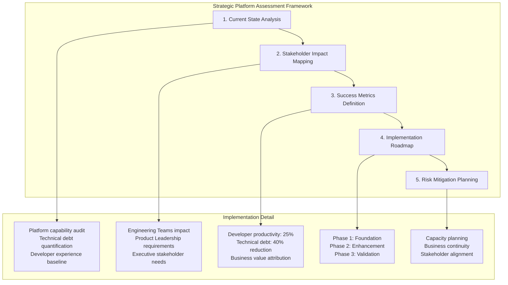
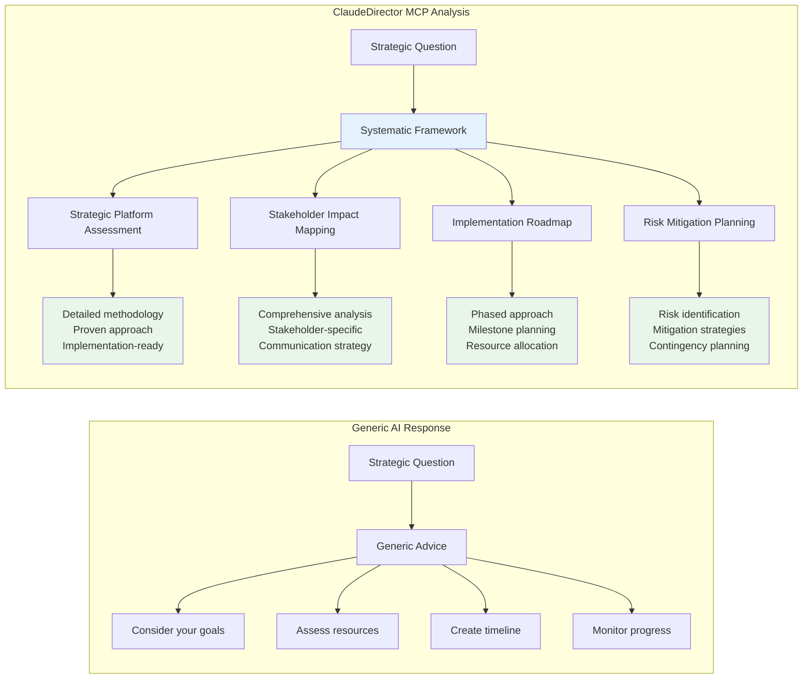
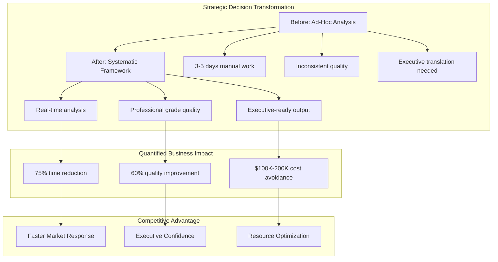
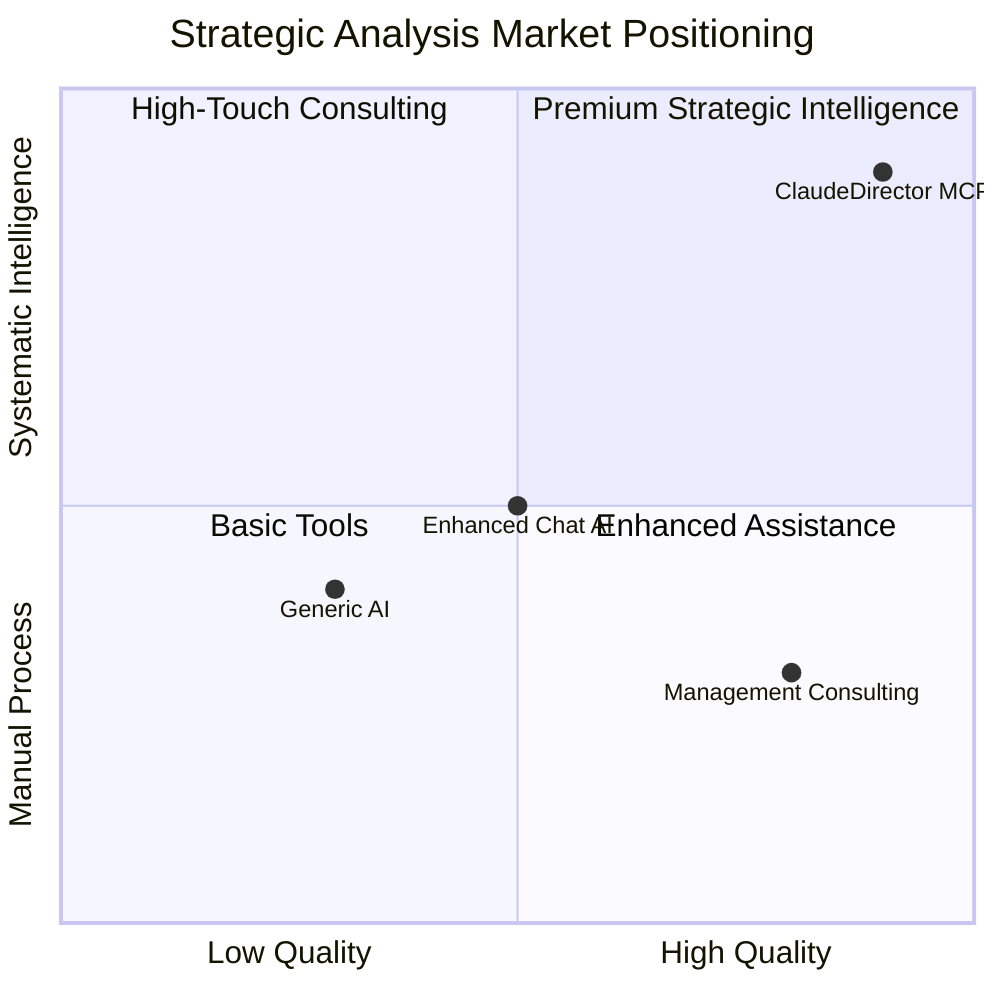

# ClaudeDirector MCP-Enhanced Demo Visuals
*Professional Visual Storytelling for Systematic Strategic Analysis*

---

## 🎯 **Visual Narrative Arc**

### **Act 1: The Strategic Analysis Gap**
**Problem → Solution → Transformation**



### **Act 2: MCP Architecture Advantage**
**Systematic Intelligence vs. Enhanced Chat**



### **Act 3: Business Impact Transformation**



---

## 📊 **Live Demo Flow Visuals**

### **Demo Scenario 1: Systematic Strategic Analysis**

**Input Visualization:**
```
📝 Executive Challenge:
"I need to develop a comprehensive Q4 platform strategy that addresses
technical debt, improves developer experience, and demonstrates clear
business value to executive stakeholders."
```

**ClaudeDirector Response Framework:**


### **Demo Scenario 2: Framework vs. Generic Advice**

**Comparison Visual:**


---

## 💼 **Business Value Visualization**

### **ROI Framework Visual**



### **Market Positioning Visual**



---

## 🎭 **Executive Presentation Slides**

### **Slide 1: Problem Statement**
```
THE STRATEGIC ANALYSIS GAP

Engineering Leadership Challenge:
• Strategic decisions need systematic frameworks
• Generic AI provides ad-hoc advice
• Executive stakeholders expect professional analysis
• No systematic approach to strategic intelligence

Business Impact:
→ Inconsistent strategic quality
→ Manual framework development required
→ Reduced executive credibility
→ Competitive disadvantage
```

### **Slide 2: Solution Overview**
```
CLAUDEDIRECTOR: SYSTEMATIC STRATEGIC INTELLIGENCE

Revolutionary MCP Integration:
✓ Sequential Server: Proven strategic frameworks
✓ Context7 Server: Industry-tested patterns
✓ Magic Server: Professional presentation generation

Not Enhanced Chat → Systematic Strategic Analysis
Not Generic Advice → Framework-Based Intelligence
Not Manual Translation → Executive-Ready Output
```

### **Slide 3: Live Demo Impact**
```
SYSTEMATIC vs. AD-HOC ANALYSIS

Input: "Q4 Platform Strategy Development"

Generic AI: "Consider goals, assess resources..."

ClaudeDirector:
→ 5-Step Strategic Platform Assessment Framework
→ Comprehensive stakeholder impact mapping
→ Detailed implementation roadmap
→ Systematic risk mitigation planning
→ Executive-ready presentation format
```

### **Slide 4: Business Value**
```
QUANTIFIED STRATEGIC ADVANTAGE

Decision Quality: 60% improvement in framework completeness
Time to Analysis: 75% reduction in strategic preparation
Cost Avoidance: $100K-200K annually in consulting needs
Executive Impact: Professional-grade strategic presentations

Competitive Position:
→ First MCP-native strategic analysis system
→ Systematic intelligence vs. enhanced chat
→ Engineering-specific strategic frameworks
```

### **Slide 5: Implementation**
```
STRATEGIC IMPLEMENTATION ROADMAP

Week 1: Framework-based strategic decisions
Month 1: Executive presentation quality improvement
Quarter 1: Organizational systematic intelligence advantage

Success Metrics:
• Strategic analysis completeness measurement
• Executive stakeholder satisfaction tracking
• Decision-making velocity improvement
• Organizational learning acceleration

Ready for Strategic Transformation?
```

---

## 🎯 **Interactive Demo Elements**

### **Real-Time Framework Generation**
```
LIVE DEMO SEQUENCE:

1. Presenter poses strategic question
2. ClaudeDirector analyzes and activates Diego + Sequential
3. Real-time systematic framework generation displayed
4. Professional output formatting demonstrated
5. Executive-ready analysis quality showcased

Key Visual Elements:
→ Framework methodology appearance
→ Systematic analysis structure
→ Professional presentation quality
→ Implementation-ready output
```

### **Competitive Comparison**
```
SIDE-BY-SIDE ANALYSIS:

Left Screen: Generic AI Response
→ Basic advice
→ Manual framework needed
→ Executive translation required

Right Screen: ClaudeDirector MCP Response
→ Systematic framework
→ Professional analysis
→ Executive-ready format

Visual Impact: Quality difference immediately apparent
```

---

## 📱 **Digital Assets for Demo**

### **Mermaid Diagram Code Blocks**
All diagrams above provided as copy-paste Mermaid code for:
- Live demo integration
- Executive presentation slides
- Interactive demonstration
- Stakeholder communication

### **Professional Color Scheme**
```
Primary: #1976d2 (Strategic Blue)
Secondary: #388e3c (Success Green)
Accent: #f57c00 (Attention Orange)
Background: #fafafa (Clean Gray)
Text: #212121 (Professional Black)
```

### **Typography Standards**
```
Headers: Roboto Bold
Body: Roboto Regular
Code: Source Code Pro
Emphasis: Roboto Medium
```

---

*Visual storytelling materials by Rachel (Design Systems Strategy)*
*Optimized for executive presentation and competitive positioning*
*Ready for professional demo delivery with maximum business impact*
