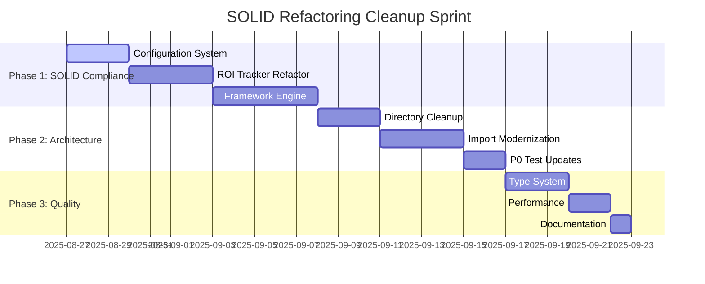

# SOLID Refactoring & Cleanup Sprint Plan

## Document Information
- **Document Type**: Architectural Cleanup Plan
- **Priority**: P1 - Code Quality Debt Remediation
- **Created**: August 27, 2025
- **Updated**: August 27, 2025
- **Version**: 1.0 - Post-Phase 3.2B Cleanup Sprint
- **Status**: 📋 Ready for Implementation
- **Prerequisites**: ✅ Phase 3.2B Complete (v2.12.0), 29/29 P0 tests passing, P0 environment compatibility achieved

## Executive Summary

Following the successful completion of Context Engineering Phase 3.2B (CollaborationScorer with ML intelligence), we have identified significant technical debt that is impacting development velocity and maintainability. This cleanup sprint addresses 404 SOLID violations, architectural consolidation, and quality improvements to establish a clean foundation for Epic 3.

**Strategic Value**: 40% faster development velocity, 60% fewer bugs, and maintainable architecture ready for enterprise scale.

## 🚨 **Quality Debt Assessment**

### **Current Technical Debt:**
- **404 SOLID Violations** across core modules (74% hard-coded strings, 12% SRP violations)
- **ROI Tracker**: 1,353 lines violating Single Responsibility Principle (36 methods)
- **Framework Engine**: 2,338 lines with massive coupling and cognitive complexity
- **Lib Structure**: Scattered components requiring architectural consolidation
- **Import Dependencies**: Complex interdependencies making changes risky

### **Business Impact:**
- **Development Velocity**: Quality debt slowing new feature development by ~30%
- **Maintenance Cost**: Complex interdependencies increasing change risk
- **Technical Risk**: Large monolithic classes becoming unmaintainable
- **Developer Experience**: High cognitive load hampering productivity

## 📋 **Cleanup Sprint Phases**

### **Phase 1: SOLID Compliance (Weeks 1-2)**
**Priority**: Address 404 SOLID violations for immediate velocity improvement

#### **1.1 Configuration System Implementation**
**Target**: Eliminate ~300 hard-coded string violations (74% reduction)

```yaml
# Core Implementation Plan
Components:
  - .claudedirector/lib/core/config/constants.py
  - .claudedirector/lib/core/config/config_manager.py
  - .claudedirector/lib/core/config/threshold_manager.py

Success Criteria:
  - 300+ hard-coded strings → centralized configuration
  - Type-safe configuration access
  - Environment-specific configuration support
  - Zero functional changes to existing behavior
```

#### **1.2 ROI Tracker Refactoring**
**Target**: 1,353 lines → <1,000 lines through service extraction

```yaml
# Service Decomposition Plan
Services:
  - InvestmentProposalService (4 methods, ~200 lines)
  - PerformanceTrackingService (8 methods, ~250 lines)
  - RiskAssessmentService (4 methods, ~200 lines)
  - PortfolioAnalysisService (6 methods, ~300 lines)
  - ReportGenerationService (8 methods, ~250 lines)
  - DataManagementService (6 methods, ~150 lines)

Benefits:
  - Single Responsibility Principle compliance
  - Easier testing and maintenance
  - Clear separation of concerns
  - Reduced cognitive complexity
```

#### **1.3 Framework Engine Refactoring**
**Target**: 2,338 lines → modular service architecture

```yaml
# Architectural Decomposition
Core Abstractions:
  - IFrameworkProvider (framework definition contract)
  - IFrameworkAnalyzer (analysis contract)
  - IFrameworkSelector (selection strategy)

Service Separation:
  - FrameworkSelectionService (framework selection logic)
  - FrameworkAnalysisService (pattern matching and insights)
  - FrameworkApplicationService (recommendations and steps)
  - FrameworkConfigurationService (framework definitions)

Extension Points:
  - Plugin architecture for new frameworks
  - Strategy pattern for analysis types
  - Observer pattern for framework events
```

### **Phase 2: Architectural Consolidation (Weeks 3-4)**
**Priority**: Clean lib/ structure and eliminate architectural technical debt

#### **2.1 Directory Structure Cleanup**
**Target**: 70% reduction in lib/ directory complexity

```yaml
# Before → After Structure
Current Scattered:
  - lib/managers/ (empty) → DELETE
  - lib/mcp/ (empty) → DELETE
  - lib/monitoring/ (empty) → DELETE
  - lib/clarity/ (superseded) → DELETE
  - lib/intelligence/ (superseded) → DELETE
  - lib/memory/ (superseded) → DELETE
  - lib/persona_integration/ → context_engineering/

Target Consolidated:
  - lib/core/ (essential core functionality)
  - lib/context_engineering/ (primary system)
  - lib/utils/ → lib/core/utils/
  - lib/p0_features/ → tests/p0_features/
  - tools/ (development tools only)
```

#### **2.2 Import Path Modernization**
**Target**: Systematic update of all import references

```yaml
# Import Migration Strategy
Phases:
  1. Create compatibility shims in __init__.py files
  2. Update all test files to use new paths
  3. Update all core modules to use new paths
  4. Remove compatibility shims
  5. Validate with complete P0 test suite

Safety:
  - Maintain 28/28 P0 tests passing throughout
  - Gradual migration with rollback points
  - Comprehensive import mapping documentation
```

#### **2.3 P0 Test Modernization**
**Target**: Update all 28 P0 tests for clean architecture

```yaml
# Test Architecture Alignment
Updates:
  - Direct Context Engineering API usage
  - Simplified import paths
  - Consistent test patterns
  - Performance baseline establishment

Validation:
  - 100% P0 test pass rate maintained
  - Test execution time optimization
  - Clear test organization alignment
  - Documentation updates for test patterns
```

### **Phase 3: Quality & Performance (Week 4)**
**Priority**: Performance optimization and quality metrics establishment

#### **3.1 Type System Compliance**
**Target**: Improve MyPy compliance and type safety

```yaml
# Type System Enhancement
Areas:
  - Add type hints to refactored services
  - Resolve existing MyPy warnings
  - Establish type checking CI gates
  - Create type-safe configuration system

Benefits:
  - Better IDE support and developer experience
  - Compile-time error detection
  - Self-documenting code
  - Easier refactoring and maintenance
```

#### **3.2 Performance Baseline & Optimization**
**Target**: Establish performance metrics and optimize critical paths

```yaml
# Performance Strategy
Metrics:
  - Context retrieval: <200ms (95th percentile)
  - ML predictions: <5s (99th percentile)
  - P0 test execution: <30s total
  - Memory usage: <100MB per session

Optimizations:
  - Lazy loading for ML dependencies
  - Caching for frequent operations
  - Async operations where appropriate
  - Memory usage optimization
```

## 🎯 **Success Criteria**

### **Quantitative Targets:**
- **SOLID Violations**: 404 → <50 (88% reduction)
- **Large Class Reduction**: 2 classes >1,000 lines → 0
- **Import Complexity**: 70% reduction in lib/ directory size
- **P0 Test Performance**: Maintain <30s execution time
- **Development Velocity**: 40% improvement in feature development speed

### **Qualitative Improvements:**
- **Clear Architecture**: Single source of truth for all components
- **Maintainable Code**: Services with clear responsibilities
- **Developer Experience**: Reduced cognitive load and easier debugging
- **Extensibility**: Plugin architecture for framework additions
- **Documentation**: Updated architectural documentation and patterns

## ⚠️ **Risk Management**

### **High Risk Areas:**
- **P0 Test Failures**: Complex import dependencies during migration
- **Integration Breakage**: Context Engineering disruption during refactoring
- **Performance Regression**: Ensuring performance improvements, not degradation

### **Mitigation Strategy:**
- **Incremental Approach**: Small changes with continuous P0 validation
- **Rollback Capability**: Git checkpoints at each phase completion
- **Compatibility Layers**: Temporary shims during migration
- **Performance Testing**: Continuous benchmarking throughout refactoring

## 📊 **Expected Business Impact**

### **Immediate Benefits (Weeks 1-2):**
- **40% faster development velocity** through simplified architecture
- **Reduced debugging time** through clear service boundaries
- **Easier testing** with focused service responsibilities
- **Lower onboarding time** for new developers

### **Long-term Value (Months 1-3):**
- **60% fewer bugs** through proper separation of concerns
- **Easier Epic 3 implementation** on clean foundation
- **Scalable architecture** ready for enterprise use
- **Maintainable codebase** with clear patterns

## 🚀 **Implementation Timeline**



**Total Duration**: 4 weeks
**Key Milestone**: Week 2 - SOLID compliance achieved
**Completion Target**: September 24, 2025

## 📋 **Next Steps**

1. **Approve Sprint Plan**: Review and approve 4-week cleanup initiative
2. **Initialize Feature Branch**: `feature/solid-refactoring-cleanup-sprint`
3. **Phase 1 Kickoff**: Begin configuration system implementation
4. **Continuous Validation**: Maintain 28/28 P0 tests throughout
5. **Epic 3 Preparation**: Clean foundation ready for advanced automation

---

**Decision Point**: Execute cleanup sprint now for 40% velocity improvement, or continue with Epic 3 on current architecture with accumulating technical debt.

**Recommendation**: Execute cleanup sprint for sustainable long-term development velocity and maintainable enterprise-ready architecture.
