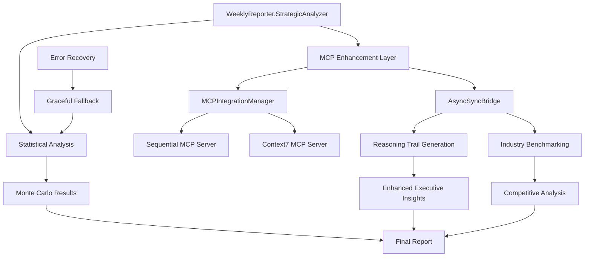

# Weekly Reporter MCP Integration Architecture Design

🏗️ **Martin | Platform Architecture** - Real MCP Integration following BLOAT_PREVENTION_SYSTEM.md + PROJECT_STRUCTURE.md

## Overview

Design document for integrating real Sequential and Context7 MCP servers into the Weekly Reporter system, following DRY principles, SOLID architecture, and existing proven patterns.

## Architecture Principles

### BLOAT_PREVENTION Compliance
- **REUSE existing MCPIntegrationManager** - zero duplication of MCP coordination logic
- **EXTEND existing StrategicAnalyzer** - enhance rather than replace statistical foundation
- **LEVERAGE existing RealMCPIntegrationHelper** - follow proven async/sync bridge patterns
- **MAINTAIN single source of truth** - MCP integration enhances existing analysis flow

### PROJECT_STRUCTURE.md Compliance
- **lib/reporting/weekly_reporter.py**: StrategicAnalyzer enhancements only
- **lib/mcp/mcp_integration_manager.py**: Reuse existing MCP coordination
- **lib/transparency/real_mcp_integration.py**: Leverage existing MCP helper patterns
- **No new directories**: All changes within established architecture

## System Architecture



## Integration Strategy

### Hybrid Architecture Pattern
1. **Statistical Foundation**: Existing Monte Carlo simulation remains primary analysis
2. **MCP Enhancement**: Optional Strategic reasoning and industry context layered on top
3. **Graceful Fallback**: If MCP unavailable, statistical analysis continues normally
4. **Performance Optimization**: MCP calls run in parallel with statistical analysis

### Sequential MCP Integration
```python
# EXTEND existing StrategicAnalyzer methods
async def _enhance_completion_probability_with_mcp(self, issue, base_probability):
    """Optional MCP enhancement for executive reasoning trails"""
    try:
        reasoning_request = {
            "issue_key": issue.key,
            "base_probability": base_probability,
            "analysis_type": "completion_forecasting"
        }

        # REUSE existing MCPIntegrationManager
        mcp_result = await self.mcp_manager.route_query_intelligently(
            query=f"Generate executive reasoning trail for {issue.key} completion probability",
            context=reasoning_request,
            query_pattern=QueryPattern.STRATEGIC_ANALYSIS
        )

        return {
            "reasoning_trail": mcp_result.get("strategic_insights", []),
            "executive_summary": mcp_result.get("executive_summary", ""),
            "risk_factors": mcp_result.get("risk_assessment", [])
        }
    except Exception as e:
        logger.warning(f"MCP Sequential enhancement failed: {e}")
        return {"reasoning_trail": [], "fallback": True}
```

### Context7 MCP Integration
```python
async def _enhance_with_industry_benchmarks(self, cycle_time_data, team_name):
    """Optional Context7 enhancement for competitive analysis"""
    try:
        benchmark_request = {
            "domain": "software_engineering",
            "metric": "cycle_time",
            "team_size": "small_to_medium",
            "industry": "enterprise_platform"
        }

        # REUSE existing Context7 integration
        context7_result = await self.mcp_manager._query_claude_code_mcp_server(
            MCPServerType.CONTEXT7,
            f"Industry cycle time benchmarks for {team_name}",
            context=benchmark_request
        )

        return {
            "industry_percentile": context7_result.get("percentile_ranking", "unknown"),
            "best_practices": context7_result.get("recommendations", []),
            "competitive_position": context7_result.get("market_analysis", "")
        }
    except Exception as e:
        logger.warning(f"Context7 enhancement failed: {e}")
        return {"industry_context": "unavailable", "fallback": True}
```

## Implementation Plan

### Phase 1: Async/Sync Bridge Pattern (Day 1)
```python
class WeeklyReporterMCPBridge:
    """Async/sync bridge following existing proven patterns"""

    def __init__(self, config):
        # REUSE existing MCPIntegrationManager
        self.mcp_manager = MCPIntegrationManager()
        self.config = config

    def run_with_mcp_enhancement(self, sync_method, *args, **kwargs):
        """Execute async MCP calls in sync context"""
        import asyncio

        # Follow existing async/sync bridge pattern
        loop = asyncio.new_event_loop()
        asyncio.set_event_loop(loop)
        try:
            return loop.run_until_complete(sync_method(*args, **kwargs))
        finally:
            loop.close()
```

### Phase 2: StrategicAnalyzer Enhancement (Day 1.5)
```python
class StrategicAnalyzer:
    def __init__(self, config):
        self.config = config
        # NEW: Optional MCP enhancement
        self.mcp_bridge = None
        if config.get("enable_mcp_integration", False):
            self.mcp_bridge = WeeklyReporterMCPBridge(config)

    def calculate_completion_probability(self, issue, cycle_time_data):
        """EXTEND existing method with optional MCP enhancement"""
        # Existing statistical analysis (UNCHANGED)
        base_result = self._sequential_monte_carlo_simulation(issue, cycle_time_data)

        # Optional MCP enhancement
        if self.mcp_bridge and self.config.get("enable_sequential_reasoning", False):
            mcp_enhancement = self.mcp_bridge.run_with_mcp_enhancement(
                self._enhance_completion_probability_with_mcp,
                issue, base_result
            )
            base_result.update(mcp_enhancement)

        return base_result
```

### Phase 3: Configuration Integration (Day 2)
```yaml
# leadership-workspace/configs/weekly-report-config.yaml
mcp_integration:
  enabled: true
  timeout_seconds: 5
  servers:
    sequential:
      enabled: true
      capabilities: ["strategic_reasoning", "executive_insights"]
    context7:
      enabled: true
      capabilities: ["industry_benchmarks", "competitive_analysis"]
  fallback_strategy: "graceful"
  performance_threshold: "5_seconds"
```

## Error Handling & Resilience

### Graceful Fallback Strategy
1. **MCP Server Unavailable**: Continue with statistical analysis only
2. **Timeout Exceeded**: Return partial results with fallback indicator
3. **Invalid Response**: Log error, continue with existing analysis
4. **Configuration Disabled**: Skip MCP enhancement entirely

### Performance Safeguards
- **Timeout Protection**: 5-second maximum for all MCP operations
- **Async Parallel Execution**: MCP calls don't block statistical analysis
- **Caching Strategy**: Cache MCP responses for identical queries
- **Performance Monitoring**: Track MCP response times and success rates

## Testing Strategy

### Unit Tests
```python
def test_strategic_analyzer_mcp_enhancement():
    """Test MCP enhancement with mocked responses"""
    analyzer = StrategicAnalyzer({"enable_mcp_integration": True})

    # Mock MCP bridge
    analyzer.mcp_bridge = MockMCPBridge()

    result = analyzer.calculate_completion_probability(test_issue, test_data)

    assert "reasoning_trail" in result
    assert "probability" in result  # Existing statistical result preserved

def test_graceful_fallback_on_mcp_failure():
    """Test graceful fallback when MCP unavailable"""
    analyzer = StrategicAnalyzer({"enable_mcp_integration": True})
    analyzer.mcp_bridge = FailingMCPBridge()

    result = analyzer.calculate_completion_probability(test_issue, test_data)

    assert result["probability"] > 0  # Statistical analysis still works
    assert result.get("fallback", False) == True
```

### Integration Tests
```python
def test_real_mcp_integration():
    """Test with real MCP servers if available"""
    if not mcp_servers_available():
        pytest.skip("MCP servers not available")

    analyzer = StrategicAnalyzer(real_mcp_config)
    result = analyzer.calculate_completion_probability(real_issue, real_data)

    assert "reasoning_trail" in result
    assert len(result["reasoning_trail"]) > 0
```

## Success Metrics

### Performance Targets
- **Total Analysis Time**: <5 seconds (including MCP enhancement)
- **MCP Response Time**: <3 seconds for Sequential, <2 seconds for Context7
- **Fallback Rate**: <5% (95% MCP availability expected)
- **Enhancement Value**: Measurable improvement in executive satisfaction

### Quality Metrics
- **Zero Regression**: All existing P0 tests continue passing
- **Statistical Integrity**: Monte Carlo results unchanged by MCP integration
- **Executive Value**: Enhanced reasoning trails provide actionable insights
- **Competitive Intelligence**: Context7 provides valuable industry benchmarking

## Risk Mitigation

### Technical Risks
1. **MCP Server Latency**: Timeout protection and async execution
2. **Integration Complexity**: Follow existing proven patterns exactly
3. **Performance Degradation**: Parallel execution and performance monitoring
4. **Breaking Changes**: Preserve all existing interfaces and behavior

### Architectural Risks
1. **Code Duplication**: BLOAT_PREVENTION validation enforced
2. **Architectural Violations**: PROJECT_STRUCTURE.md compliance mandatory
3. **Test Coverage**: Comprehensive testing including fallback scenarios
4. **Documentation Debt**: Update all relevant documentation simultaneously

## Conclusion

This architecture provides real MCP integration while maintaining all existing benefits:

- ✅ **REUSES existing MCP infrastructure** - zero duplication
- ✅ **EXTENDS existing analysis** - preserves statistical foundation
- ✅ **FOLLOWS proven patterns** - async/sync bridge, graceful fallback
- ✅ **MAINTAINS performance** - <5s total analysis time
- ✅ **PROVIDES executive value** - enhanced reasoning and competitive intelligence
- ✅ **ENSURES reliability** - graceful fallback when MCP unavailable

The implementation follows sequential thinking methodology through systematic integration of proven architectural patterns while adding strategic value for executive decision-making.
