# Phase 9: Architecture Evolution - Technical Specification

**Version**: 1.0
**Status**: Draft
**Author**: Martin (Platform Architecture)
**Dependencies**: Phase 8 DRY Consolidation Complete

---

## 🎯 **Executive Summary**

Phase 9 represents a strategic evolution of the ClaudeDirector architecture, building upon the successful Phase 8 DRY consolidation. This phase focuses on completing the 8-layer Context Engineering system, optimizing performance characteristics, and establishing production-ready reliability patterns.

**Key Outcomes**:
- Complete 8-layer Context Engineering system (currently 6/8 functional)
- <200ms average response time (50% improvement)
- >95% framework detection accuracy
- Production-ready monitoring and alerting

---

## 🏗️ **System Architecture Evolution**

### **Current Architecture State (Post-Phase 8)**


### **Target Architecture State (Phase 9)**

```mermaid
graph TB
    subgraph "Enhanced Core Infrastructure"
        A[Optimized BaseManager]
        B[Enhanced BaseProcessor]
        C[Smart Manager Factory]
        D[Dynamic Configuration]
        E[Performance Monitor]
    end

    subgraph "Complete Context Engineering (8/8 Layers)"
        F[Layer 1: Conversation ✓]
        G[Layer 2: Strategic ✓]
        H[Layer 3: Stakeholder ✓]
        I[Layer 4: Learning ✓]
        J[Layer 5: Organizational ✓]
        K[Layer 6: Team Dynamics ✓]
        L[Layer 7: Real-time Monitor ✓]
        M[Layer 8: ML Pattern Detection ✓]
    end

    subgraph "Enhanced Strategic Intelligence"
        N[Intelligent Context Bridge]
        O[Advanced Spec Enhancer]
        P[Optimized Coordinator]
        Q[Smart Sequential Workflow]
    end

    subgraph "Production Reliability"
        R[Health Monitoring]
        S[Alerting System]
        T[Error Recovery]
        U[Performance Analytics]
    end
```


---

## 🔧 **Technical Implementation Specifications**

### **Phase 9.1: Context Engineering Completion**

#### **Layer 7: Real-time Monitoring Enhancement**
```python
class RealTimeMonitor(BaseProcessor):
    """Enhanced real-time monitoring with <5 minute detection latency"""

    def __init__(self, config: RealTimeConfig):
        super().__init__(config)
        self.detection_latency_target = 300  # 5 minutes
        self.accuracy_target = 0.90  # 90%
        self.false_positive_rate_max = 0.05  # 5%

    async def monitor_team_coordination(self) -> CoordinationMetrics:
        """Monitor cross-team coordination with real-time alerts"""

    async def detect_bottlenecks(self) -> List[Bottleneck]:
        """Detect team bottlenecks with 75%+ accuracy"""

    async def generate_alerts(self, metrics: CoordinationMetrics) -> List[Alert]:
        """Generate proactive alerts for coordination issues"""
```

#### **Layer 8: ML Pattern Detection Optimization**
```python
class MLPatternEngine(BaseProcessor):
    """Optimized ML pattern detection with 85%+ accuracy"""

    def __init__(self, config: MLPatternConfig):
        super().__init__(config)
        self.prediction_accuracy_target = 0.85  # 85%
        self.response_time_target = 5000  # 5 seconds
        self.feature_extraction_timeout = 2000  # 2 seconds

    async def predict_collaboration_success(self, context: TeamContext) -> Prediction:
        """Predict collaboration success with ensemble ML models"""

    async def extract_features(self, conversation: Conversation) -> FeatureVector:
        """Extract features for ML prediction with <2s timeout"""

    async def update_models(self, feedback: CollaborationOutcome) -> ModelMetrics:
        """Update ML models based on collaboration outcomes"""
```

### **Phase 9.2: Performance Optimization**

#### **Response Time Optimization**
```python
class OptimizedResponseHandler(BaseManager):
    """Response handler with <200ms target for strategic queries"""

    def __init__(self, config: ResponseConfig):
        super().__init__(config)
        self.response_time_target = 200  # milliseconds
        self.cache_hit_rate_target = 0.80  # 80%
        self.connection_pool_size = 10

    async def handle_strategic_query(self, query: StrategyQuery) -> Response:
        """Handle strategic queries with <200ms response time"""

    async def optimize_mcp_connections(self) -> ConnectionMetrics:
        """Optimize MCP server connections with pooling"""

    def implement_intelligent_caching(self) -> CacheStrategy:
        """Implement multi-level caching with LRU eviction"""
```

#### **Memory Optimization**
```python
class MemoryOptimizer(BaseManager):
    """Memory optimization with <100MB baseline target"""

    def __init__(self, config: MemoryConfig):
        super().__init__(config)
        self.baseline_memory_target = 100  # MB
        self.gc_optimization_enabled = True
        self.object_pooling_enabled = True

    async def optimize_memory_usage(self) -> MemoryMetrics:
        """Optimize memory usage with object pooling"""

    async def implement_gc_optimization(self) -> GCMetrics:
        """Implement garbage collection optimization"""

    def monitor_memory_pressure(self) -> MemoryPressure:
        """Monitor memory pressure with automatic relief"""
```

### **Phase 9.3: AI Enhancement**

#### **Enhanced Framework Detection**
```python
class EnhancedFrameworkDetector(BaseProcessor):
    """Framework detection with >95% accuracy target"""

    def __init__(self, config: FrameworkConfig):
        super().__init__(config)
        self.accuracy_target = 0.95  # 95%
        self.confidence_threshold = 0.85
        self.multi_framework_support = True

    async def detect_frameworks(self, content: str) -> List[FrameworkMatch]:
        """Detect strategic frameworks with >95% accuracy"""

    async def analyze_confidence(self, matches: List[FrameworkMatch]) -> ConfidenceScore:
        """Analyze detection confidence with scoring"""

    def update_detection_models(self, feedback: DetectionFeedback) -> ModelUpdate:
        """Update detection models based on user feedback"""
```

#### **Advanced Strategic Analysis**
```python
class AdvancedStrategicAnalyzer(BaseManager):
    """Strategic analysis with enhanced decision support"""

    def __init__(self, config: AnalysisConfig):
        super().__init__(config)
        self.analysis_quality_target = 0.8  # 80%
        self.decision_support_accuracy = 0.90  # 90%
        self.predictive_capability = True

    async def analyze_strategic_context(self, context: StrategyContext) -> Analysis:
        """Analyze strategic context with enhanced intelligence"""

    async def provide_decision_support(self, decision: StrategicDecision) -> Recommendation:
        """Provide decision support with 90%+ accuracy"""

    async def predict_outcomes(self, strategy: Strategy) -> OutcomePrediction:
        """Predict strategic outcomes with confidence scoring"""
```

### **Phase 9.4: System Reliability**

#### **Health Monitoring System**
```python
class SystemHealthMonitor(BaseManager):
    """Production-ready health monitoring with real-time alerts"""

    def __init__(self, config: HealthConfig):
        super().__init__(config)
        self.uptime_target = 0.999  # 99.9%
        self.alert_response_time = 300  # 5 minutes
        self.health_check_interval = 60  # 1 minute

    async def monitor_system_health(self) -> HealthMetrics:
        """Monitor system health with comprehensive metrics"""

    async def generate_health_alerts(self, metrics: HealthMetrics) -> List[Alert]:
        """Generate health alerts with severity classification"""

    def track_uptime_sla(self) -> UptimeMetrics:
        """Track uptime SLA with 99.9% target"""
```

#### **Error Recovery System**
```python
class ErrorRecoverySystem(BaseManager):
    """Error recovery with >99% success rate"""

    def __init__(self, config: RecoveryConfig):
        super().__init__(config)
        self.recovery_success_rate_target = 0.99  # 99%
        self.graceful_degradation_enabled = True
        self.automatic_retry_enabled = True

    async def handle_system_error(self, error: SystemError) -> RecoveryResult:
        """Handle system errors with graceful recovery"""

    async def implement_graceful_degradation(self, failure: ComponentFailure) -> DegradationPlan:
        """Implement graceful degradation for component failures"""

    def track_recovery_metrics(self) -> RecoveryMetrics:
        """Track error recovery metrics and success rates"""
```

---

## 📊 **Performance Specifications**

### **Response Time Targets**
| Component | Current | Target | Improvement |
|-----------|---------|--------|-------------|
| Strategic Queries | ~500ms | <200ms | 60% faster |
| Context Retrieval | ~800ms | <500ms | 37% faster |
| Framework Detection | ~300ms | <150ms | 50% faster |
| P0 Test Execution | ~40s | <30s | 25% faster |

### **Memory Usage Targets**
| Component | Current | Target | Improvement |
|-----------|---------|--------|-------------|
| Baseline Usage | ~150MB | <100MB | 33% reduction |
| Peak Usage | ~300MB | <200MB | 33% reduction |
| Context Engine | ~80MB | <50MB | 37% reduction |
| Cache Usage | ~50MB | <30MB | 40% reduction |

### **Reliability Targets**
| Metric | Current | Target | Improvement |
|--------|---------|--------|-------------|
| System Uptime | 99.5% | 99.9% | 0.4% improvement |
| Error Recovery | 95% | 99% | 4% improvement |
| Alert Response | ~10min | <5min | 50% faster |
| Data Backup | 98% | 100% | 2% improvement |

---

## 🧪 **Testing Strategy**

### **Performance Testing**
- Load testing with 100+ concurrent strategic conversations
- Memory leak detection with extended runtime tests
- Response time benchmarking under various load conditions
- Cache efficiency testing with realistic usage patterns

### **Reliability Testing**
- Chaos engineering for component failure scenarios
- Network partition testing for MCP server connectivity
- Memory pressure testing with resource constraints
- Recovery time testing for various failure modes

### **AI Enhancement Testing**
- Framework detection accuracy testing with diverse content
- Strategic analysis quality assessment with expert validation
- Predictive capability testing with historical data
- Multi-framework detection testing with complex content

---

## ✅ **Acceptance Criteria**

### **Functional Requirements**
- [ ] All 8 Context Engineering layers fully functional
- [ ] Framework detection accuracy >95% on test dataset
- [ ] Strategic analysis quality score >0.8
- [ ] Error recovery success rate >99%

### **Performance Requirements**
- [ ] Average response time <200ms for strategic queries
- [ ] Memory usage <100MB baseline
- [ ] P0 test execution <30 seconds
- [ ] System uptime >99.9%

### **Quality Requirements**
- [ ] 100% P0 test pass rate maintained
- [ ] Code coverage >90% for new components
- [ ] Documentation coverage >90%
- [ ] Security scan pass rate 100%

---

## 🚀 **Implementation Timeline**

### **Week 1: Context Engineering Completion**
- Days 1-2: Layer 7 real-time monitoring enhancement
- Days 3-4: Layer 8 ML pattern detection optimization
- Days 5-7: Integration testing and validation

### **Week 2: Performance Optimization**
- Days 1-2: Response time optimization implementation
- Days 3-4: Memory usage optimization
- Days 5-7: Performance testing and validation

### **Week 3: AI Enhancement**
- Days 1-2: Framework detection improvements
- Days 3-4: Strategic analysis enhancement
- Days 5-7: AI capability testing and validation

### **Week 4: System Reliability**
- Days 1-2: Health monitoring implementation
- Days 3-4: Error recovery system
- Days 5-7: Reliability testing and final validation

---

**Status**: 📋 **DRAFT SPECIFICATION** - Ready for technical review and implementation planning.
