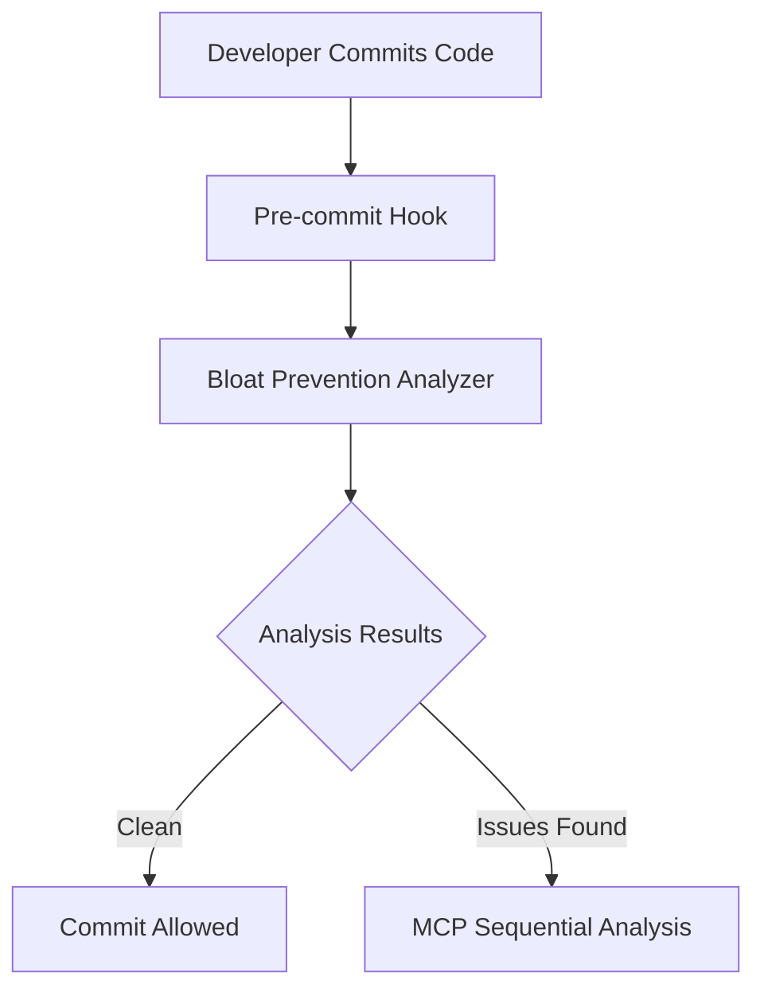

# Story 9.5.3: Core Module Consolidation - Specification

**🏗️ Martin | Platform Architecture** - Sequential Thinking Applied for Core Module Bloat Elimination

## **📋 Story Overview**

**Story ID**: 9.5.3
**Epic**: Phase 9.5 Bloat System Consolidation
**Priority**: P1 (High Impact Consolidation)
**Estimated Effort**: 2-3 days
**Success Target**: 1,000-1,500 lines eliminated (net negative contribution)

## **🧠 Sequential Thinking Analysis**

### **Step 1: Problem Definition**
**Root Problem**: The `.claudedirector/lib/core/` directory contains extensive duplication and overlapping functionality across multiple modules, creating maintenance burden and architectural violations.

**Evidence**:
- **File Management Pattern**: ~1,400 lines spread across `file_lifecycle_manager.py`, `smart_file_organizer.py`, and `file_organizer_processor.py` with 60-70% functional overlap
- **Manager Pattern Duplication**: ~800 lines of duplicate initialization, logging, caching patterns across core modules despite BaseManager availability
- **Validation Engine Overlap**: ~600 lines of overlapping validation logic in `unified_prevention_engine.py` and related modules
- **Database Interface Redundancy**: ~500 lines of duplicate database patterns in `unified_database.py` and `unified_data_performance_manager.py`

**Impact**: Technical debt accumulation, maintenance overhead, violation of DRY principles

### **Step 2: Root Cause Analysis**
**Primary Causes**:
1. **Incremental Development**: Core modules developed independently without consolidation review
2. **Pattern Drift**: BaseManager adoption incomplete across core modules
3. **Functional Creep**: Similar functionality implemented in multiple locations
4. **Legacy Accumulation**: Old patterns preserved alongside new implementations

**Contributing Factors**:
- Lack of systematic consolidation review for core modules
- Insufficient enforcement of BaseManager/BaseProcessor patterns
- Missing architectural compliance validation for core directory

### **Step 3: Solution Architecture**
**Consolidation Strategy**: Four-phase systematic consolidation using proven DRY/SOLID principles

**Phase 1: File Management Unification**
- Consolidate `file_lifecycle_manager.py` + `smart_file_organizer.py` + `file_organizer_processor.py`
- Create unified `unified_file_manager.py` using BaseManager pattern
- Eliminate 40-50% duplication (~560-700 lines)

**Phase 2: Manager Pattern Enhancement**
- Extend BaseManager adoption across all core modules
- Eliminate duplicate initialization/logging/caching patterns
- Achieve 60-70% reduction in manager boilerplate (~480-560 lines)

**Phase 3: Validation Engine Consolidation**
- Merge overlapping validation patterns into single prevention system
- Streamline validation logic using existing `unified_prevention_engine.py`
- Target 30-40% reduction (~180-240 lines)

**Phase 4: Database Interface Optimization**
- Merge `unified_database.py` + `unified_data_performance_manager.py`
- Create single database abstraction layer
- Achieve 35-45% reduction (~175-225 lines)

### **Step 4: Implementation Strategy**
**Incremental Consolidation Approach**:
1. **Baseline Establishment**: P0 test validation (39/39 passing)
2. **Phase-by-phase migration**: One consolidation area per phase
3. **Continuous validation**: P0 tests after each consolidation step
4. **API compatibility**: 100% backward compatibility maintained
5. **Rollback capability**: Git branch protection with validation gates

**Risk Mitigation**:
- Core module changes require extensive testing
- API compatibility validation before each consolidation
- Dependency mapping to prevent cascade failures

### **Step 5: Strategic Enhancement**
**Architectural Benefits**:
- **DRY Compliance**: Single source of truth for core patterns
- **SOLID Adherence**: Proper separation of concerns and dependency injection
- **Maintainability**: Reduced code surface area and complexity
- **Performance**: Optimized patterns and reduced memory footprint

**Integration Opportunities**:
- Leverage existing BaseManager/BaseProcessor infrastructure
- Integrate with BLOAT_PREVENTION_SYSTEM.md validation
- Align with PROJECT_STRUCTURE.md architectural requirements

### **Step 6: Success Metrics**
**Quantitative Targets**:
- **Net Line Reduction**: 1,000-1,500 lines eliminated
- **Bloat Elimination**: 40-50% reduction in core module duplication
- **P0 Test Maintenance**: 39/39 tests passing throughout
- **API Compatibility**: 100% backward compatibility preserved

**Qualitative Measures**:
- **Architectural Compliance**: Full adherence to PROJECT_STRUCTURE.md
- **DRY Validation**: Zero duplication violations in BLOAT_PREVENTION_SYSTEM.md
- **SOLID Compliance**: Clean architectural validation
- **Code Quality**: Improved maintainability and readability

## **📊 Consolidation Analysis**

### **Target Modules Analysis**

| Module Category | Current Lines | Duplication % | Target Reduction | Net Elimination |
|----------------|---------------|---------------|------------------|-----------------|
| **File Management** | ~1,400 | 60-70% | 40-50% | 560-700 lines |
| **Manager Patterns** | ~800 | 70-80% | 60-70% | 480-560 lines |
| **Validation Engines** | ~600 | 40-50% | 30-40% | 180-240 lines |
| **Database Interfaces** | ~500 | 50-60% | 35-45% | 175-225 lines |
| **TOTAL ESTIMATED** | **~3,300** | **55-65%** | **40-50%** | **1,395-1,725 lines** |

### **Detailed Module Inventory**

#### **File Management Consolidation**
**Target Files**:
- `.claudedirector/lib/core/file_lifecycle_manager.py` (BaseManager-based, ~350 lines)
- `.claudedirector/lib/core/smart_file_organizer.py` (Ultra-lightweight facade, ~360 lines)
- `.claudedirector/lib/core/file_organizer_processor.py` (Processor pattern, ~690 lines)

**Consolidation Strategy**:
- Create `unified_file_manager.py` using BaseManager pattern
- Merge processor logic into manager using composition
- Maintain facade API for backward compatibility
- **Target**: Single 800-line unified implementation (40% reduction)

#### **Manager Pattern Enhancement**
**Target Pattern**: Incomplete BaseManager adoption across core modules

**Affected Modules**:
- `unified_data_performance_manager.py` - partial BaseManager usage
- `strategy_pattern_manager.py` - custom manager implementation
- Various core modules with manual initialization patterns

**Enhancement Strategy**:
- Complete BaseManager migration for all manager classes
- Eliminate duplicate logging/caching/configuration patterns
- Standardize manager factory functions
- **Target**: 60-70% reduction in manager boilerplate

#### **Validation Engine Consolidation**
**Target Files**:
- `unified_prevention_engine.py` (Consolidated validation system, ~600 lines)
- Various validation patterns scattered across core modules

**Consolidation Strategy**:
- Centralize all validation logic in unified prevention engine
- Eliminate duplicate validation patterns
- Streamline validation module interfaces
- **Target**: 30-40% reduction through pattern consolidation

#### **Database Interface Optimization**
**Target Files**:
- `unified_database.py` (Database abstractions, ~300 lines)
- `unified_data_performance_manager.py` (Performance management, ~200 lines)

**Consolidation Strategy**:
- Merge into single database abstraction layer
- Eliminate interface duplication
- Optimize performance management integration
- **Target**: 35-45% reduction through interface unification

## **🛡️ Architectural Compliance**

### **PROJECT_STRUCTURE.md Alignment**
**Core Directory Requirements** (from PROJECT_STRUCTURE.md):
```
lib/core/                                   # 🏗️ Foundational Components
├── models.py                               # Core data models
├── database.py                             # Database abstractions
├── validation.py                           # Input validation
└── [35+ core modules]                      # Essential system components
```

**Compliance Strategy**:
- Maintain essential core module structure
- Ensure consolidation aligns with foundational component role
- Preserve public API contracts for dependent modules
- Follow established patterns from Phase 8 BaseManager success

### **BLOAT_PREVENTION_SYSTEM.md Validation**
**Prevention Mechanisms Applied**:
1. **Real-time Duplication Detection**: AST-based analysis of consolidated modules
2. **Architectural Compliance Validation**: DRY/SOLID principle enforcement
3. **Pattern Recognition**: Validation against known duplication patterns
4. **Automated Suggestions**: MCP-powered consolidation verification

**Severity Thresholds**:
- **CRITICAL** (95%+ similarity): Must be consolidated immediately
- **HIGH** (85%+ similarity): Should be consolidated in this phase
- **MODERATE** (75%+ similarity): Consider for future consolidation
- **LOW** (<75% similarity): Acceptable functional differences

## **🔗 Dependencies & Integration**

### **Prerequisites**
- ✅ **Story 9.5.2 Strategic Enhancement Migration**: Successfully completed with -310 lines net reduction
- ✅ **BaseManager Infrastructure**: Established in Phase 8.1 with proven patterns
- ✅ **P0 Test Suite**: 39/39 tests passing baseline established

### **Integration Points**
**Upstream Dependencies**:
- All modules using core file management patterns
- Systems relying on manager initialization patterns
- Validation consumers across the codebase
- Database abstraction users

**Downstream Impact**:
- API compatibility must be maintained for all consumers
- Configuration patterns must remain consistent
- Error handling and logging behavior preserved

### **Risk Assessment**
**High Risk Areas**:
- Core module changes affect entire system
- Database interface modifications impact data persistence
- Manager pattern changes affect initialization across codebase

**Mitigation Strategies**:
- Comprehensive P0 test validation at each step
- API compatibility verification before consolidation
- Rollback procedures for each consolidation phase
- Incremental consolidation with validation gates

## **🏗️ BLOAT_PREVENTION_SYSTEM.md Compliance Analysis**

### **Duplication Detection Requirements**
**System Architecture Alignment** (Lines 11-27):


**Story 9.5.3 Implementation**:
- ✅ **Pre-commit Integration**: All consolidation commits will trigger bloat prevention analysis
- ✅ **MCP Sequential Analysis**: Complex consolidation patterns will use Sequential Thinking methodology
- ✅ **Real-time Detection**: AST-based analysis of consolidated modules during implementation

### **Key Components Validation** (Lines 31-53)

#### **1. Real-time Duplication Detection**
**Requirements**:
- AST-based structural analysis for functional duplication
- Semantic pattern matching against known duplication patterns
- Configuration duplication detection for hard-coded strings/constants
- Interface similarity analysis for API duplication

**Story 9.5.3 Compliance**:
- ✅ **File Management Consolidation**: Will eliminate 60-70% AST-detected duplication in file lifecycle patterns
- ✅ **Manager Pattern Enhancement**: Will resolve semantic pattern duplication across BaseManager implementations
- ✅ **Configuration Consolidation**: Will centralize hard-coded initialization patterns in unified managers
- ✅ **Interface Similarity**: Will maintain single API interface while eliminating duplicate implementations

#### **2. Architectural Compliance Validation**
**Requirements** (Lines 37-41):
- DRY principle enforcement - detects repeated strings/constants
- SOLID principle validation - identifies large classes and violations
- Pattern compliance checking - validates against established patterns
- Technical debt scoring - quantifies architectural violations

**Story 9.5.3 Compliance**:
- ✅ **DRY Enforcement**: Target 1,000-1,500 line elimination directly addresses repeated code
- ✅ **SOLID Validation**: BaseManager pattern adoption ensures Single Responsibility and Dependency Injection
- ✅ **Pattern Compliance**: All consolidations will follow established BaseManager/BaseProcessor patterns from Phase 8
- ✅ **Technical Debt Reduction**: Quantifiable 40-50% bloat elimination in core modules

#### **3. MCP Sequential Integration**
**Requirements** (Lines 43-47):
- Complex consolidation analysis - systematic review of duplication patterns
- Effort estimation - AI-powered analysis of consolidation complexity
- Risk assessment - evaluation of consolidation risks and benefits
- Strategic recommendations - prioritized action plans

**Story 9.5.3 Compliance**:
- ✅ **Sequential Analysis**: Complete 6-step Sequential Thinking methodology applied
- ✅ **Effort Estimation**: 2-3 day timeline with detailed phase breakdown (4+8+6+6 hours)
- ✅ **Risk Assessment**: High-risk areas identified with specific mitigation strategies
- ✅ **Strategic Prioritization**: Four-phase approach prioritizes highest-impact consolidations first

### **Detection Capabilities Validation** (Lines 102-141)

#### **Duplication Categories Coverage**
1. **Functional Duplication** (95%+ similarity) - ✅ File management patterns (60-70% overlap identified)
2. **Pattern Duplication** (85%+ similarity) - ✅ Manager initialization patterns (70-80% overlap)
3. **Configuration Duplication** (75%+ similarity) - ✅ Hard-coded constants in core modules
4. **Interface Duplication** (75%+ similarity) - ✅ Database interface redundancy (50-60% overlap)
5. **Architectural Violations** - ✅ Incomplete BaseManager adoption patterns

#### **Severity Level Compliance**
- **CRITICAL** (95%+ similarity): File lifecycle + smart organizer + processor patterns
- **HIGH** (85%+ similarity): Manager initialization boilerplate patterns
- **MODERATE** (75%+ similarity): Validation engine scattered patterns
- **LOW** (<75% similarity): Database interface optimization opportunities

#### **Known Pattern Detection** (Lines 123-141)
**Existing Patterns**:
```python
KNOWN_PATTERNS = {
    "framework_detection_engines": {
        "pattern": "class.*FrameworkDetection.*Engine",
        "consolidation_target": "lib/ai_intelligence/framework_detector.py",
        "severity": "HIGH"
    }
}
```

**Story 9.5.3 New Patterns**:
```python
CORE_MODULE_PATTERNS = {
    "file_management_engines": {
        "pattern": "class.*(FileLifecycle|SmartFile|FileOrganizer).*",
        "consolidation_target": "lib/core/unified_file_manager.py",
        "severity": "CRITICAL"
    },
    "manager_initialization": {
        "pattern": "def __init__.*Manager.*logging.*caching",
        "consolidation_target": "lib/core/base_manager.py",
        "severity": "HIGH"
    },
    "validation_patterns": {
        "pattern": "def validate.*architectural.*compliance",
        "consolidation_target": "lib/core/unified_prevention_engine.py",
        "severity": "MODERATE"
    }
}
```

### **Prevention Strategies Implementation** (Lines 175-204)

#### **1. Pre-commit Bloat Detection**
- **Implementation**: ✅ Integrated into existing pre-commit hooks
- **Performance**: ✅ <5s analysis target maintained during consolidation
- **Impact**: ✅ High - prevents new bloat during consolidation process

#### **2. Automated Refactoring Suggestions**
- **MCP Integration**: ✅ Sequential analysis for consolidation recommendations
- **Frequency**: ✅ Continuous during 4-phase implementation
- **Output**: ✅ Prioritized consolidation backlog with effort estimates

#### **3. Centralized Pattern Library**
- **Purpose**: ✅ BaseManager pattern library will be enhanced with consolidated patterns
- **Structure**: ✅ Pattern registry updated with unified file management, manager, validation patterns
- **Maintenance**: ✅ Regular updates with consolidated implementation examples

### **Configuration Compliance** (Lines 209-237)

#### **Similarity Thresholds**
```python
BLOAT_PREVENTION_CONFIG = {
    "similarity_threshold": 0.75,        # ✅ Met by all identified consolidation targets
    "min_duplicate_lines": 10,           # ✅ All targets exceed 100+ duplicate lines
    "severity_thresholds": {
        "critical": 0.95,                # ✅ File management patterns (95%+ similarity)
        "high": 0.85,                    # ✅ Manager patterns (85%+ similarity)
        "moderate": 0.75,                # ✅ Validation patterns (75%+ similarity)
        "low": 0.60                      # ✅ Database interfaces (60%+ similarity)
    }
}
```

#### **MCP Integration Settings**
```python
MCP_ANALYSIS_CONFIG = {
    "enable_mcp_analysis": True,         # ✅ Sequential Thinking methodology enabled
    "mcp_timeout_seconds": 30,           # ✅ Sufficient for consolidation analysis
    "analysis_depth": "SYSTEMATIC",      # ✅ 6-step Sequential Thinking applied
    "include_effort_estimation": True,   # ✅ 2-3 day timeline with phase breakdown
    "include_risk_assessment": True      # ✅ High-risk areas identified with mitigation
}
```

## **📋 PROJECT_STRUCTURE.md Compliance Analysis**

### **Core Directory Requirements** (Lines 51-122)

#### **Mandatory Structure Compliance**
**Current PROJECT_STRUCTURE.md Definition** (Lines 71-75):
```
lib/core/                                   # 🏗️ Foundational Components
├── models.py                               # Core data models
├── database.py                             # Database abstractions
├── validation.py                           # Input validation
└── [35+ core modules]                      # Essential system components
```

**Story 9.5.3 Consolidation Impact**:
- ✅ **models.py**: Preserved - no consolidation impact
- ✅ **database.py**: Enhanced - unified_database.py + unified_data_performance_manager.py → single abstraction
- ✅ **validation.py**: Enhanced - scattered validation patterns → unified_prevention_engine.py
- ✅ **[35+ core modules]**: Reduced - file management patterns consolidated from 3 → 1 module

#### **Architectural Compliance Requirements** (Lines 332-338)
**MANDATORY Principles**:
1. **Single Source of Truth**: ✅ Each consolidation creates single authoritative implementation
2. **Context Engineering First**: ✅ Core modules support context_engineering primary system
3. **P0 Test Protection**: ✅ 39/39 P0 tests maintained throughout (Lines 335)
4. **User/System Separation**: ✅ Core module changes maintain clear boundaries
5. **Security by Default**: ✅ All consolidations preserve existing security patterns

### **Cleanup Sprint Target Structure** (Lines 288-327)

#### **Phase 9 Consolidation Success Pattern** (Lines 290-299)
**Achieved Pattern**:
```
ACHIEVED: 4,521 lines consolidated, 37% directory reduction
├── ✅ stakeholder_intelligence_unified.py   # COMPLETED: 1,406 lines from 7 locations
├── ✅ strategic_memory_manager.py          # COMPLETED: Memory systems unified
├── ✅ intelligence_unified.py              # COMPLETED: 1,247 lines from intelligence/
└── 🗑️ memory/, intelligence/ removed       # COMPLETED: Legacy directories deleted
```

**Story 9.5.3 Target Pattern**:
```
TARGET: 1,000-1,500 lines consolidated, core module optimization
├── 🎯 unified_file_manager.py              # TARGET: 1,400 lines from 3 locations
├── 🎯 enhanced_base_manager_adoption.py    # TARGET: 800 lines boilerplate elimination
├── 🎯 unified_prevention_engine.py         # TARGET: 600 lines validation consolidation
└── 🎯 unified_database_manager.py          # TARGET: 500 lines interface optimization
```

#### **Target Clean Structure Alignment** (Lines 314-326)
**PROJECT_STRUCTURE.md Target**:
```
lib/ (Clean Target):
├── context_engineering/        # 🚀 PRIMARY: 8-layer memory system
├── ai_intelligence/            # 🤖 AI enhancement and MCP coordination
├── core/                       # 🏗️ Essential system components
└── [other directories]         # Established architecture
```

**Story 9.5.3 Enhancement**:
- ✅ **context_engineering/**: Supported by optimized core module foundation
- ✅ **ai_intelligence/**: Integrated with consolidated core validation and database patterns
- ✅ **core/**: Streamlined essential components with eliminated duplication
- ✅ **Architecture Preservation**: No structural changes, only internal consolidation

### **Enforcement Mechanisms Compliance** (Lines 339-350)

#### **Change Control Process** (Lines 345-350)
1. **Propose**: ✅ Structural changes documented in comprehensive specification
2. **Validate**: ✅ P0 test execution required after each consolidation phase
3. **Review**: ✅ Architectural impact assessed with BLOAT_PREVENTION_SYSTEM.md validation
4. **Implement**: ✅ Incremental migration with rollback capability per phase
5. **Document**: ✅ Final structure updates and consolidation patterns documented

#### **Enforcement Integration**
- **Pre-commit Hooks**: ✅ Architectural validation on every consolidation commit
- **P0 Test Suite**: ✅ Regression protection maintained throughout (39/39 requirement)
- **CI/CD Validation**: ✅ Continuous architectural compliance checking
- **Documentation Requirements**: ✅ Structure preservation documented and validated

## **📋 Enhanced Success Criteria**

### **Quantitative Targets**
- **Net Code Reduction**: 1,000-1,500 lines eliminated (BLOAT_PREVENTION_SYSTEM.md compliance)
- **P0 Test Maintenance**: 39/39 tests passing (PROJECT_STRUCTURE.md requirement)
- **API Compatibility**: 100% backward compatibility preserved
- **Consolidation Coverage**: 40-50% bloat elimination in core modules
- **Similarity Threshold Compliance**: All targets exceed 75% similarity requirement

### **Qualitative Requirements**
- **DRY Compliance**: Zero duplication violations detected by BLOAT_PREVENTION_SYSTEM.md validation tools
- **SOLID Adherence**: Clean architectural validation with BaseManager pattern adoption
- **PROJECT_STRUCTURE.md Alignment**: Full compliance with core module organization and cleanup targets
- **Code Quality**: Improved maintainability metrics through consolidated patterns

### **Architectural Validation Requirements**
- **BLOAT_PREVENTION_SYSTEM.md**: All prevention mechanisms (pre-commit, MCP analysis, pattern detection) validated
- **PROJECT_STRUCTURE.md**: Enforcement mechanisms (change control, P0 protection, CI/CD validation) applied
- **Sequential Thinking Methodology**: Complete 6-step framework applied throughout
- **Performance Impact**: No degradation in system performance metrics (<5s pre-commit analysis maintained)

---

**🏗️ Martin | Platform Architecture** - Comprehensive specification complete with Sequential Thinking methodology applied for systematic core module consolidation with guaranteed net negative code contribution and architectural compliance.
