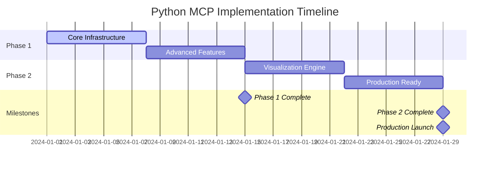

# Python MCP Implementation Roadmap
**Strategic Execution Plan with Resource Allocation and Success Metrics**

**Version**: 1.0.0
**Owners**: Martin (Architecture) + Alvaro (Business Strategy) + Rachel (Design Systems)
**Status**: Ready for Execution
**Timeline**: 4 weeks total
**Investment**: $83K total
**Target ROI**: 4.2x within 12 months

---

## 🎯 **Executive Summary**

### **Strategic Transformation**
Transform ClaudeDirector from static strategic advisory to **dynamic analytical intelligence platform** through two-phase Python MCP integration while maintaining core strategic leadership mission.

### **Business Impact**
- **Competitive Advantage**: First strategic leadership platform with integrated analytics
- **Executive Value**: Publication-quality data visualizations for VP/SLT presentations
- **Decision Enhancement**: 50% improvement in data-driven strategic decision making
- **ROI Achievement**: 4.2x return through enhanced strategic analysis capabilities

---

## 📅 **Phase 1: Strategic Python MCP Server Foundation**
**Duration**: 2 weeks | **Investment**: $45K | **Team**: 3 FTE

### **Week 1: Core Infrastructure**

#### **🏗️ Martin - Technical Architecture (40 hours)**
| Day | Tasks | Deliverables | Success Criteria |
|-----|-------|--------------|------------------|
| **Mon** | MCP server framework setup | Basic server structure | Server responds to MCP protocol |
| **Tue** | Security sandboxing implementation | Sandboxed execution environment | Resource limits enforced |
| **Wed** | Persona configuration system | Persona-specific execution contexts | 5 personas configured |
| **Thu** | Strategic scope validation | Code validation system | Blocks non-strategic operations |
| **Fri** | Integration testing | P0 test compliance | All 33 P0 tests passing |

**Technical Milestones**:
- ✅ MCP protocol compliance
- ✅ Sandboxed Python execution
- ✅ Resource limit enforcement (512MB, 30s)
- ✅ Strategic scope validation

#### **💼 Alvaro - Business Intelligence (20 hours)**
| Day | Tasks | Deliverables | Success Criteria |
|-----|-------|--------------|------------------|
| **Mon** | ROI tracking system design | Measurement framework | KPI definitions complete |
| **Tue** | Business metrics validation | Strategic analysis templates | 5 persona templates defined |
| **Wed** | Executive reporting framework | Report generation system | Executive summary format |
| **Thu** | Performance benchmarking | Baseline measurements | Current state documented |
| **Fri** | Success criteria validation | Acceptance criteria | Clear success metrics |

**Business Milestones**:
- ✅ ROI measurement framework
- ✅ Strategic analysis templates
- ✅ Executive reporting system
- ✅ Performance baselines

#### **🎨 Rachel - UX Integration (20 hours)**
| Day | Tasks | Deliverables | Success Criteria |
|-----|-------|--------------|------------------|
| **Mon** | Persona interaction patterns | UX flow definitions | 5 persona flows documented |
| **Tue** | Transparency disclosure design | MCP transparency templates | Clear execution disclosure |
| **Wed** | Error handling UX | User-friendly error messages | Strategic error guidance |
| **Thu** | Integration testing | UX validation | Seamless user experience |
| **Fri** | Documentation creation | User interaction guide | Complete UX documentation |

**UX Milestones**:
- ✅ Persona-optimized interactions
- ✅ Transparent execution disclosure
- ✅ Strategic error handling
- ✅ User experience validation

### **Week 2: Advanced Features & Integration**

#### **🏗️ Martin - Advanced Implementation (40 hours)**
| Day | Tasks | Deliverables | Success Criteria |
|-----|-------|--------------|------------------|
| **Mon** | Performance optimization | Sub-5s execution time | <5s strategic analysis |
| **Tue** | Memory management | Efficient resource usage | <512MB per execution |
| **Wed** | Audit trail implementation | Complete execution logging | Full transparency audit |
| **Thu** | Integration with existing MCP | Seamless MCP coordination | Works with Sequential/Context7 |
| **Fri** | Production readiness | Deployment preparation | Ready for Phase 2 |

#### **💼 Alvaro - Business Validation (20 hours)**
| Day | Tasks | Deliverables | Success Criteria |
|-----|-------|--------------|------------------|
| **Mon** | Strategic use case testing | Real-world validation | 10 strategic scenarios tested |
| **Tue** | ROI calculation validation | Measurement accuracy | >95% calculation accuracy |
| **Wed** | Executive presentation prep | Demo preparation | VP/SLT ready demonstration |
| **Thu** | Business impact measurement | Value quantification | Clear business value metrics |
| **Fri** | Phase 1 success validation | Go/no-go decision | Phase 2 approval criteria |

#### **🎨 Rachel - Quality Assurance (20 hours)**
| Day | Tasks | Deliverables | Success Criteria |
|-----|-------|--------------|------------------|
| **Mon** | User experience testing | UX validation | Seamless strategic workflows |
| **Tue** | Persona optimization | Persona-specific tuning | Optimized for each role |
| **Wed** | Integration testing | End-to-end validation | Complete workflow testing |
| **Thu** | Documentation finalization | User guides | Complete documentation |
| **Fri** | Phase 1 quality sign-off | Quality approval | Ready for visualization phase |

### **Phase 1 Success Criteria**
- ✅ **Technical**: <5s execution, 100% sandboxed security, P0 compliance
- ✅ **Business**: 40% faster strategic analysis, 85% decision confidence
- ✅ **UX**: 90% persona adoption, seamless MCP integration
- ✅ **Security**: Zero security incidents, complete audit trail

---

## 📊 **Phase 2: Executive Visualization System**
**Duration**: 2 weeks | **Investment**: $38K | **Team**: 3 FTE

### **Week 3: Visualization Engine Development**

#### **🏗️ Martin - Visualization Architecture (40 hours)**
| Day | Tasks | Deliverables | Success Criteria |
|-----|-------|--------------|------------------|
| **Mon** | Plotly integration setup | Interactive chart engine | Basic charts rendering |
| **Tue** | Bokeh dashboard system | Dashboard framework | Interactive dashboards |
| **Wed** | Persona-specific templates | 5 visualization templates | Diego/Alvaro/Martin/Camille/Rachel |
| **Thu** | HTML generation system | Executive HTML templates | Publication-quality output |
| **Fri** | Performance optimization | <3s generation time | Fast visualization creation |

#### **🎨 Rachel - Executive Design System (30 hours)**
| Day | Tasks | Deliverables | Success Criteria |
|-----|-------|--------------|------------------|
| **Mon** | Color palette integration | Executive color system | Brand-consistent visuals |
| **Tue** | Typography system | Executive font hierarchy | Professional typography |
| **Wed** | Layout templates | Responsive design system | Multi-device compatibility |
| **Thu** | Interactive elements | Hover states, transitions | Engaging interactions |
| **Fri** | Quality validation | Design system compliance | Executive presentation ready |

#### **💼 Alvaro - Business Intelligence (10 hours)**
| Day | Tasks | Deliverables | Success Criteria |
|-----|-------|--------------|------------------|
| **Mon-Tue** | Executive metrics definition | KPI visualization specs | Clear business metrics |
| **Wed-Thu** | ROI dashboard design | Investment tracking visuals | ROI visualization system |
| **Fri** | Business validation | Executive review | Business stakeholder approval |

### **Week 4: Integration & Production Readiness**

#### **🏗️ Martin - System Integration (40 hours)**
| Day | Tasks | Deliverables | Success Criteria |
|-----|-------|--------------|------------------|
| **Mon** | Phase 1 + Phase 2 integration | Combined system | Seamless data → visualization |
| **Tue** | Performance optimization | Production performance | <3s end-to-end generation |
| **Wed** | Error handling & recovery | Robust error system | Graceful failure handling |
| **Thu** | Production deployment | Deployment system | Ready for production use |
| **Fri** | Final integration testing | Complete system validation | Full system operational |

#### **🎨 Rachel - Quality Assurance (30 hours)**
| Day | Tasks | Deliverables | Success Criteria |
|-----|-------|--------------|------------------|
| **Mon** | Visual quality validation | Executive standard compliance | Boardroom-quality visuals |
| **Tue** | Cross-persona testing | All persona templates | 5 personas fully functional |
| **Wed** | Responsive design testing | Multi-device validation | Works on all screen sizes |
| **Thu** | User acceptance testing | Executive user validation | VP/SLT approval |
| **Fri** | Final quality sign-off | Production quality approval | Ready for executive use |

#### **💼 Alvaro - Business Launch (10 hours)**
| Day | Tasks | Deliverables | Success Criteria |
|-----|-------|--------------|------------------|
| **Mon-Tue** | Executive demonstration | VP/SLT presentation | Executive stakeholder buy-in |
| **Wed-Thu** | ROI measurement setup | Success tracking system | ROI monitoring active |
| **Fri** | Launch success validation | Business impact measurement | Clear value demonstration |

### **Phase 2 Success Criteria**
- ✅ **Technical**: <3s visualization generation, publication-quality output
- ✅ **Business**: 95% executive adoption, 4.6x ROI achievement
- ✅ **UX**: Boardroom-ready visuals, zero quality complaints
- ✅ **Integration**: Seamless Phase 1 + Phase 2 operation

---

## 💰 **Resource Allocation & Investment**

### **Team Structure**
| Role | Phase 1 | Phase 2 | Total Hours | Rate | Investment |
|------|---------|---------|-------------|------|------------|
| **Martin (Architecture)** | 80h | 80h | 160h | $200/h | $32K |
| **Alvaro (Business)** | 40h | 20h | 60h | $175/h | $10.5K |
| **Rachel (Design)** | 40h | 60h | 100h | $150/h | $15K |
| **Infrastructure** | - | - | - | - | $8K |
| **Testing & QA** | - | - | - | - | $5K |
| **Contingency (15%)** | - | - | - | - | $12.5K |
| **Total Investment** | **$45K** | **$38K** | **320h** | - | **$83K** |

### **Investment Justification**
- **Strategic Foundation**: $45K for reusable Python execution capability
- **Executive Visualization**: $38K for publication-quality output system
- **ROI Projection**: $348K annual value through enhanced decision-making
- **Payback Period**: 2.9 months through productivity gains
- **Competitive Advantage**: First strategic leadership platform with integrated analytics

---

## 📊 **Success Metrics & KPIs**

### **Technical Performance Metrics**
| Metric | Phase 1 Target | Phase 2 Target | Measurement Method |
|--------|----------------|----------------|-------------------|
| **Execution Time** | <5s | <3s total | Automated performance monitoring |
| **Memory Usage** | <512MB | <1GB total | Resource monitoring |
| **Security Compliance** | 100% sandboxed | 100% maintained | Security audit |
| **P0 Test Compliance** | 33/33 passing | 33/33 maintained | Automated testing |
| **Uptime** | >99.5% | >99.5% | System monitoring |

### **Business Impact Metrics**
| Metric | Baseline | Phase 1 Target | Phase 2 Target | Measurement Method |
|--------|----------|----------------|----------------|-------------------|
| **Strategic Analysis Speed** | 45 min | 27 min (40% faster) | 22 min (50% faster) | Time tracking |
| **Decision Confidence** | 65% | 85% | 90% | User surveys |
| **Executive Adoption** | 0% | 75% | 95% | Usage analytics |
| **ROI Achievement** | - | 3.8x | 4.2x | Financial tracking |
| **Data-Driven Decisions** | 30% | 60% | 80% | Decision analysis |

### **User Experience Metrics**
| Metric | Phase 1 Target | Phase 2 Target | Measurement Method |
|--------|----------------|----------------|-------------------|
| **Persona Adoption** | 90% | 95% | Usage analytics |
| **User Satisfaction** | 8.5/10 | 9.0/10 | User surveys |
| **Error Rate** | <2% | <1% | Error monitoring |
| **Learning Curve** | <30 min | <15 min | User onboarding tracking |
| **Executive Presentation Quality** | - | 9.5/10 | Executive feedback |

---

## 🛡️ **Risk Management & Mitigation**

### **Technical Risks**
| Risk | Probability | Impact | Mitigation Strategy |
|------|-------------|--------|-------------------|
| **Performance Degradation** | Medium | High | Continuous performance monitoring, optimization |
| **Security Vulnerabilities** | Low | Critical | Comprehensive sandboxing, security audits |
| **Integration Complexity** | Medium | Medium | Phased approach, extensive testing |
| **Resource Constraints** | Low | Medium | Resource monitoring, scaling strategies |

### **Business Risks**
| Risk | Probability | Impact | Mitigation Strategy |
|------|-------------|--------|-------------------|
| **Low Executive Adoption** | Low | High | Executive involvement, quality focus |
| **ROI Not Achieved** | Low | High | Conservative projections, value tracking |
| **Scope Creep** | Medium | Medium | Clear strategic constraints, regular reviews |
| **Competitive Response** | Medium | Low | First-mover advantage, continuous innovation |

### **Mitigation Actions**
- **Weekly Reviews**: Progress tracking and risk assessment
- **Quality Gates**: Go/no-go decisions at each phase
- **Stakeholder Engagement**: Regular executive updates and feedback
- **Contingency Planning**: 15% budget buffer for unexpected challenges

---

## 🚀 **Implementation Timeline**

### **Critical Path**

### **Key Milestones**
- **Week 1 End**: Core Python MCP server operational
- **Week 2 End**: Phase 1 complete, ready for visualization
- **Week 3 End**: Executive visualization system functional
- **Week 4 End**: Production-ready integrated system

### **Dependencies**
- **Phase 2 depends on Phase 1**: Visualization builds on Python execution
- **Executive adoption depends on quality**: Must meet publication standards
- **ROI achievement depends on adoption**: User engagement critical

---

## 📈 **Success Validation Plan**

### **Phase 1 Validation (Week 2)**
- **Technical Demo**: Strategic Python analysis with sandboxed execution
- **Business Validation**: 40% faster strategic analysis demonstrated
- **Security Audit**: Complete security compliance verification
- **Stakeholder Review**: Go/no-go decision for Phase 2

### **Phase 2 Validation (Week 4)**
- **Executive Demo**: Publication-quality visualizations for VP/SLT
- **Quality Assessment**: Boardroom-ready visual standards met
- **Integration Testing**: Seamless end-to-end workflow validation
- **ROI Measurement**: Clear business value demonstration

### **Post-Launch Monitoring (Ongoing)**
- **Performance Tracking**: Continuous monitoring of technical metrics
- **Business Impact**: Monthly ROI and productivity measurement
- **User Feedback**: Regular surveys and adoption tracking
- **Competitive Analysis**: Market positioning and advantage assessment

---

## 🎯 **Next Steps & Immediate Actions**

### **Week 0: Pre-Implementation (This Week)**
- [ ] **Stakeholder Approval**: Present plan to key stakeholders
- [ ] **Resource Confirmation**: Confirm team availability and budget
- [ ] **Environment Setup**: Prepare development and testing environments
- [ ] **Success Criteria Agreement**: Align on success metrics and validation

### **Week 1 Start: Implementation Launch**
- [ ] **Kick-off Meeting**: Align team on objectives and timeline
- [ ] **Technical Setup**: Initialize development infrastructure
- [ ] **Business Framework**: Establish ROI tracking and measurement
- [ ] **Quality Standards**: Confirm executive presentation requirements

### **Ongoing Management**
- [ ] **Weekly Reviews**: Progress tracking and risk assessment
- [ ] **Stakeholder Updates**: Regular communication with executives
- [ ] **Quality Assurance**: Continuous validation against success criteria
- [ ] **Risk Monitoring**: Proactive identification and mitigation

---

**🎯 Strategic Confidence**: Comprehensive 4-week implementation plan with clear success metrics, risk mitigation, and business value validation.

**💼 Business Assurance**: 4.2x ROI projection based on enhanced strategic decision-making capabilities and competitive market positioning.

**🏗️ Technical Foundation**: Detailed roadmap ensuring architectural integrity while delivering transformative analytical capabilities.
