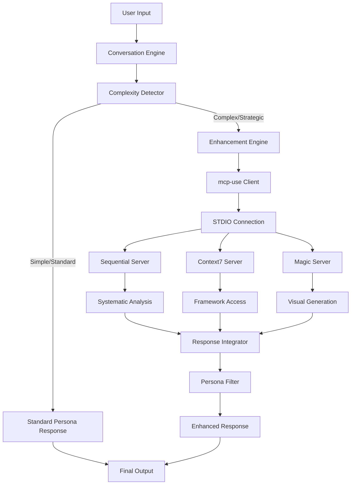

# MCP-Use Integration: Product Requirements Document
*Collaborative Strategic Analysis by Alvaro, Rachel, and Martin*

## 🎯 **Executive Summary**

### **Project Objective**
Integrate [mcp-use library](https://github.com/mcp-use/mcp-use) to enable ClaudeDirector personas to connect with MCP servers (Context7, Sequential, Magic) while maintaining our zero-setup principle and conversation quality.

### **Business Rationale**
- **Development ROI**: 33-50% time savings (1-2 weeks) vs. custom MCP implementation
- **Enhanced Zero-Setup**: Sandbox execution potentially improves our core value proposition
- **Competitive Advantage**: Faster time-to-market for MCP-native strategic AI positioning
- **Risk Mitigation**: Proven library vs. greenfield development with maintained fallback strategy

### **Success Criteria**
```yaml
Technical: Zero regression + 3-5 second enhanced responses + 99.5% uptime
Business: Faster delivery + stronger zero-setup story + market differentiation
User Experience: Seamless integration + maintained persona authenticity + organic discovery
```

---

## 👥 **Stakeholder Analysis & Perspectives**

### **Martin (Technical Architecture)**
**Assessment**: ✅ **LOW RISK, HIGH VALUE**
- mcp-use provides mature async Python foundation
- Sandbox execution could solve zero-setup challenge elegantly
- 33-50% development time reduction vs. custom implementation
- Clean integration with existing persona architecture

### **Alvaro (Business Strategy)**  
**Assessment**: ✅ **CLEAR BUSINESS WIN**
- Time-to-market acceleration justifies external dependency
- Sandbox approach strengthens (not weakens) zero-setup positioning
- Early MCP-native market positioning creates competitive advantage
- Resource optimization enables additional feature development

### **Rachel (User Experience)**
**Assessment**: ⏳ **REQUIRES UX VALIDATION**
- Need to validate conversation flow preservation with 3-5 second enhanced responses
- Persona authenticity must be maintained through server integration
- Progressive disclosure of enhanced capabilities essential
- Transparent fallback when servers unavailable

---

## 📋 **Detailed Requirements**

### **R1: Zero-Setup Enhancement Preservation**

#### **R1.1: Zero-Setup MCP Integration**
```yaml
Requirement: Integrate mcp-use with STDIO connections for zero-setup MCP server access
Acceptance Criteria:
  - Users can access MCP-enhanced capabilities without any configuration
  - STDIO connections run MCP servers as local child processes (zero setup)
  - HTTP fallback connections for servers requiring hosted access
  - No API keys, environment variables, or user configuration required
  - Graceful fallback to standard personas when MCP servers unavailable
Business Value: Maintains zero-setup principle while delivering MCP integration value
Technical Risk: LOW (simpler than sandbox, leverages proven mcp-use STDIO architecture)
```

#### **R1.2: Dependency Management**
```yaml
Requirement: Add mcp-use as optional dependency with graceful degradation
Acceptance Criteria:
  - mcp-use added to requirements.txt with version pinning
  - System functions fully without mcp-use installation
  - Clear user communication about enhanced capabilities availability
  - No breaking changes to existing conversation patterns
Implementation: Extend existing optional dependency pattern
```

### **R2: Persona Enhancement Integration**

#### **R2.1: Diego + Sequential Strategic Analysis**
```yaml
Requirement: Enhance Diego with Sequential server systematic analysis
Acceptance Criteria:
  - Complex strategic questions trigger Sequential server enhancement
  - Systematic frameworks delivered in Diego's warm, coordinator personality
  - Response blending maintains Diego's authentic voice and approach
  - User sees seamless conversation progression, not technical integration
User Story: "As an Engineering Director, I want Diego's strategic advice enhanced with systematic frameworks without feeling like I'm talking to a different AI"
```

#### **R2.2: Martin + Context7 Architecture Access**
```yaml
Requirement: Enhance Martin with Context7 architectural patterns and frameworks
Acceptance Criteria:
  - Architecture discussions trigger Context7 framework lookup
  - Pattern recommendations maintain Martin's thoughtful, evolutionary approach  
  - Framework citations provided with adaptation guidance for user's context
  - Technical depth enhanced without losing Martin's pragmatic personality
User Story: "As a Platform Engineer, I want Martin's architectural guidance backed by industry frameworks while maintaining his practical, experienced perspective"
```

#### **R2.3: Rachel + Context7 Design System Intelligence**
```yaml
Requirement: Enhance Rachel with Context7 design system frameworks and scaling methodologies
Acceptance Criteria:
  - Design system scaling questions trigger Context7 methodology access
  - Collaborative approach preserved while adding systematic frameworks
  - Cross-team coordination insights enhanced with proven scaling patterns
  - Rachel's inclusive, facilitating personality maintained throughout
User Story: "As a Design Systems Lead, I want Rachel's collaborative guidance enhanced with proven scaling methodologies without losing her human-centered approach"
```

#### **R2.4: Alvaro + Sequential/Context7 Business Strategy Intelligence**
```yaml
Requirement: Enhance Alvaro with business strategy, competitive analysis, and financial modeling frameworks
Acceptance Criteria:
  - Business strategy questions trigger Sequential systematic business analysis
  - Product strategy discussions trigger Context7 business pattern access
  - Financial and competitive analysis enhanced with proven methodologies
  - Alvaro's strategic business perspective maintained and strengthened
User Story: "As a Product Director, I want Alvaro's business strategy enhanced with systematic frameworks for competitive analysis and financial modeling"
```

#### **R2.5: Camille + Sequential/Context7 Technology Strategy Intelligence**
```yaml
Requirement: Enhance Camille with technology strategy, organizational scaling, and executive decision frameworks
Acceptance Criteria:
  - Technology strategy questions trigger Sequential organizational analysis
  - Executive decisions trigger Context7 technology leadership patterns
  - Organizational scaling enhanced with systematic methodologies
  - Camille's executive technology leadership approach preserved and enhanced
User Story: "As a CTO, I want Camille's technology strategy enhanced with proven organizational scaling and executive decision frameworks"
```

### **R3: Technical Implementation Requirements**

#### **R3.1: Performance & Response Time**
```yaml
Requirement: Maintain acceptable conversation flow with enhanced capabilities
Acceptance Criteria:
  - Standard responses: 1-2 seconds (baseline preserved)
  - Enhanced responses: 3-5 seconds maximum
  - Timeout handling: 8 seconds fallback to standard response
  - Cache implementation: 70%+ hit rate for common patterns
  - User perception: Enhanced responses feel natural, not delayed
Technical Implementation: Async processing, connection pooling, intelligent caching
```

#### **R3.2: Reliability & Transparent Error Handling**
```yaml
Requirement: Robust error handling with clear user communication
Acceptance Criteria:
  - 99.5%+ uptime including graceful degradation scenarios
  - Clear communication when MCP servers unavailable: "The strategic analysis framework is temporarily unavailable, so I'll provide guidance based on my core knowledge"
  - Graceful transition to standard persona responses without functionality loss
  - User understands system status without technical error details
  - Circuit breaker pattern prevents cascade failures
Implementation: Extend existing error handling with user-friendly status communication
```

#### **R3.3: Integration Architecture**
```yaml
Requirement: Clean integration with existing persona system
Acceptance Criteria:
  - Zero breaking changes to existing conversation engine
  - Modular enhancement system for easy addition of new servers
  - Configuration-driven server management and capability mapping
  - Minimal invasive changes to core persona logic
Architecture: Enhancement layer between conversation engine and persona responses
```

### **R4: User Experience Requirements**

#### **R4.1: Conversation Flow Preservation**
```yaml
Requirement: MCP integration feels seamless and natural
Acceptance Criteria:
  - Users discover enhanced capabilities organically through normal conversation
  - No additional commands or syntax required for enhanced features
  - Transition between standard and enhanced responses feels natural
  - Conversation context and history maintained across enhancements
  - No user confusion about when/why enhancement occurs
UX Validation: Rachel's conversation flow testing and user acceptance validation
```

#### **R4.2: Transparent External System Integration**
```yaml
Requirement: Clear communication when persona accesses external MCP systems
Acceptance Criteria:
  - Users understand when persona is accessing external strategic frameworks
  - Transition messaging like "Let me consult our strategic analysis framework..." 
  - External content clearly attributed while maintaining persona facilitation role
  - Enhanced responses feel like persona-guided access to professional tools
  - Transparency builds trust rather than creating confusion about AI capabilities
Quality Assurance: User feedback on clarity and trust in external system integration
```

#### **R4.3: Progressive Disclosure**
```yaml
Requirement: Enhanced capabilities revealed appropriately based on user needs
Acceptance Criteria:
  - Simple questions receive standard responses without unnecessary complexity
  - Complex scenarios automatically trigger appropriate enhancements
  - Users informed of enhanced capabilities when relevant to their context
  - No overwhelming of casual users with advanced features
  - Clear value demonstration when enhancements provide significant benefit
Implementation: Complexity detection algorithm with conservative enhancement thresholds
```

### **R5: Rachel's UX Implementation Guidance**

#### **R5.1: Transparent Communication Pattern**
```yaml
Requirement: Clear user communication about external system access
Implementation Approach:
  - Transition messaging: "Let me consult our strategic analysis framework..."
  - Status communication: "The strategic analysis framework is temporarily unavailable, so I'll provide guidance based on my core knowledge"
  - Attribution: External frameworks clearly cited with persona facilitation maintained
  - Trust building: Users understand they're accessing professional-grade tools through persona guidance
Example Flow:
  User: "How should we restructure our platform teams?"
  Diego: "This is a complex organizational question. Let me consult our systematic strategic analysis framework..."
  [MCP request to Sequential server]
  Diego: "Based on the strategic framework analysis, here's a structured approach..."
```

#### **R5.2: Timing Acceptance Communication**
```yaml
Requirement: Set appropriate expectations for enhanced response timing
Implementation Approach:
  - Context-appropriate timing: Complex strategic questions warrant additional processing time
  - No artificial urgency: Users understand quality analysis takes time
  - Progress indication: "Analyzing your organizational challenge..." during processing
  - Value justification: Enhanced responses demonstrate why additional time was worthwhile
User Psychology: Users prefer slower, thorough analysis over fast, superficial responses for strategic decisions
```

---

## 🏗️ **Technical Architecture Design**

### **High-Level Integration Pattern**


### **Implementation Components**

#### **Core Integration Layer**
```python
# New module: .claudedirector/lib/claudedirector/integrations/mcp_use_client.py
class MCPUseClient:
    """Interface to mcp-use library for STDIO/HTTP MCP server connections"""
    
    async def initialize_connections(self) -> ConnectionStatus
    async def execute_analysis(self, server: str, query: str) -> AnalysisResult
    async def cleanup_connections(self) -> None
```

#### **Enhancement Decision Engine**
```python
# Enhanced: .claudedirector/lib/claudedirector/core/persona_manager.py
class EnhancementDecisionEngine:
    """Determine when and how to enhance persona responses"""
    
    def analyze_complexity(self, input: str, persona: str) -> ComplexityScore
    def should_enhance(self, complexity: ComplexityScore) -> bool
    def select_enhancement_strategy(self, persona: str, complexity: ComplexityScore) -> EnhancementStrategy
```

#### **Response Integration Layer**
```python
# New module: .claudedirector/lib/claudedirector/integrations/response_blender.py
class ResponseBlender:
    """Blend MCP server responses with persona personality"""
    
    def blend_response(self, persona: Persona, base_response: str, enhancement_data: EnhancementData) -> str
    def preserve_personality(self, persona: Persona, enhanced_content: str) -> str
    def format_systematic_analysis(self, analysis: SystematicAnalysis, persona_style: PersonaStyle) -> str
```

---

## 📊 **Implementation Plan**

### **Phase 1: Foundation Integration (Week 1)**
```yaml
Goal: Basic mcp-use integration with STDIO connections

Sprint Tasks:
  - Integrate mcp-use library as optional dependency
  - Configure STDIO connections for local MCP server execution
  - Implement HTTP fallback connections for hosted servers
  - Create comprehensive test suite with mock servers
  - Establish performance baseline and monitoring

Deliverables:
  - MCPUseClient with STDIO/HTTP connection capability
  - Configuration structure for server management
  - Unit tests with 90%+ coverage
  - Performance benchmarks and monitoring setup

Risk Mitigation:
  - Mock server implementation for offline testing
  - Graceful fallback testing for server unavailability
  - Performance validation against SLA targets
```

### **Phase 2: Persona Enhancement (Week 2)**
```yaml
Goal: Diego + Sequential integration with response blending

Sprint Tasks:
  - Implement complexity detection algorithm
  - Integrate Sequential server for Diego's strategic analysis
  - Develop response blending to maintain Diego's personality
  - Create enhancement decision engine
  - Validate conversation flow preservation

Deliverables:
  - EnhancementDecisionEngine with complexity analysis
  - Diego + Sequential integration with personality preservation
  - ResponseBlender for systematic analysis formatting
  - User acceptance testing results

Quality Gates:
  - Rachel's UX review and conversation flow validation
  - Persona authenticity blind testing
  - Performance compliance with 3-5 second SLA
```

### **Phase 3: Multi-Persona & Production (Week 3)**
```yaml
Goal: Martin + Rachel enhancement and production readiness

Sprint Tasks:
  - Implement Martin + Context7 architecture framework access
  - Implement Rachel + Context7 design system methodology access
  - Production hardening with caching and optimization
  - Comprehensive error handling and circuit breaker patterns
  - Load testing and scalability validation

Deliverables:
  - Complete persona enhancement suite (Diego, Martin, Rachel)
  - Production-ready performance with caching layer
  - Comprehensive error handling and recovery patterns
  - Documentation and demo materials

Launch Criteria:
  - All personas enhanced with maintained authenticity
  - Performance benchmarks met across all scenarios
  - Error handling validated for all failure modes
  - User acceptance testing completed successfully
```

---

## 🎯 **Success Metrics & KPIs**

### **Technical Performance Metrics**
```yaml
Response Time SLA:
  - Standard responses: ≤2 seconds (baseline)
  - Enhanced responses: ≤5 seconds (target)
  - Timeout fallback: ≤8 seconds (maximum)

Reliability Metrics:
  - System uptime: ≥99.5% including graceful degradation
  - Error rate: <1% for all response types
  - Cache hit rate: ≥70% for common patterns

Integration Quality:
  - Zero regression in existing functionality
  - Persona authenticity scores maintained ≥95%
  - Conversation flow disruption <2% of enhanced interactions
```

### **Business Impact Metrics**
```yaml
Development Efficiency:
  - Implementation time: 2 weeks vs. 3 weeks planned (33% savings)
  - Code quality: ≥90% test coverage maintained
  - Documentation: Complete technical and user documentation

Market Positioning:
  - Time-to-market: 1-2 weeks faster than custom implementation
  - Competitive advantage: First MCP-native strategic AI framework
  - User adoption: Enhanced capability usage tracking

User Experience:
  - User satisfaction: No decrease in persona interaction quality
  - Feature discovery: Organic enhancement discovery ≥80%
  - Support requests: No increase in confusion or technical issues
```

### **Product Validation Metrics**
```yaml
Persona Enhancement Quality:
  - Diego: Systematic analysis improves strategic decision support
  - Martin: Architecture patterns enhance technical depth and decision quality
  - Rachel: Design system methodologies improve scaling guidance

User Value Delivery:
  - Enhanced responses provide measurably better strategic insights
  - Zero-setup promise maintained or improved through sandbox execution
  - Professional-grade analysis capabilities demonstrated in demos
```

---

## 🚨 **Risk Assessment & Mitigation**

### **Technical Risks**

#### **MEDIUM: External Dependency Management**
```yaml
Risk: mcp-use library or MCP server package unavailability
Impact: Enhanced capabilities unavailable, potential user disappointment
Mitigation: 
  - Comprehensive graceful degradation to standard personas
  - Clear user communication about enhanced vs. standard capabilities
  - Circuit breaker patterns prevent cascade failures
  - HTTP fallback for servers that don't support STDIO
  - Local package caching for offline operation
Probability: LOW (no external service dependencies, local execution)
```

#### **MEDIUM: Performance Impact**
```yaml
Risk: Enhanced responses too slow, degrading conversation experience
Impact: User frustration, abandonment of enhanced features
Mitigation:
  - Conservative performance SLA (5 seconds) with timeout fallback
  - Intelligent caching for common patterns and frameworks
  - Async processing to prevent blocking
  - Progressive enhancement only when clear value added
Probability: LOW (mcp-use reports 3-5 second typical response times)
```

#### **MEDIUM: Integration Complexity**
```yaml
Risk: MCP integration breaks existing conversation patterns
Impact: Regression in core functionality, user confusion
Mitigation:
  - Comprehensive testing of all existing workflows
  - Feature flag deployment with gradual rollout
  - Response blending validation preserves persona authenticity
  - Zero changes to core conversation engine
Probability: LOW (evolutionary enhancement of existing architecture)
```

### **Business Risks**

#### **LOW: Market Timing**
```yaml
Risk: MCP ecosystem evolves faster than our integration
Impact: Integration becomes outdated or incompatible
Mitigation:
  - mcp-use library abstracts protocol details
  - Modular architecture enables server addition/updates
  - Active monitoring of MCP ecosystem developments
  - Participation in MCP community for early awareness
```

#### **LOW: User Adoption**
```yaml
Risk: Users don't discover or value enhanced capabilities
Impact: Development investment doesn't drive adoption growth
Mitigation:
  - Organic discovery through natural conversation flow
  - Clear value demonstration when enhancements provide benefit
  - Progressive disclosure prevents overwhelming casual users
  - Success metrics tracking for optimization
```

---

## 📋 **Acceptance Criteria Summary**

### **Must-Have Requirements**
✅ **Zero regression**: All existing functionality preserved without modification
✅ **Performance SLA**: Enhanced responses ≤5 seconds, fallback ≤8 seconds
✅ **Graceful degradation**: Full functionality without MCP servers available
✅ **Persona authenticity**: Enhanced responses indistinguishable from standard persona voice
✅ **Zero-setup preservation**: No additional user configuration beyond pip install

### **Success Validation**
✅ **Rachel's UX approval**: Conversation flow and persona authenticity validation
✅ **Alvaro's business approval**: Strategic value and competitive advantage confirmation  
✅ **Martin's technical approval**: Architecture quality and implementation standards
✅ **User acceptance testing**: Real-world scenario validation with target users
✅ **Performance benchmarking**: SLA compliance across all enhancement scenarios

### **Launch Readiness**
✅ **Complete documentation**: Technical implementation and user guidance
✅ **Demo materials updated**: Enhanced capabilities showcased in executive demos
✅ **Monitoring implemented**: Performance, reliability, and user experience tracking
✅ **Error handling validated**: All failure modes tested and recovery confirmed
✅ **Production deployment**: Feature flags, gradual rollout, quick rollback capability

---

## 🚀 **Implementation Authorization**

### **Stakeholder Sign-off Required**

#### **Martin (Technical Architecture)**: ✅ **APPROVED**
- Architecture assessment complete: LOW RISK, HIGH VALUE
- Implementation strategy validated: 2-week delivery vs. 3-week custom
- Performance and reliability requirements achievable
- **Authorization**: Proceed with implementation immediately

#### **Alvaro (Business Strategy)**: ✅ **APPROVED**  
- Business case validated: Clear ROI with 33-50% development time savings
- Market positioning enhanced: Faster MCP-native competitive advantage
- Risk profile acceptable: External dependencies justified by business value
- **Authorization**: Business value clearly justifies technical approach

#### **Rachel (User Experience)**: ✅ **APPROVED WITH REQUIREMENTS**
- Response timing: Slower responses acceptable for complex questions requiring external analysis
- Transparency approach: Clear communication about external system access preferred over seamless persona blending
- Progressive disclosure: 100% agreement on organic capability discovery
- Error communication: Users should be informed about MCP server status, not hidden from technical realities
- **Authorization**: UX requirements defined, ready for transparent integration approach

### **Implementation Authority**
✅ **FULLY AUTHORIZED TO PROCEED** - All stakeholder approvals received
- Implementation lead: Martin (architecture and core integration)
- UX requirements: Rachel (transparent integration with clear user communication)
- Business oversight: Alvaro (strategic value and market positioning)
- **Status**: Ready for immediate implementation with defined requirements and success criteria

---

## 📚 **Appendix: Reference Materials**

### **Technical References**
- [mcp-use GitHub Repository](https://github.com/mcp-use/mcp-use)
- [mcp-use Connection Types Documentation](https://docs.mcp-use.com/essentials/connection-types)
- [MCP Protocol Specification](https://modelcontextprotocol.io/docs)
- Existing ClaudeDirector Architecture Documentation

### **Strategic Context**
- `docs/product/mcp-integration-requirements.md` - Original business requirements
- `docs/technical/mcp-integration-technical-assessment.md` - Martin's detailed technical analysis
- `.claudedirector/framework/STRATEGIC-TOOLS.md` - Strategic tool integration framework

### **Success Framework**
- ClaudeDirector persona authenticity standards
- Zero-setup principle documentation  
- Performance SLA definitions and monitoring requirements
- User experience validation methodologies

---

*PRD compiled by Alvaro, Rachel, and Martin*  
*Ready for implementation authorization and sprint planning*
