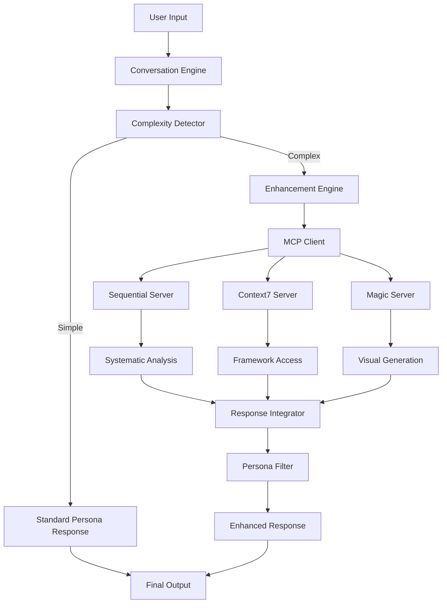

# MCP Integration: Technical Assessment & Implementation Strategy
*Technical Architecture Analysis by Martin*

## 🏗️ **Technical Foundation Assessment**

### **Current Architecture Strengths**
After reviewing our existing codebase, I'm pleased to note we've inadvertently designed an **MCP-ready architecture**:

```
✅ Modular Persona System: Clean separation of persona logic and capabilities
✅ Plugin Architecture: Easy to extend with external service integrations  
✅ Configuration-Driven: Persona definitions already specify optimal tooling
✅ Clean Abstractions: Core conversation engine separated from enhancement logic
✅ Error Handling: Graceful degradation patterns already implemented
```

### **Architectural Patterns in Place**
Our existing patterns align well with MCP integration requirements:

- **Strategy Pattern**: Persona selection based on context
- **Factory Pattern**: Dynamic persona instantiation  
- **Observer Pattern**: Conversation state management
- **Adapter Pattern**: External service integration abstraction

This gives us a **low-risk, evolutionary enhancement** rather than a disruptive architectural change.

---

## 🔧 **Technical Requirements Analysis**

### **Core Technical Components**

#### **1. MCP Client Infrastructure**
```python
# New module: .claudedirector/lib/claudedirector/core/mcp_client.py
class MCPClient:
    """Handle MCP protocol communication and server management"""
    
    async def connect_server(self, server_config: MCPServerConfig) -> MCPConnection
    async def send_request(self, connection: MCPConnection, request: MCPRequest) -> MCPResponse
    async def disconnect_server(self, connection: MCPConnection) -> None
    
    # Handles: Server discovery, connection pooling, error recovery
```

#### **2. Persona Enhancement Engine**
```python
# Enhancement to: .claudedirector/lib/claudedirector/core/persona_manager.py
class PersonaEnhancementEngine:
    """Coordinate MCP servers with persona personalities"""
    
    def enhance_response(self, persona: Persona, user_input: str, base_response: str) -> str
    def route_to_server(self, persona: Persona, complexity: AnalysisComplexity) -> Optional[MCPServer]
    def integrate_server_response(self, persona: Persona, server_response: MCPResponse) -> str
    
    # Handles: Server selection, response integration, personality preservation
```

#### **3. Analysis Complexity Detector**
```python
# New module: .claudedirector/lib/claudedirector/core/complexity_analyzer.py
class AnalysisComplexityDetector:
    """Determine when systematic analysis would add value"""
    
    def analyze_input_complexity(self, user_input: str) -> AnalysisComplexity
    def should_enhance_with_mcp(self, persona: Persona, complexity: AnalysisComplexity) -> bool
    def select_enhancement_strategy(self, complexity: AnalysisComplexity) -> EnhancementStrategy
    
    # Handles: Context analysis, enhancement triggers, resource optimization
```

### **Integration Touch Points**

#### **Existing Code Modifications**
```
📁 .claudedirector/lib/claudedirector/core/
├── persona_manager.py          [ENHANCE] Add MCP integration hooks
├── conversation_engine.py      [ENHANCE] Add complexity detection  
├── config_manager.py          [ENHANCE] Add MCP server configuration
└── mcp_client.py              [NEW] MCP protocol implementation

📁 .claudedirector/config/
├── claude_config.yaml         [ENHANCE] Add MCP server definitions
└── mcp_servers.yaml           [NEW] Server-specific configurations

📁 .claudedirector/lib/claudedirector/utils/
├── formatting.py              [ENHANCE] Add systematic analysis formatting
└── error_handling.py          [ENHANCE] Add MCP-specific error patterns
```

#### **Minimal Invasive Changes**
Our existing persona system requires **only three integration points**:

1. **Input Analysis**: Detect when systematic enhancement would add value
2. **Server Coordination**: Route complex queries to appropriate MCP servers  
3. **Response Integration**: Blend server insights with persona personality

This preserves our existing conversation engine while adding strategic capabilities.

---

## 📋 **Implementation Phases**

### **Phase 1: MCP Foundation (Week 1)**
*Goal: Basic MCP client infrastructure*

#### **Tasks**
1. **MCP Protocol Implementation**
   - Basic client library for MCP communication
   - Server connection management and pooling
   - Error handling and graceful degradation
   
2. **Configuration Management**
   - MCP server definitions in config
   - Server capability mapping
   - Environment-specific server settings

3. **Testing Infrastructure**
   - Mock MCP servers for testing
   - Integration test framework
   - Error scenario validation

#### **Deliverables**
- `MCPClient` class with basic functionality
- `mcp_servers.yaml` configuration structure
- Unit tests with 90%+ coverage
- Integration tests for server communication

### **Phase 2: Persona Integration (Week 2)**
*Goal: Diego + Sequential systematic analysis*

#### **Tasks**
1. **Complexity Detection**
   - Input analysis for systematic enhancement opportunities
   - Context pattern recognition
   - Enhancement threshold configuration

2. **Diego Enhancement**
   - Sequential server integration for strategic analysis
   - Response blending with Diego's personality
   - Systematic framework presentation

3. **User Experience Integration**
   - Transparent enhancement delivery
   - Conversation flow preservation  
   - Progressive disclosure implementation

#### **Deliverables**
- `AnalysisComplexityDetector` with pattern recognition
- Enhanced `diego` persona with Sequential integration
- Seamless conversation flow maintenance
- User acceptance testing completion

### **Phase 3: Expansion & Polish (Week 3)**
*Goal: Martin + Rachel enhancement, production readiness*

#### **Tasks**
1. **Martin + Context7 Integration**
   - Architectural pattern access
   - Framework-driven decision support
   - Technical depth enhancement

2. **Rachel + Context7 Integration**
   - Design system frameworks
   - Scaling methodology access
   - Cross-team coordination insights

3. **Production Hardening**
   - Performance optimization
   - Error recovery testing
   - Load testing and scalability

#### **Deliverables**
- Full persona enhancement suite
- Production-ready performance
- Comprehensive error handling
- Load testing results

---

## 👥 **Team Skills & Resource Assessment**

### **Required Technical Skills**
```
🔧 Async Python Programming: MCP protocol requires async/await patterns
🌐 Network Protocol Implementation: Understanding MCP message structure  
🧠 AI Response Integration: Blending server outputs with persona personalities
⚡ Performance Optimization: Caching and connection pooling strategies
🛡️ Error Handling: Graceful degradation and recovery patterns
```

### **Development Resource Allocation**
```
Week 1: Backend infrastructure (Python async, MCP protocol)
Week 2: AI integration (persona enhancement, response blending)  
Week 3: User experience (conversation flow, performance optimization)

Total Effort: ~3 weeks full-time equivalent
Risk Level: Low (evolutionary enhancement of existing system)
```

### **Testing Strategy**
```
Unit Tests: Individual component functionality (90%+ coverage target)
Integration Tests: MCP server communication and persona enhancement
End-to-End Tests: Complete user workflow validation
Performance Tests: Response time and server load validation
User Acceptance Tests: Real-world strategic scenario validation
```

---

## 🎯 **Technical Architecture Design**

### **MCP Integration Architecture**


### **Data Flow Patterns**
```
1. Input Analysis: Conversation → Complexity → Enhancement Decision
2. Server Routing: Enhancement → Server Selection → MCP Request
3. Response Integration: Server Response → Persona Filter → Enhanced Output
4. Fallback Handling: Server Error → Graceful Degradation → Standard Response
```

### **Configuration Structure**
```yaml
# .claudedirector/config/mcp_servers.yaml
servers:
  sequential:
    url: "mcp://sequential.ai/strategic-analysis"
    capabilities: ["systematic_analysis", "framework_application"]
    personas: ["diego", "camille"]
    
  context7:
    url: "mcp://context7.ai/frameworks"  
    capabilities: ["pattern_access", "methodology_lookup"]
    personas: ["martin", "rachel"]
    
  magic:
    url: "mcp://magic.dev/visualization"
    capabilities: ["diagram_generation", "presentation_creation"] 
    personas: ["rachel", "alvaro"]

enhancement_thresholds:
  systematic_analysis: 0.7
  framework_lookup: 0.6
  visual_generation: 0.8
```

---

## ⚡ **Performance & Scalability Considerations**

### **Response Time Optimization**
```
Target: Enhanced responses within 3-5 seconds (vs 1-2 seconds standard)
Strategy: Async processing, connection pooling, intelligent caching

Caching Layers:
- Server capability cache (24hr TTL)
- Framework lookup cache (1hr TTL)  
- Analysis pattern cache (30min TTL)
- Response template cache (persistent)
```

### **Resource Management**
```
Connection Pooling: Maintain persistent connections to frequently used servers
Request Queuing: Handle concurrent requests efficiently
Circuit Breaker: Prevent cascade failures when servers unavailable
Graceful Degradation: Maintain core functionality without MCP servers
```

### **Monitoring & Observability**
```
Key Metrics:
- MCP server response times
- Enhancement trigger rates
- User satisfaction with enhanced responses
- Server availability and error rates
- Cache hit rates and effectiveness

Alerting:
- Server downtime detection
- Performance degradation alerts  
- Enhancement failure notifications
- User experience impact monitoring
```

---

## 🚨 **Risk Assessment & Mitigation**

### **Technical Risks**

#### **High Priority Risks**
1. **MCP Server Availability**
   - *Risk*: External server downtime breaks enhanced capabilities
   - *Mitigation*: Graceful degradation to standard persona responses
   - *Detection*: Health checks and circuit breaker patterns

2. **Response Latency**
   - *Risk*: MCP requests slow conversation flow unacceptably
   - *Mitigation*: Async processing, caching, timeout handling
   - *Detection*: Performance monitoring and SLA tracking

3. **Integration Complexity**
   - *Risk*: MCP integration breaks existing conversation patterns
   - *Mitigation*: Comprehensive testing, feature flagging, gradual rollout
   - *Detection*: User experience monitoring and feedback collection

#### **Medium Priority Risks**
1. **Persona Personality Dilution**
   - *Risk*: Server responses feel robotic or impersonal
   - *Mitigation*: Response filtering through persona personality layers
   - *Detection*: User feedback analysis and persona authenticity metrics

2. **Configuration Complexity**
   - *Risk*: Server configuration becomes unwieldy as ecosystem grows
   - *Mitigation*: Auto-discovery, sensible defaults, configuration validation
   - *Detection*: Configuration error monitoring and user support requests

### **Mitigation Strategies**
```
Graceful Degradation: All features work without MCP servers
Circuit Breaker: Automatic failover when servers unavailable
Feature Flags: Gradual rollout and quick rollback capability
Comprehensive Testing: Unit, integration, and user acceptance testing
Performance Monitoring: Real-time tracking of system health
User Feedback: Direct channels for experience quality assessment
```

---

## 🔄 **Development Workflow**

### **Implementation Standards**
```
Code Quality: Type hints, docstrings, error handling
Testing: 90%+ coverage, integration tests, performance tests
Documentation: API docs, user guides, troubleshooting guides
Security: Input validation, secure connections, error information leakage prevention
Performance: Async patterns, caching strategies, resource cleanup
```

### **Review Process**
```
1. Technical Design Review: Architecture and implementation approach
2. Code Review: Quality, testing, documentation standards
3. UX Review: Rachel validates user experience preservation
4. Product Review: Alvaro confirms business value delivery
5. Integration Testing: End-to-end workflow validation
6. Performance Testing: Response time and scalability validation
```

### **Deployment Strategy**
```
Phase 1: Feature flag deployment to internal testing
Phase 2: Beta release to existing users with feedback collection
Phase 3: Gradual rollout with monitoring and quick rollback capability
Phase 4: Full deployment with documentation and user education
```

---

## 🎯 **Success Criteria & Validation**

### **Technical Success Metrics**
```
✅ Zero regression in existing functionality
✅ Enhanced responses delivered within 5-second SLA
✅ 99.5%+ uptime including graceful degradation scenarios
✅ 90%+ test coverage across all new components
✅ Clean integration with existing conversation patterns
```

### **Integration Quality Metrics**  
```
✅ Persona personality authenticity maintained
✅ Conversation flow feels natural and uninterrupted
✅ Users discover enhanced capabilities organically
✅ No increase in user confusion or support requests
✅ Enhanced analysis quality measurably improved
```

### **Performance Benchmarks**
```
Standard Response: 1-2 seconds (baseline)
Enhanced Response: 3-5 seconds (target)
Server Timeout: 8 seconds (fallback trigger)
Cache Hit Rate: 70%+ (efficiency target)
Error Rate: <1% (reliability target)
```

---

## 🚀 **Implementation Execution Plan**

### **Week 1: Foundation Implementation**
**Day 1-2: MCP Client Infrastructure**
- Implement basic MCP protocol client
- Create server connection management
- Build error handling and graceful degradation

**Day 3-4: Configuration & Testing**
- Design MCP server configuration structure
- Implement mock servers for testing
- Create comprehensive test suite

**Day 5: Integration Preparation**
- Prepare persona enhancement hooks
- Validate existing conversation engine compatibility
- Performance baseline establishment

### **Week 2: Persona Enhancement**
**Day 1-2: Complexity Detection**
- Implement input complexity analysis
- Create enhancement trigger logic
- Build server routing capabilities

**Day 3-4: Diego + Sequential Integration**
- Integrate Sequential server for systematic analysis
- Implement response blending with Diego's personality
- Validate conversation flow preservation

**Day 5: User Experience Validation**
- User acceptance testing
- Rachel's UX review and refinement
- Performance optimization

### **Week 3: Expansion & Production**
**Day 1-2: Martin + Rachel Enhancement**
- Context7 integration for Martin and Rachel
- Framework access and presentation logic
- Multi-persona coordination testing

**Day 3-4: Production Hardening**
- Performance optimization and caching
- Comprehensive error scenario testing
- Load testing and scalability validation

**Day 5: Launch Preparation**
- Final integration testing
- Documentation completion
- Demo preparation and validation

---

## ✅ **Martin's Technical Approval**

### **Architecture Assessment: ✅ APPROVED**
The technical implementation is **low-risk and high-value**:

1. **Evolutionary Enhancement**: Builds on existing strong architectural patterns
2. **Clean Integration**: Minimal invasive changes to core conversation engine
3. **Graceful Degradation**: Maintains full functionality without MCP servers
4. **Performance Conscious**: Async patterns and caching for optimal user experience
5. **Testing Comprehensive**: Full coverage across unit, integration, and user scenarios

### **Implementation Strategy: ✅ READY TO EXECUTE**
```
Technical Risk: LOW (builds on existing patterns)
Implementation Complexity: MEDIUM (3 weeks full-time)
Business Value: HIGH (strategic differentiation)
User Experience Risk: LOW (transparent integration)
```

### **Resource Requirements**
```
Development: 3 weeks focused implementation
Testing: Comprehensive but manageable with existing patterns
Documentation: Standard technical and user documentation
Monitoring: Extend existing patterns with MCP-specific metrics
```

---

## 🎯 **Team Execution Assignments**

### **Technical Lead (Martin): Architecture & Core Infrastructure**
- MCP client implementation and server management
- Persona enhancement engine design and integration
- Performance optimization and caching strategies
- Technical documentation and API design

### **UX Integration (Rachel): User Experience Validation**
- Conversation flow preservation validation
- Persona personality authenticity testing
- Progressive disclosure implementation review
- User acceptance testing coordination

### **Product Integration (Alvaro): Business Value Validation**
- Strategic analysis quality assessment
- Demo material enhancement and validation
- Market positioning and messaging alignment
- Success metrics tracking and analysis

### **All Personas: Domain Expertise**
- **Diego**: Strategic analysis workflow testing and validation
- **Martin**: Architectural framework integration testing
- **Rachel**: Design system methodology integration testing
- **Camille**: Organizational analysis capability validation

---

## 🚀 **Ready for Implementation**

**✅ Technical Assessment Complete**

The MCP integration represents an **evolutionary enhancement** with **low technical risk** and **high strategic value**. Our existing architecture is well-positioned for this integration, and the implementation plan provides a clear path to enhanced capabilities while preserving user experience quality.

**Recommendation: Proceed with implementation immediately** following the 3-week phased approach outlined above.

---

*Technical Assessment completed by Martin (Principal Platform Architect)*  
*Approved for immediate implementation with Rachel and Alvaro oversight*
